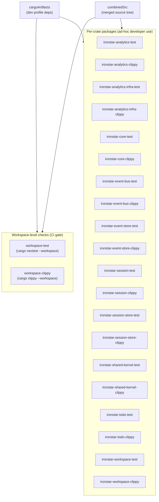

# Nix CI build system

This document describes the nix-based CI pipeline that `nix-fast-build` (or `nix flake check`) evaluates.
The build graph has three layers: filtered source inputs, shared intermediate artifacts, and the 12 check derivations that gate every merge.

## CI check dependency graph

The following diagram shows how repository content flows through source filters, intermediate build artifacts, and into the 12 checks that constitute the CI gate.

```mermaid
flowchart TD
    subgraph sources ["Source inputs"]
        src_rust["Rust sources<br/>(Cargo + *.rs + *.sql)"]
        src_webcomponents["web-components/"]
        src_migrations["migrations/"]
        src_docs["docs sources<br/>(packages/docs/)"]
        src_eventcatalog["eventcatalog sources<br/>(packages/eventcatalog/)"]
        src_e2e["E2E test sources<br/>(e2e/, playwright.config.ts)"]
        src_self["entire repo (self)<br/>(unfiltered)"]
    end

    subgraph intermediates ["Shared intermediate artifacts"]
        frontendAssets["frontendAssets<br/>(Rolldown bundled CSS/JS)"]
        combinedSrc["combinedSrc<br/>(merged source tree)"]
        cargoVendorDir["cargoVendorDir<br/>(vendored crate deps)"]
        cargoArtifacts["cargoArtifacts<br/>(dev profile deps)"]
        cargoArtifactsRel["cargoArtifactsRelease<br/>(release profile deps)"]
        pkg_ironstar["ironstar<br/>(dev binary)"]
        pkg_ironstar_rel["ironstar-release<br/>(production binary)"]
        pkg_docs["ironstar-docs<br/>(built Astro site)"]
        pkg_eventcatalog["ironstar-eventcatalog<br/>(built EventCatalog site)"]
        bunDeps_docs["bunDeps (docs)"]
        bunDeps_ec["bunDeps (eventcatalog)"]
        bunDeps_e2e["bunDeps (e2e)"]
        playwrightBrowsers["Playwright browsers<br/>(chromium-headless-shell)"]
    end

    subgraph checks ["The 12 checks"]
        workspace_fmt["workspace-fmt<br/>(cargo fmt --check)"]
        workspace_test["workspace-test<br/>(cargo nextest, 911 tests)"]
        workspace_clippy["workspace-clippy<br/>(clippy -D warnings)"]
        treefmt["treefmt<br/>(nixfmt + rustfmt + biome)"]
        pre_commit["pre-commit<br/>(treefmt + gitleaks hooks)"]
        gitleaks["gitleaks<br/>(secret scanning)"]
        nix_unit["nix-unit<br/>(flake structure assertions)"]
        docs_unit["docs-unit<br/>(Vitest)"]
        docs_e2e["docs-e2e<br/>(Playwright)"]
        eventcatalog_unit["eventcatalog-unit<br/>(Vitest)"]
        eventcatalog_e2e["eventcatalog-e2e<br/>(Playwright)"]
        ironstar_e2e["ironstar-e2e<br/>(Playwright)"]
    end

    %% Source → Intermediate edges
    src_webcomponents --> frontendAssets
    src_rust --> combinedSrc
    frontendAssets --> combinedSrc
    src_migrations --> combinedSrc
    src_rust --> cargoVendorDir
    combinedSrc --> cargoArtifacts
    cargoVendorDir --> cargoArtifacts
    combinedSrc --> cargoArtifactsRel
    cargoVendorDir --> cargoArtifactsRel
    cargoArtifacts --> pkg_ironstar
    combinedSrc --> pkg_ironstar
    cargoArtifactsRel --> pkg_ironstar_rel
    combinedSrc --> pkg_ironstar_rel
    src_docs --> bunDeps_docs
    bunDeps_docs --> pkg_docs
    src_docs --> pkg_docs
    src_eventcatalog --> bunDeps_ec
    bunDeps_ec --> pkg_eventcatalog
    src_eventcatalog --> pkg_eventcatalog
    src_e2e --> bunDeps_e2e

    %% Intermediate/Source → Check edges
    src_rust --> workspace_fmt
    combinedSrc --> workspace_test
    cargoArtifacts --> workspace_test
    combinedSrc --> workspace_clippy
    cargoArtifacts --> workspace_clippy
    src_self --> treefmt
    src_self --> pre_commit
    src_self --> gitleaks
    src_self --> nix_unit
    src_docs --> docs_unit
    bunDeps_docs --> docs_unit
    src_docs --> docs_e2e
    bunDeps_docs --> docs_e2e
    pkg_docs --> docs_e2e
    playwrightBrowsers --> docs_e2e
    src_eventcatalog --> eventcatalog_unit
    bunDeps_ec --> eventcatalog_unit
    src_eventcatalog --> eventcatalog_e2e
    bunDeps_ec --> eventcatalog_e2e
    pkg_eventcatalog --> eventcatalog_e2e
    playwrightBrowsers --> eventcatalog_e2e
    src_e2e --> ironstar_e2e
    bunDeps_e2e --> ironstar_e2e
    pkg_ironstar --> ironstar_e2e
    playwrightBrowsers --> ironstar_e2e
```

## Per-crate nix derivation composition

Each of the 10 library crates in the workspace gets two independent nix packages: `{crate}-test` and `{crate}-clippy`.
These per-crate derivations share `cargoArtifacts` and `combinedSrc` with the workspace-level checks but are not composed into them.
The workspace-level `workspace-test` and `workspace-clippy` checks run cargo across the entire workspace in a single invocation rather than aggregating per-crate results.
Per-crate packages exist for ad-hoc developer use when iterating on a single crate.

## Key observations

The `combinedSrc` derivation is the critical merge point for all Rust builds.
A change to `web-components/` triggers `frontendAssets` to rebuild, which invalidates `combinedSrc`, which in turn invalidates `cargoArtifacts` and every Rust check downstream.

The `workspace-fmt` check is the lightest Rust check because it depends only on `src_rust` directly, bypassing both `combinedSrc` and `cargoArtifacts`.
This means formatting checks complete quickly regardless of frontend asset or dependency changes.

E2E checks form the deepest dependency chains in the graph.
The `ironstar-e2e` check sits at the bottom of the longest path: `src_webcomponents` through `frontendAssets`, `combinedSrc`, `cargoArtifacts`, the full `ironstar` binary build, and finally the Playwright test execution with browser dependencies.

The `gitleaks`, `treefmt`, `pre-commit`, and `nix-unit` checks all use the unfiltered `self` source.
They are sensitive to any file change in the repository but are lightweight since they involve no Rust or frontend compilation.

Per-crate packages are fully independent from the workspace-level checks that gate CI.
Building `ironstar-todo-test` does not influence the `workspace-test` result and vice versa.
They are convenience derivations for faster feedback when working within a single crate.

The `cargoArtifacts` derivation is the major cache layer for all Rust compilation.
It only rebuilds when `Cargo.lock`, `Cargo.toml` files, or the `combinedSrc` hash changes.
Once cached, all downstream checks that depend on it (workspace-test, workspace-clippy, ironstar binary, per-crate packages) skip dependency compilation entirely and only build project code.
