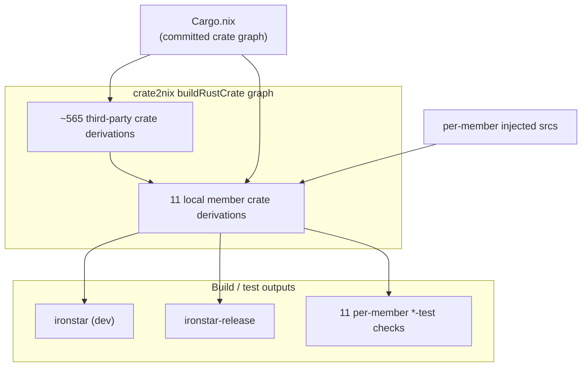

# Nix CI build system

This document describes the nix-based CI pipeline that `nix-fast-build` (or `nix flake check`) evaluates.
The build graph has three layers: filtered source inputs, shared intermediate artifacts, and the 27 check derivations that gate every merge.

The Rust build substrate is crate2nix: the committed `Cargo.nix` emits one `buildRustCrate` derivation per crate, so a single dependency bump invalidates only that crate's reverse-dependency cone rather than a monolithic dependency blob.

## CI check dependency graph

The following diagram shows how repository content flows through source filters, intermediate build artifacts, and into the 27 checks that constitute the CI gate.

```mermaid
flowchart TD
    subgraph sources ["Source inputs"]
        src_rust["Rust sources<br/>(Cargo + *.rs + *.toml + *.sql)"]
        src_webcomponents["web-components/"]
        src_migrations["migrations/"]
        src_cargolock["Cargo.lock"]
        src_cargonix["Cargo.nix<br/>(committed crate graph)"]
        src_docs["docs sources<br/>(packages/docs/)"]
        src_eventcatalog["eventcatalog sources<br/>(packages/eventcatalog/)"]
        src_e2e["E2E test sources<br/>(e2e/, playwright.config.ts)"]
        src_self["entire repo (self)<br/>(unfiltered)"]
    end

    subgraph intermediates ["Shared intermediate artifacts"]
        frontendAssets["frontendAssets<br/>(Rolldown bundled CSS/JS)"]
        combinedSrc["combinedSrc<br/>(filtered source + assets + migrations)"]
        memberSrc["per-member injected srcs<br/>(ironstar, ironstar-analytics-infra)"]
        crateGraph["crate2nix buildRustCrate graph<br/>(one derivation per crate)"]
        cargoVendorDeps["cargoVendorDeps<br/>(importCargoLock vendor)"]
        pkg_ironstar["ironstar<br/>(dev binary)"]
        pkg_ironstar_rel["ironstar-release<br/>(production binary)"]
        pkg_docs["ironstar-docs<br/>(built Astro site)"]
        pkg_eventcatalog["ironstar-eventcatalog<br/>(built EventCatalog site)"]
        bunDeps_docs["bunDeps (docs)"]
        bunDeps_ec["bunDeps (eventcatalog)"]
        bunDeps_e2e["bunDeps (e2e)"]
        playwrightBrowsers["Playwright browsers<br/>(chromium-headless-shell)"]
    end

    subgraph checks ["The 27 checks"]
        ironstar_pkg["ironstar<br/>(dev binary build)"]
        dev_platform["dev-platform<br/>(process-compose stack)"]
        workspace_test["workspace-test<br/>(zero-cost aggregate over 11 per-member tests)"]
        per_member_test["11 per-member *-test checks<br/>(crate2nix runTests)"]
        workspace_clippy["workspace-clippy<br/>(clippy -D warnings)"]
        treefmt["treefmt<br/>(nixfmt + rustfmt + biome)"]
        gitleaks["gitleaks<br/>(secret scanning)"]
        cargo_nix_lock_sync["cargo-nix-lock-sync<br/>(Cargo.lock ↔ Cargo.nix set diff)"]
        build_graph_invariants["build-graph-invariants<br/>(graph-drift regulator)"]
        structure_invariant["structure-package-set-invariant<br/>(package/check parity)"]
        docs_unit["ironstar-docs-unit<br/>(Vitest)"]
        docs_e2e["ironstar-docs-e2e<br/>(Playwright)"]
        eventcatalog_unit["ironstar-eventcatalog-unit<br/>(Vitest)"]
        eventcatalog_e2e["ironstar-eventcatalog-e2e<br/>(Playwright)"]
        ironstar_e2e["ironstar-e2e<br/>(Playwright)"]
    end

    %% Source → Intermediate edges
    src_webcomponents --> frontendAssets
    src_rust --> combinedSrc
    frontendAssets --> combinedSrc
    src_migrations --> combinedSrc
    src_rust --> memberSrc
    frontendAssets --> memberSrc
    src_migrations --> memberSrc
    src_cargonix --> crateGraph
    src_rust --> crateGraph
    memberSrc --> crateGraph
    src_cargolock --> cargoVendorDeps
    crateGraph --> pkg_ironstar
    crateGraph --> pkg_ironstar_rel
    src_docs --> bunDeps_docs
    bunDeps_docs --> pkg_docs
    src_docs --> pkg_docs
    src_eventcatalog --> bunDeps_ec
    bunDeps_ec --> pkg_eventcatalog
    src_eventcatalog --> pkg_eventcatalog
    src_e2e --> bunDeps_e2e

    %% Intermediate/Source → Check edges
    pkg_ironstar --> ironstar_pkg
    crateGraph --> per_member_test
    per_member_test --> workspace_test
    combinedSrc --> workspace_clippy
    cargoVendorDeps --> workspace_clippy
    src_self --> treefmt
    src_self --> gitleaks
    src_cargolock --> cargo_nix_lock_sync
    src_cargonix --> cargo_nix_lock_sync
    src_self --> build_graph_invariants
    src_self --> structure_invariant
    src_docs --> docs_unit
    bunDeps_docs --> docs_unit
    src_docs --> docs_e2e
    bunDeps_docs --> docs_e2e
    pkg_docs --> docs_e2e
    playwrightBrowsers --> docs_e2e
    src_eventcatalog --> eventcatalog_unit
    bunDeps_ec --> eventcatalog_unit
    src_eventcatalog --> eventcatalog_e2e
    bunDeps_ec --> eventcatalog_e2e
    pkg_eventcatalog --> eventcatalog_e2e
    playwrightBrowsers --> eventcatalog_e2e
    src_e2e --> ironstar_e2e
    bunDeps_e2e --> ironstar_e2e
    pkg_ironstar --> ironstar_e2e
    playwrightBrowsers --> ironstar_e2e
```

## The 27 checks

The check surface groups into Rust correctness, structural regulators, formatting and secrets, and the docs/eventcatalog/e2e site suites.

Rust correctness comes from the crate2nix substrate.
The `ironstar` check builds the dev binary.
Eleven per-member `*-test` checks (`ironstar-test`, `ironstar-core-test`, `ironstar-shared-kernel-test`, `ironstar-todo-test`, `ironstar-session-test`, `ironstar-analytics-test`, `ironstar-workspace-test`, `ironstar-event-store-test`, `ironstar-event-bus-test`, `ironstar-analytics-infra-test`, `ironstar-session-store-test`) each run their member's crate2nix `runTests` variant, delivering per-crate test cache granularity.
The `workspace-test` check is a zero-cost `linkFarm` aggregate over those eleven, preserving the historical name for devshell `inputsFrom` and CI ergonomics.
The `workspace-clippy` check runs a single workspace-wide `cargo clippy --all-targets -- -D warnings` over `combinedSrc` with offline deps from `rustPlatform.importCargoLock`.

Structural regulators gate the build graph itself.
`cargo-nix-lock-sync` is a pure no-network check diffing the `Cargo.lock` `[[package]]` set against the `Cargo.nix` `crateName/version` set, failing on a stale `Cargo.nix` with an actionable `just regenerate-cargo-nix` message.
`build-graph-invariants` validates a committed build-graph snapshot against accepted duplication and node-count ceilings, acting as the graph-drift regulator.
`structure-package-set-invariant` asserts that every package has a corresponding check (and vice versa where intended), computed at outer eval time over the attribute-name lists.

Formatting and secrets run over the unfiltered repository.
`treefmt` runs nixfmt, rustfmt, and biome; `gitleaks` scans for committed secrets.

The site suites build and test the documentation packages.
`ironstar-docs` and `ironstar-eventcatalog` build the Astro and EventCatalog sites; `ironstar-docs-unit`/`ironstar-eventcatalog-unit` run Vitest; `ironstar-docs-e2e`/`ironstar-eventcatalog-e2e`/`ironstar-e2e` run Playwright.
`dev-platform` builds the process-compose development stack.

## crate2nix per-crate composition

Each crate in the workspace — local members and third-party dependencies alike — compiles to its own `buildRustCrate` derivation.
The dev binary (`ironstar`), the release binary (`ironstar-release`), and each per-member test variant reuse these per-crate derivations through the crate graph, so a dependency change rebuilds only the affected crate and its reverse-dependency cone.

```mermaid
flowchart TD
    cargonix["Cargo.nix<br/>(committed crate graph)"]
    memberSrc["per-member injected srcs"]

    subgraph crate_graph ["crate2nix buildRustCrate graph"]
        dep_crates["~565 third-party crate derivations"]
        member_crates["11 local member crate derivations"]
    end

    subgraph outputs ["Build / test outputs"]
        pkg_ironstar["ironstar (dev)"]
        pkg_ironstar_rel["ironstar-release"]
        per_member_test["11 per-member *-test checks"]
    end

    cargonix --> dep_crates
    cargonix --> member_crates
    memberSrc --> member_crates
    dep_crates --> member_crates
    member_crates --> pkg_ironstar
    member_crates --> pkg_ironstar_rel
    member_crates --> per_member_test
```

## Key observations

The `combinedSrc` derivation is the source merge point for the `workspace-clippy` gate, joining the filtered Rust source, the Rolldown-built frontend assets, and the SQL migrations.
A change to `web-components/` rebuilds `frontendAssets`, which invalidates `combinedSrc` and the per-member injected source trees for the two crates that read assets through `$CARGO_MANIFEST_DIR/../../`.

The crate2nix substrate is the cache-granularity payoff.
A single Renovate-style dependency bump in `Cargo.lock` (regenerated into `Cargo.nix`) invalidates only that dependency crate's derivation and its reverse-dependency cone, leaving every unaffected crate derivation cached.
This per-crate granularity is the property the crate2nix substrate was adopted to obtain, replacing a prior single monolithic vendored-dependency blob that any lock change rebuilt in full.

The per-member `*-test` checks form a finer regulator than a monolithic workspace test.
Restoring a single comment in one crate's source rebuilds only that crate's `*-test` check (and any reverse-dependent members), not the whole workspace.

The `treefmt`, `gitleaks`, `build-graph-invariants`, and `structure-package-set-invariant` checks use the unfiltered `self` source or small content-addressed slices.
They are sensitive to repository changes but involve no Rust or frontend compilation, so they complete quickly.

E2E checks form the deepest dependency chains in the graph.
The `ironstar-e2e` check sits at the bottom of the longest path: `web-components/` through `frontendAssets`, the per-member injected source, the full `ironstar` binary build, and finally the Playwright test execution with browser dependencies.
