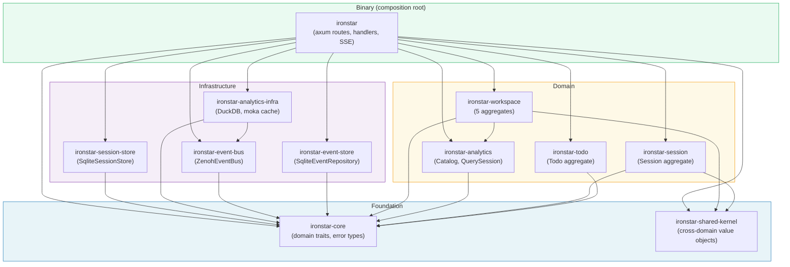

# Workspace dependency DAG

The ironstar Cargo workspace contains 11 crates organized into four role-based layers.
Edges in the diagram represent workspace-internal path dependencies only.
Each crate has its own README with module structure, type documentation, and cross-links to the corresponding [Idris2 specification](../spec/README.md).

## Crate documentation

| Crate | README | Spec counterpart |
|-------|--------|-----------------|
| ironstar-core | [README](ironstar-core/README.md) | [spec/Core/](../spec/Core/README.md) |
| ironstar-shared-kernel | [README](ironstar-shared-kernel/README.md) | [spec/SharedKernel/](../spec/SharedKernel/README.md) |
| ironstar-todo | [README](ironstar-todo/README.md) | [spec/Todo/](../spec/Todo/README.md) |
| ironstar-session | [README](ironstar-session/README.md) | [spec/Session/](../spec/Session/README.md) |
| ironstar-analytics | [README](ironstar-analytics/README.md) | [spec/Analytics/](../spec/Analytics/README.md) |
| ironstar-workspace | [README](ironstar-workspace/README.md) | [spec/Workspace/](../spec/Workspace/README.md) |
| ironstar-event-store | [README](ironstar-event-store/README.md) | [spec/Core/Effect](../spec/Core/README.md) |
| ironstar-event-bus | [README](ironstar-event-bus/README.md) | [spec/Core/Effect](../spec/Core/README.md) |
| ironstar-analytics-infra | [README](ironstar-analytics-infra/README.md) | (no spec counterpart) |
| ironstar-session-store | [README](ironstar-session-store/README.md) | (no spec counterpart) |
| ironstar | [README](ironstar/README.md) | (composition root, outside spec scope) |

## Notes

The two foundation crates are independent of each other: `ironstar-core` provides domain traits and error types while `ironstar-shared-kernel` provides cross-domain value objects like `UserId` and `OAuthProvider`.

Among the domain crates, `ironstar-workspace` is unique in depending on another domain crate (`ironstar-analytics`), reflecting the workspace aggregate's need to reference analytics types.

The infrastructure layer maintains clean separation from the domain layer: no infrastructure crate depends on any domain crate.
Within infrastructure, `ironstar-analytics-infra` is the only crate with a cross-infrastructure dependency, relying on `ironstar-event-bus` for Zenoh-based cache invalidation.

The binary crate `ironstar` is the sole composition root, depending on all ten library crates to wire domain logic and infrastructure together behind axum routes and SSE endpoints.
