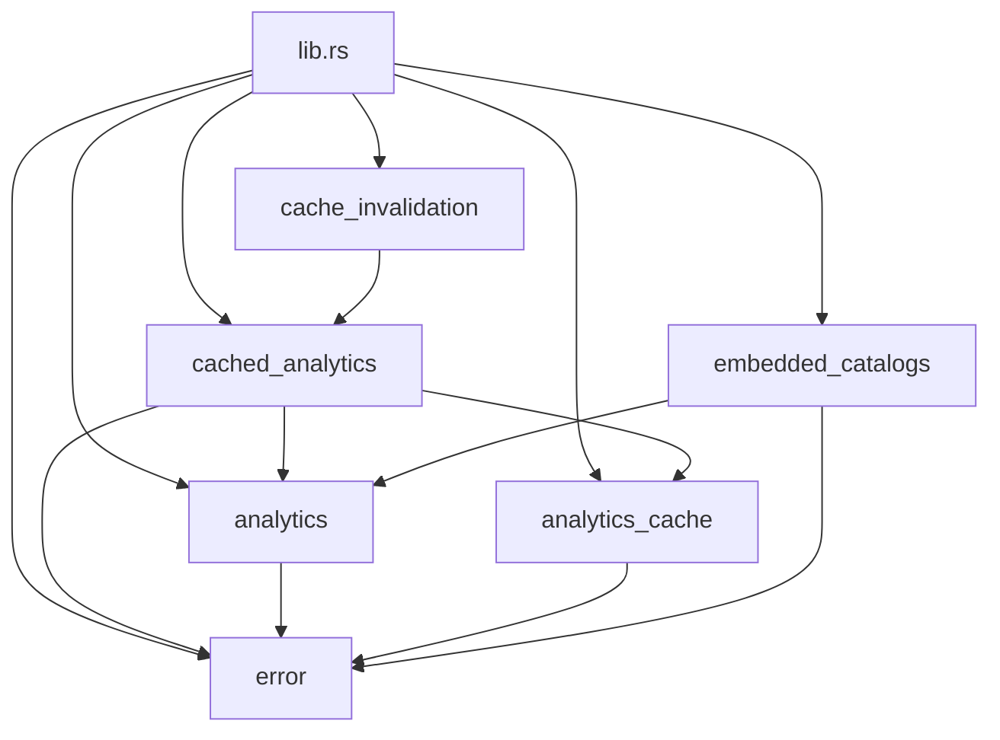

# ironstar-analytics-infra

Infrastructure crate providing DuckDB analytics query execution, moka in-memory cache with TTL, and Zenoh-based cache invalidation.
This crate has no direct spec counterpart -- it implements the infrastructure layer that the [Analytics domain](../../spec/Analytics/README.md) delegates to at effect boundaries.
See the [crate DAG](../README.md) for how this crate fits into the workspace dependency graph.

## Module structure



## Key components

`DuckDBService` wraps an `Option<async_duckdb::Pool>` to centralize availability checking.
When the pool is `None`, all query methods return a service unavailable error that maps to HTTP 503.
The service provides `query` for read-only operations, `query_mut` for DDL and mutations, `initialize_extensions` for loading httpfs and ducklake on all pool connections, and `attach_catalog` for attaching DuckLake catalogs with SQL injection-safe identifier validation.

```rust
let result = analytics.service.query(|conn| {
    let mut stmt = conn.prepare("SELECT COUNT(*) FROM events")?;
    stmt.query_row([], |row| row.get::<_, i64>(0))
}).await?;
```

`AnalyticsState` is the axum state container that handlers extract via `State<AnalyticsState>`.
It provides both raw DuckDB access via `service` and cache-assisted queries via `cached`.

`AnalyticsCache` wraps `moka::future::Cache<String, Vec<u8>>` with rkyv serialization for zero-copy deserialization of cached query results.
Default TTL policy is 5 minutes time-to-live and 60 seconds time-to-idle, with a maximum capacity of 1,000 entries.
Static `serialize` and `deserialize` methods encapsulate the rkyv API for callers.

`CachedAnalyticsService` composes `DuckDBService` and `AnalyticsCache` into a cache-aside pattern.
On cache hit, stored bytes are deserialized directly without executing the DuckDB query.
On cache miss, the query runs, results are serialized and cached, then returned.
Cache keys follow the structure `{prefix}:{query_hash:x}` where the prefix identifies the query context and the hash is a 64-bit hex-encoded hash of query parameters.

`CacheInvalidationRegistry` holds a list of `CacheDependency` entries (defined in [ironstar-event-bus](../ironstar-event-bus/README.md)) that describe which cache keys depend on which event streams.
`spawn_cache_invalidation` starts a background tokio task that subscribes to all domain events on the Zenoh bus and invalidates matching cache entries by prefix when events arrive.

`DuckLakeCatalogs` uses `rust_embed` to compile DuckLake catalog `.db` files from `assets/ducklake-catalogs/` into the binary at build time.
The `attach_all` function extracts embedded catalogs to a temporary directory and ATTACHes them to DuckDB, eliminating the network download penalty for known datasets.
Cache key prefixes incorporate `CARGO_PKG_VERSION` so entries automatically invalidate when the binary is rebuilt with updated catalogs.

## Dependency note

This is the only infrastructure crate that depends on another infrastructure crate ([ironstar-event-bus](../ironstar-event-bus/README.md)) for Zenoh-based cache invalidation.
The `cache_invalidation` module imports `CacheDependency` and the `ALL_EVENTS` key expression constant from the event bus crate.

## Cross-links

- [ironstar-analytics](../ironstar-analytics/README.md) -- domain types consumed by this crate's query and caching infrastructure
- [ironstar-event-bus](../ironstar-event-bus/README.md) -- provides `CacheDependency` and Zenoh session for event-driven cache invalidation
- [spec/Analytics](../../spec/Analytics/README.md) -- domain specification that this infrastructure layer realizes
