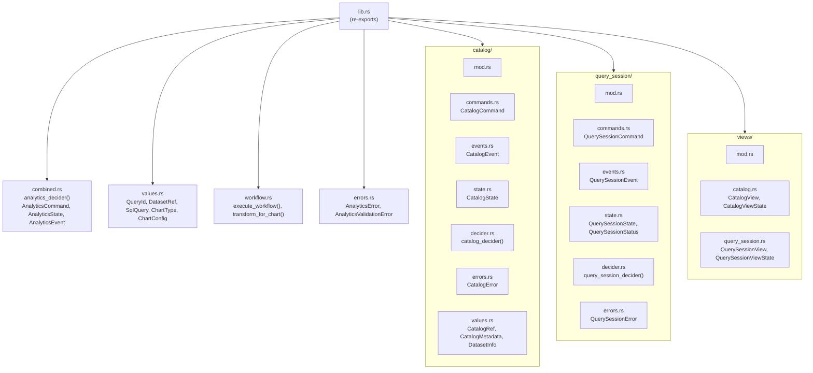

# ironstar-analytics

Rust implementation of the Analytics bounded context, providing DuckLake catalog management, query session lifecycle, chart visualization values, and a combined Decider composing both aggregates.
See the [specification](../../spec/Analytics/README.md) for the Idris2 type-level design.
See the [crate dependency DAG](../README.md) for how this crate fits into the workspace.

## Module structure

The crate is organized into domain modules for each aggregate, shared value objects, views for read-side projections, and a workflow pipeline for query execution.

## Spec-to-implementation correspondence

| Spec (Idris2) | Rust type | Module path |
|----------------|-----------|-------------|
| `CatalogCommand` | `CatalogCommand` | `src/catalog/commands.rs` |
| `CatalogEvent` | `CatalogEvent` | `src/catalog/events.rs` |
| `CatalogState` | `CatalogState` | `src/catalog/state.rs` |
| `catalogDecider` | `catalog_decider()` | `src/catalog/decider.rs` |
| `CatalogRef` | `CatalogRef` | `src/catalog/values.rs` |
| `CatalogMetadata` | `CatalogMetadata` | `src/catalog/values.rs` |
| `DatasetInfo` | `DatasetInfo` | `src/catalog/values.rs` |
| `QueryCommand` | `QuerySessionCommand` | `src/query_session/commands.rs` |
| `QueryEvent` | `QuerySessionEvent` | `src/query_session/events.rs` |
| `QueryState` | `QuerySessionState` | `src/query_session/state.rs` |
| `queryDecider` | `query_session_decider()` | `src/query_session/decider.rs` |
| `QueryId` | `QueryId` | `src/values.rs` |
| `SqlQuery` | `SqlQuery` | `src/values.rs` |
| `DatasetRef` | `DatasetRef` | `src/values.rs` |
| `ChartType` | `ChartType` | `src/values.rs` |
| `ChartConfig` | `ChartConfig` | `src/values.rs` |
| `analyticsDecider` | `analytics_decider()` | `src/combined.rs` |
| `Sum CatalogCommand QueryCommand` | `AnalyticsCommand` | `src/combined.rs` |
| `(CatalogState, QueryState)` | `AnalyticsState` | `src/combined.rs` |
| `Sum CatalogEvent QueryEvent` | `AnalyticsEvent` | `src/combined.rs` |
| `queryHistoryView` | `query_session_view()` | `src/views/query_session.rs` |
| `QueryHistory` | `QuerySessionViewState` | `src/views/query_session.rs` |
| `analyticsView` | `catalog_view()` | `src/views/catalog.rs` |
| `QueryStatus` | `QuerySessionStatus` | `src/query_session/state.rs` |

The Rust implementation extends the spec in several ways.
The `QuerySessionState` introduces `Pending`, `Executing`, and `Cancelled` states beyond the spec's three-state model.
Value objects (`QueryId`, `DatasetRef`, `SqlQuery`, `CatalogRef`) use smart constructors with validation, following the "parse, don't validate" principle.
The `workflow` module adds a railway-oriented pipeline (`execute_workflow`) composing pure validation with async effect boundaries (`SchemaLoader`, `QueryExecutor` traits).
Error types carry UUID tracking and backtrace capture for distributed tracing.

## Cross-links

- [ironstar-analytics-infra](../ironstar-analytics-infra/README.md) for the DuckDB service, moka cache, and infrastructure implementations of `SchemaLoader` and `QueryExecutor`.
- [spec/Analytics](../../spec/Analytics/README.md) for the Idris2 specification this crate implements.
