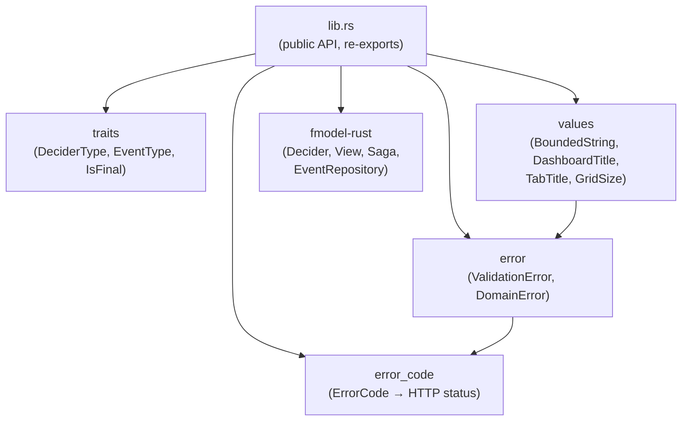

# ironstar-core

Foundation crate providing domain traits, error types, validated value objects, and fmodel-rust re-exports.
This crate realizes the algebraic patterns defined in [spec/Core/](../../spec/Core/README.md) and sits at the root of the [crate dependency DAG](../README.md).
Every domain crate depends on ironstar-core rather than on fmodel-rust directly, centralizing version management and aligning with the Idris2 spec.

## Module structure



## Key types

The crate's public API falls into four categories.

*Domain marker traits* define the behavioral contracts that every aggregate and event type must satisfy.
`DeciderType` returns the aggregate type name for polymorphic routing.
`EventType` returns the event variant name for JSON schema evolution.
`IsFinal` marks terminal aggregate states that refuse further commands.

*fmodel-rust re-exports* centralize the framework's core abstractions so downstream crates never depend on fmodel-rust directly.
The re-exported types are `Decider`, `View`, `Saga`, `Identifier`, `Sum`, `EventComputation`, `ViewStateComputation`, `EventRepository`, `EventSourcedAggregate`, and `DeciderTestSpecification`.
The spec's `Core.Decider` record maps to fmodel-rust's `Decider` struct; `Core.View` maps to `View`; `Core.Saga` maps to `Saga`.

*Error types* provide UUID-tracked errors with backtrace capture for distributed tracing.
`ValidationError` covers field-level validation failures (empty field, format mismatch, length bounds, numeric range).
`DomainError` covers business rule violations (invalid state transition, version conflict, not found, already exists).
`ErrorCode` maps domain errors to HTTP status codes (400, 401, 403, 404, 409, 500, 503).

*Validated value objects* implement the "parse, don't validate" principle.
`BoundedString`, `DashboardTitle`, `TabTitle`, and `GridSize` enforce invariants at construction time and are detailed in the next section.

## Correspondence to spec

The spec's `Core.Decider` record maps to fmodel-rust's `Decider` struct, which encodes the decide/evolve/initialState triple.
The spec's `Core.View` and `Core.Saga` similarly map to the re-exported `View` and `Saga` types.
The spec's `Core.Event` interfaces (`EventType`, `IsFinal`) are realized as Rust traits in this crate.

The spec's `Core.Effect` interfaces (event persistence, event publishing) are *not* in this crate.
Those effectful boundaries are realized by [ironstar-event-store](../ironstar-event-store/README.md) and [ironstar-event-bus](../ironstar-event-bus/README.md), preserving the pure/effectful split.

## BoundedString

`BoundedString<const MIN: usize, const MAX: usize>` encodes string length constraints at the type level using const generics.
This is a Rust-specific enhancement over the Idris2 spec, which uses plain String newtypes.

```rust
pub struct BoundedString<const MIN: usize, const MAX: usize>(String);

// Construction is fallible: invalid input is rejected at parse time
let title: BoundedString<1, 200> = BoundedString::new("  Sales Overview  ", "title")?;
assert_eq!(title.as_str(), "Sales Overview"); // trimmed automatically

// Domain-specific newtypes wrap BoundedString with serde integration
type DashboardTitle = BoundedString<1, 200>; // simplified; actual impl is a newtype struct
```

The smart constructor trims whitespace, counts characters (not bytes) for Unicode correctness, and returns `ValidationError` with structured context (field name, bounds, actual length) on failure.
Downstream newtypes like `DashboardTitle`, `TabTitle`, `TodoText`, and `WorkspaceName` wrap `BoundedString` with specific bounds and derive `Serialize`/`Deserialize` via `TryFrom<String>`, ensuring validation runs on deserialization.

## Cross-links

Spec: [spec/Core/](../../spec/Core/README.md)

Domain crates that depend on ironstar-core:
- [ironstar-shared-kernel](../ironstar-shared-kernel/README.md) (cross-domain value objects)
- [ironstar-todo](../ironstar-todo/README.md) (Todo aggregate)
- [ironstar-session](../ironstar-session/README.md) (Session aggregate)
- [ironstar-analytics](../ironstar-analytics/README.md) (Catalog, QuerySession aggregates)
- [ironstar-workspace](../ironstar-workspace/README.md) (Workspace, Dashboard, SavedQuery, UserPreferences, WorkspacePreferences aggregates)

Infrastructure crates that depend on ironstar-core:
- [ironstar-event-store](../ironstar-event-store/README.md) (SqliteEventRepository)
- [ironstar-event-bus](../ironstar-event-bus/README.md) (ZenohEventBus)
