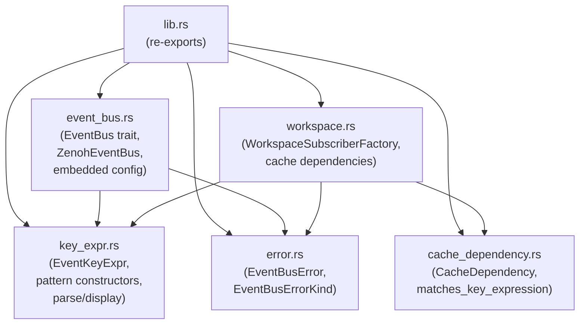

# ironstar-event-bus

Infrastructure crate implementing event distribution via Zenoh for ironstar.
It realizes the `EventNotifier` and `EventSubscriber` interfaces from the [Idris2 specification](../../spec/Core/README.md#effect-boundary-diagram), providing fire-and-forget event publishing, key expression routing, subscriber factories, and declarative cache invalidation.
See the [crate DAG](../README.md) for where this crate fits in the workspace dependency graph.

## Module structure



## Interface realization

| Spec interface (Idris2) | Rust implementation | Key methods |
|------------------------|---------------------|-------------|
| `EventNotifier e` | `ZenohEventBus` (via `EventBus` trait) | `publish` |
| `EventNotifier.publishAll` | `publish_events_fire_and_forget` | Iterates and publishes, logging failures without propagating |
| `EventSubscriber e` | `ZenohEventBus::session()` + Zenoh `declare_subscriber` | Direct session access for key-expression-filtered subscriptions |
| `EventSubscriber e` (workspace) | `WorkspaceSubscriberFactory` | `subscribe_workspace`, `subscribe_dashboard`, `subscribe_all`, etc. |

The `EventBus` trait defines the publish-only interface:

```rust
pub trait EventBus: Send + Sync {
    fn publish<E>(&self, event: &E) -> impl Future<Output = Result<(), EventBusError>> + Send
    where
        E: Identifier + DeciderType + Serialize + Sync;
}
```

The trait intentionally omits a `subscribe` method.
Zenoh's `Subscriber` type ties its lifecycle to `Drop`, which does not translate cleanly to a trait abstraction.
Instead, `ZenohEventBus::session()` exposes the underlying `Arc<Session>` for direct subscription access, preserving Zenoh's zero-copy efficiency and key expression wildcards.

`ZenohEventBus` runs in embedded mode by default (no network communication), configured via `zenoh_embedded_config()`.
Switching to multi-node distribution requires only endpoint configuration changes, no code changes.

## Key expression utilities

The `key_expr` module defines the hierarchical key expression schema used for Zenoh routing.

```text
events/{aggregate_type}/{aggregate_id}/{sequence}
  |         |                |              |
  |         |                |              +-- Event sequence number (monotonic per aggregate)
  |         |                +-- Aggregate instance ID (e.g., UUID)
  |         +-- Aggregate type name (e.g., "Todo", "Session")
  +-- Root namespace for domain events
```

Pattern constructors build key expressions for common subscription scenarios:

| Function | Pattern | Use case |
|----------|---------|----------|
| `aggregate_type_pattern("Todo")` | `events/Todo/**` | All Todo events (type-wide projection) |
| `aggregate_instance_pattern("Todo", "abc-123")` | `events/Todo/abc-123/**` | Single aggregate SSE feed |
| `event_key("Todo", "abc-123", 5)` | `events/Todo/abc-123/5` | Specific event (point lookup) |
| `event_key_without_sequence("Todo", "abc-123")` | `events/Todo/abc-123` | Current publish format |
| `ALL_EVENTS` | `events/**` | Global audit log |

The `EventKeyExpr` type provides validated, parsed key expressions with `FromStr`/`Display` implementations and round-trip fidelity.

## Cache invalidation

The `cache_dependency` module enables declarative cache invalidation by mapping cache keys to Zenoh key expression patterns they depend on.
When an event is published, `CacheDependency::matches` checks whether the event's key expression matches any declared dependency, indicating the cache entry should be invalidated.

```rust
let dep = CacheDependency::new("dashboard:summary")
    .depends_on_aggregate("Todo")
    .depends_on_instance("Session", "user-42");
```

The `workspace` module pre-declares cache dependencies for the four workspace bounded context aggregates (Workspace, Dashboard, SavedQuery, UserPreferences) and provides `WorkspaceSubscriberFactory` for creating typed Zenoh subscribers that satisfy the subscribe-before-replay invariant.

## Cross-links

- [spec/Core/Effect](../../spec/Core/README.md) -- Idris2 specification of the `EventNotifier` and `EventSubscriber` interfaces.
- [ironstar-event-store](../ironstar-event-store/README.md) -- Event persistence layer (realizes `EventRepository`).
- [ironstar-analytics-infra](../ironstar-analytics-infra/README.md) -- DuckDB analytics and moka cache, which consumes cache invalidation events from this crate.
