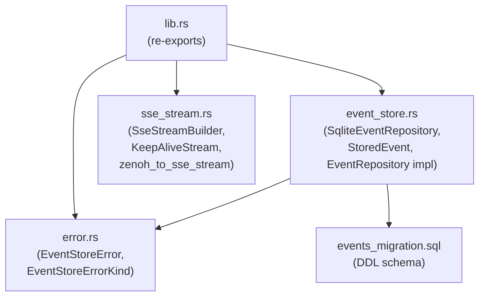

# ironstar-event-store

Infrastructure crate implementing the event persistence layer for ironstar.
It realizes the `EventRepository` interface from the [Idris2 specification](../../spec/Core/README.md#effect-boundary-diagram) as `SqliteEventRepository`, providing append-only event storage with optimistic locking and SSE stream composition utilities.
See the [crate DAG](../README.md) for where this crate fits in the workspace dependency graph.

## Module structure



## Interface realization

The spec defines four methods on the `EventRepository` interface.
`SqliteEventRepository` realizes all four, plus extension methods for projection rebuild and SSE reconnection.

| Spec interface (Idris2) | Rust implementation | Key methods |
|------------------------|---------------------|-------------|
| `EventRepository e err` | `SqliteEventRepository<C, E>` | `fetch_events`, `save` (via fmodel-rust trait), `query_since_sequence`, `query_all` |
| `EventRepository.append` | `save_with_command` | Append events with transaction-based optimistic locking |
| `EventRepository.fetch` | `fetch_events` | Fetch events for a command's aggregate, ordered by global sequence |
| `EventRepository.fetchSince` | `query_since_sequence` | Fetch events after a global sequence for SSE reconnection |

The fmodel-rust `EventRepository` trait is implemented directly:

```rust
impl<C, E> EventRepository<C, E, String, EventStoreError> for SqliteEventRepository<C, E>
where
    C: Identifier + DeciderType + Sync + Send,
    E: Identifier + EventType + DeciderType + IsFinal
        + Serialize + DeserializeOwned + Clone + Sync + Send,
{
    async fn fetch_events(&self, command: &C) -> Result<Vec<(E, String)>, EventStoreError>;
    async fn save(&self, events: &[E]) -> Result<Vec<(E, String)>, EventStoreError>;
    async fn version_provider(&self, event: &E) -> Result<Option<String>, EventStoreError>;
}
```

Extension methods beyond the trait:

```rust
impl<C, E> SqliteEventRepository<C, E>
where
    E: DeserializeOwned + Clone,
{
    pub async fn query_all(&self) -> Result<Vec<StoredEvent<E>>, EventStoreError>;
    pub async fn query_since_sequence(&self, since: i64) -> Result<Vec<StoredEvent<E>>, EventStoreError>;
    pub async fn earliest_sequence(&self) -> Result<Option<i64>, EventStoreError>;
    pub async fn latest_sequence(&self) -> Result<Option<i64>, EventStoreError>;
    pub async fn fetch_all_events_by_type(&self, aggregate_type: &str) -> Result<Vec<(E, String)>, EventStoreError>;
    pub async fn fetch_events_by_aggregate(&self, aggregate_type: &str, aggregate_id: &str) -> Result<Vec<(E, String)>, EventStoreError>;
}
```

## Event store schema

The `events` table uses an append-only design with optimistic locking via a `previous_id` chain.
The global `id` column provides monotonic ordering across all aggregates for SSE `Last-Event-ID` semantics.

| Column | Type | Purpose |
|--------|------|---------|
| `id` | `INTEGER PRIMARY KEY AUTOINCREMENT` | Global SSE sequence (monotonic) |
| `event_id` | `TEXT NOT NULL UNIQUE` | Event UUID, used as Version for optimistic locking |
| `aggregate_type` | `TEXT NOT NULL` | From `DeciderType` trait (e.g., "Todo") |
| `aggregate_id` | `TEXT NOT NULL` | From `Identifier` trait |
| `previous_id` | `TEXT UNIQUE REFERENCES events(event_id)` | Chain predecessor for optimistic locking (NULL for first event) |
| `event_type` | `TEXT NOT NULL` | Event variant name from `EventType` trait |
| `schema_version` | `INTEGER NOT NULL DEFAULT 1` | For upcaster routing during schema evolution |
| `payload` | `TEXT NOT NULL` | JSON event data, validated via `CHECK(json_valid(payload))` |
| `command_id` | `TEXT` | Causation tracking (command UUID) |
| `metadata` | `TEXT` | JSON correlation context |
| `final` | `INTEGER NOT NULL DEFAULT 0` | Terminal state marker from `IsFinal` trait |
| `created_at` | `TEXT NOT NULL` | ISO 8601 UTC timestamp |

Four triggers enforce invariants at the database level: immutability (no UPDATE or DELETE), first-event validation (NULL `previous_id` only for the first event per aggregate), same-aggregate chain integrity, and finalization (no appends to a finalized stream).

## SSE stream composition

The `sse_stream` module provides utilities for composing SSE event streams from historical replay and live Zenoh subscriptions.
`SseStreamBuilder` chains a finite replay stream (from `query_since_sequence`) with an infinite live stream (from a Zenoh subscriber), interleaving keep-alive comments to prevent proxy timeouts.

The subscribe-before-replay invariant is critical: subscribe to the Zenoh event bus *before* loading historical events from the store.
This prevents a race condition where events arriving during replay are missed.

Key components:

- `SseStreamBuilder` constructs SSE streams with configurable keep-alive intervals (default 15 seconds).
- `KeepAliveStream` yields SSE comment events (`: keepalive`) at regular intervals.
- `zenoh_to_sse_stream` transforms a Zenoh subscriber into an SSE-compatible `Stream`, deserializing JSON payloads and skipping malformed samples.
- `stored_events_to_stream` converts a `Vec<StoredEvent>` into a finite replay stream.
- `event_with_sequence` creates an SSE event with the global sequence number as the event ID.

## Cross-links

- [spec/Core/Effect](../../spec/Core/README.md) -- Idris2 specification of the `EventRepository`, `EventNotifier`, and `EventSubscriber` interfaces.
- [ironstar-event-bus](../ironstar-event-bus/README.md) -- Zenoh-based event distribution (realizes `EventNotifier` and `EventSubscriber`).
- [ironstar (binary)](../ironstar/README.md) -- Composition root where `SqliteEventRepository` is instantiated and wired to handlers and SSE endpoints.
