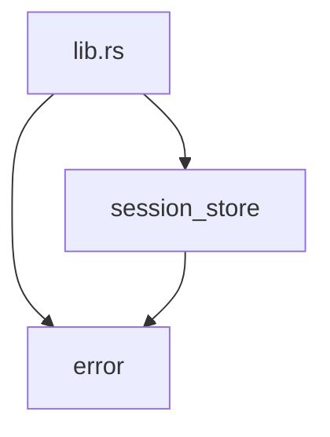

# ironstar-session-store

Infrastructure crate providing SQLite-based session persistence with TTL cleanup.
This crate has no direct spec counterpart -- it realizes the session storage implied by the [Session domain](../../spec/Session/README.md).
See the [crate DAG](../README.md) for how this crate fits into the workspace dependency graph.

## Module structure



## Key components

`SessionStore` is the trait defining session CRUD operations: `create`, `get`, `update_data`, `touch`, `delete`, `cleanup_expired`, and `delete_user_sessions`.
All methods are async and return `Result<_, SessionStoreError>`.

`SqliteSessionStore` implements `SessionStore` using sqlx with a `SqlitePool`.
Sessions are stored with a configurable TTL (default 30 days).
Session IDs use 192 bits of CSPRNG entropy (24 bytes) encoded as URL-safe base64 without padding, producing 32-character tokens.
The `get` method filters out expired sessions at query time by comparing `expires_at` against the current UTC timestamp.

```rust
let store = SqliteSessionStore::with_default_ttl(pool);
let session = store.create(Some("user-123")).await?;
let fetched = store.get(&session.id).await?;
```

The `Session` struct holds session state: `id`, optional `user_id` (bound after OAuth), timestamps (`created_at`, `last_seen_at`, `expires_at`), and a `serde_json::Value` for session-scoped application data.

`spawn_session_cleanup` starts a background tokio task that periodically calls `cleanup_expired` at a caller-specified interval, deleting sessions whose `expires_at` has passed.
The task logs deletions at `info` level, no-ops at `trace`, and failures at `error`.

`SESSIONS_MIGRATION_SQL` embeds the DDL for the sessions table so that tests can create the schema without depending on the binary crate's migrations directory.
The table uses SQLite STRICT mode with TEXT columns for timestamps and a partial index on `user_id` for efficient per-user session lookups.

## Cross-links

- [ironstar-session](../ironstar-session/README.md) -- domain types for the Session bounded context
- [spec/Session](../../spec/Session/README.md) -- domain specification that this infrastructure layer realizes
