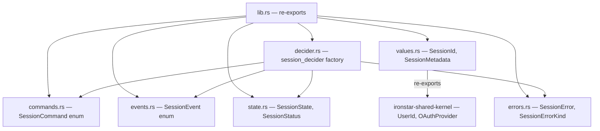

# ironstar-session

Rust implementation of the Session bounded context using the fmodel-rust Decider pattern.
This crate contains pure domain logic with no infrastructure dependencies beyond `ironstar-core` and `ironstar-shared-kernel`.
See the [specification](../../spec/Session/README.md) for the Idris2 formalization and the [crate DAG](../README.md) for where this crate sits in the workspace dependency graph.

## Module structure

`lib.rs` re-exports the primary public types (`SessionCommand`, `SessionEvent`, `SessionState`, `SessionStatus`, `SessionDecider`, `session_decider`, `SessionError`, `SessionErrorKind`, `SessionId`, `UserId`, `OAuthProvider`, `SessionMetadata`) for ergonomic imports.

## Correspondence table

| Idris2 (spec) | Rust (crate) | Notes |
|---|---|---|
| `SessionCommand` (3 constructors) | `SessionCommand` enum (3 variants: `Create`, `Refresh`, `Invalidate`) | Rust variants carry boundary-injected timestamps and metadata as struct fields |
| `SessionEvent` (4 constructors) | `SessionEvent` enum (4 variants: `Created`, `Refreshed`, `Invalidated`, `Expired`) | Serde-tagged with `#[serde(tag = "type")]`; implements `IsFinal` for terminal detection |
| `SessionState` (4 constructors) | `SessionState` enum (4 variants: `NoSession`, `Active`, `Expired`, `Invalidated`) | `Default` derives to `NoSession`; helper methods `is_active`, `is_terminated`, `session_id`, `user_id`, `expires_at` |
| `SessionStatus` (3 constructors) | `SessionStatus` enum (4 variants: `NoSession`, `Active`, `Expired`, `Invalidated`) | Rust adds `NoSession` variant; converts via `From<&SessionState>` |
| `sessionDecider` | `session_decider() -> SessionDecider<'a>` | Factory returning `Decider<SessionCommand, SessionState, SessionEvent, SessionError>` |
| `activeSessionView` | Not yet implemented in this crate | Planned for read-side projection |
| `ExpiresAt` (newtype record) | `DateTime<Utc>` (chrono) | No newtype wrapper; chrono provides ordering and arithmetic directly |
| `RevocationReason` | Not yet implemented | Planned for session invalidation audit trail |
| `SessionMetadata` (record) | `SessionMetadata` struct | Rust version has 2 fields (`ip_address`, `user_agent`); spec has 3 (adds `geoLocation`) |
| `UserId` (re-export from SharedKernel) | `UserId` (re-export from `ironstar-shared-kernel`) | UUID wrapper with `Copy` semantics |
| `OAuthProvider` (re-export from SharedKernel) | `OAuthProvider` (re-export from `ironstar-shared-kernel`) | Enum with `GitHub` variant; `Google` planned |
| `SessionId` (opaque) | `SessionId` struct (UUID v4 wrapper) | `Copy`, `Hash`, `serde(transparent)`, ts-rs export |
| `String` (error type) | `SessionError` / `SessionErrorKind` | Structured error with UUID tracking and backtrace capture |

## Cross-links

- [ironstar-session-store](../ironstar-session-store/README.md) for SQLite persistence of session state.
- [Specification](../../spec/Session/README.md) for the Idris2 formalization of this domain.
