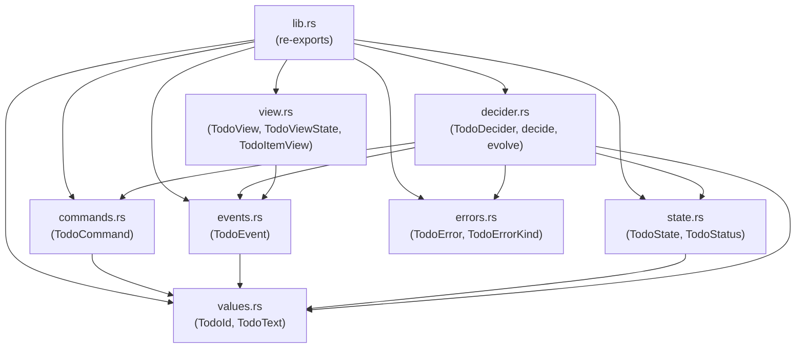

# ironstar-todo

Rust implementation of the Todo bounded context, realizing the Decider, View, and Saga patterns from the [specification](../../spec/Todo/README.md).
This is a domain crate in the ironstar workspace; see the [crate DAG](../README.md) for its position in the dependency graph.

## Module structure

## Specification correspondence

| Spec (Idris2) | Rust module | Rust type | Notes |
|---|---|---|---|
| `TodoId` | `values.rs` | `TodoId` (newtype over `Uuid`) | Smart constructor via `TodoId::new()` and `TodoId::from_uuid()` |
| -- | `values.rs` | `TodoText` (newtype over `String`) | Smart constructor with validation (non-empty, max 500 chars, trimmed). Not in spec. |
| `TodoCommand` | `commands.rs` | `TodoCommand` (enum) | Five variants: `Create`, `UpdateText`, `Complete`, `Uncomplete`, `Delete`. Spec has four; `UpdateText` is a Rust-side addition. All variants carry `TodoId` and timestamps. |
| `TodoEvent` | `events.rs` | `TodoEvent` (enum) | Five variants: `Created`, `TextUpdated`, `Completed`, `Uncompleted`, `Deleted`. `TextUpdated` is a Rust-side addition. Events carry validated `TodoText` (not raw strings). Implements `IsFinal` on `Deleted`. |
| `TodoState` | `state.rs` | `TodoState` (struct) + `TodoStatus` (enum) | Spec uses a sum type; Rust splits into a product struct with an enum status field (`NotCreated`, `Active`, `Completed`, `Deleted`). Decider wraps as `Option<TodoState>` where `None` = `NonExistent`. |
| `TodoError` | `errors.rs` | `TodoError` (struct) + `TodoErrorKind` (enum) | Rust adds UUID tracking for distributed tracing, backtrace capture, and finer-grained variants (`EmptyText`, `TextTooLong`, `AlreadyCompleted`, `NotCompleted`, `InvalidTransition`). |
| `todoDecider` | `decider.rs` | `todo_decider() -> TodoDecider` | Factory returning `Decider<TodoCommand, Option<TodoState>, TodoEvent, TodoError>`. Pure `decide` and `evolve` functions with tracing instrumentation. |
| `todoListView` | `view.rs` | `todo_view() -> TodoView` | Factory returning `View<TodoViewState, TodoEvent>`. Materializes `TodoItemView` list with `count` and `completed_count` invariants. |
| `completionNotificationSaga` | -- | -- | Not yet implemented in Rust. Specified in `spec/Todo/Todo.idr`. |

## Cross-links

- [Specification](../../spec/Todo/README.md) -- Idris2 specification with state machine, types, and proof terms
- [Crate DAG](../README.md) -- workspace dependency graph showing `ironstar-todo` depends on `ironstar-core`
- [ironstar-core](../ironstar-core/) -- foundation crate providing `Decider`, `View`, `DeciderType`, `EventType`, `IsFinal` traits
