# ironstar-workspace

Rust implementation of the Workspace bounded context with 5 sub-aggregates composed via fmodel-rust `Decider` instances.
This is a supporting domain crate managing workspace lifecycle, dashboard layouts, saved queries, and user/workspace preferences.

See the [specification](../../spec/Workspace/README.md) for the formal Idris2 model and the [crate DAG](../README.md) for dependency relationships.

## Module structure

Each aggregate follows the standard module layout: commands, decider, errors, events, state, and values.
The `views/` module provides read-side projections across all five aggregates.

```mermaid
flowchart TB
    lib["lib.rs"]

    lib --> workspace["workspace/"]
    lib --> dashboard["dashboard/"]
    lib --> saved_query["saved_query/"]
    lib --> user_preferences["user_preferences/"]
    lib --> workspace_preferences["workspace_preferences/"]
    lib --> views["views/"]

    workspace --> w_cmd["commands.rs"]
    workspace --> w_dec["decider.rs"]
    workspace --> w_err["errors.rs"]
    workspace --> w_evt["events.rs"]
    workspace --> w_st["state.rs"]
    workspace --> w_val["values.rs"]

    dashboard --> d_cmd["commands.rs"]
    dashboard --> d_dec["decider.rs"]
    dashboard --> d_err["errors.rs"]
    dashboard --> d_evt["events.rs"]
    dashboard --> d_st["state.rs"]
    dashboard --> d_val["values.rs"]

    saved_query --> sq_cmd["commands.rs"]
    saved_query --> sq_dec["decider.rs"]
    saved_query --> sq_err["errors.rs"]
    saved_query --> sq_evt["events.rs"]
    saved_query --> sq_st["state.rs"]
    saved_query --> sq_val["values.rs"]

    user_preferences --> up_cmd["commands.rs"]
    user_preferences --> up_dec["decider.rs"]
    user_preferences --> up_err["errors.rs"]
    user_preferences --> up_evt["events.rs"]
    user_preferences --> up_st["state.rs"]
    user_preferences --> up_val["values.rs"]

    workspace_preferences --> wp_cmd["commands.rs"]
    workspace_preferences --> wp_dec["decider.rs"]
    workspace_preferences --> wp_err["errors.rs"]
    workspace_preferences --> wp_evt["events.rs"]
    workspace_preferences --> wp_st["state.rs"]
    workspace_preferences --> wp_val["values.rs"]

    views --> v_workspace["workspace.rs"]
```

## Spec-to-implementation correspondence

| Spec (Idris2) | Rust type | Module |
|---|---|---|
| `WorkspaceCommand` | `WorkspaceCommand` | `workspace::commands` |
| `WorkspaceEvent` | `WorkspaceEvent` | `workspace::events` |
| `WorkspaceState` | `WorkspaceState` | `workspace::state` |
| `workspaceDecider` | `workspace_decider()` -> `WorkspaceDecider` | `workspace::decider` |
| `WorkspaceId` | `WorkspaceId` | `workspace::values` |
| `WorkspaceName` | `WorkspaceName` | `workspace::values` |
| `Visibility` | `Visibility` | `workspace::values` |
| `WorkspaceStatus` (implicit) | `WorkspaceStatus` | `workspace::state` |
| `DashboardCommand` | `DashboardCommand` | `dashboard::commands` |
| `DashboardEvent` | `DashboardEvent` | `dashboard::events` |
| `DashboardState` | `DashboardState` | `dashboard::state` |
| `dashboardDecider` | `dashboard_decider()` -> `DashboardDecider` | `dashboard::decider` |
| `DashboardId` | `DashboardId` | `dashboard::values` |
| `ChartPlacement` | `ChartPlacement` | `dashboard::values` |
| `ChartDefinitionRef` | `ChartDefinitionRef` | `dashboard::values` |
| `TabId` / `TabInfo` | `TabId` / `TabInfo` | `dashboard::values` |
| `GridPosition` / `GridSize` | `GridPosition` | `dashboard::values` |
| `ChartId` | `ChartId` | `dashboard::values` |
| `SavedQueryCommand` | `SavedQueryCommand` | `saved_query::commands` |
| `SavedQueryEvent` | `SavedQueryEvent` | `saved_query::events` |
| `SavedQueryState` | `SavedQueryState` | `saved_query::state` |
| `savedQueryDecider` | `saved_query_decider()` -> `SavedQueryDecider` | `saved_query::decider` |
| `SavedQueryId` | `SavedQueryId` | `saved_query::values` |
| `QueryName` | `QueryName` | `saved_query::values` |
| `PreferencesCommand` | `UserPreferencesCommand` | `user_preferences::commands` |
| `PreferencesEvent` | `UserPreferencesEvent` | `user_preferences::events` |
| `PreferencesState` | `UserPreferencesState` | `user_preferences::state` |
| `preferencesDecider` | `user_preferences_decider()` -> `UserPreferencesDecider` | `user_preferences::decider` |
| `PreferencesId` | `PreferencesId` | `user_preferences::values` |
| `Theme` | `Theme` | `user_preferences::values` |
| `Locale` | `Locale` | `user_preferences::values` |
| `WorkspacePreferencesCommand` | `WorkspacePreferencesCommand` | `workspace_preferences::commands` |
| `WorkspacePreferencesEvent` | `WorkspacePreferencesEvent` | `workspace_preferences::events` |
| `WorkspacePreferencesState` | `WorkspacePreferencesState` | `workspace_preferences::state` |
| `workspacePreferencesDecider` | `workspace_preferences_decider()` -> `WorkspacePreferencesDecider` | `workspace_preferences::decider` |
| `CatalogName` | `CatalogUri` | `workspace_preferences::values` |
| `LayoutDefaults` (implicit) | `LayoutDefaults` | `workspace_preferences::values` |

The `views/workspace.rs` module provides four read-side projections not present in the specification: `WorkspaceListView`, `DashboardLayoutView`, `SavedQueryListView`, and `UserPreferencesView`.

## Cross-links

- [Specification](../../spec/Workspace/README.md)
- [Crate DAG](../README.md)
- [ironstar-core](../ironstar-core/README.md) (Decider, View traits)
- [ironstar-shared-kernel](../ironstar-shared-kernel/README.md) (UserId)
- [ironstar-analytics](../ironstar-analytics/README.md) (ChartDefinitionRef supplier)
