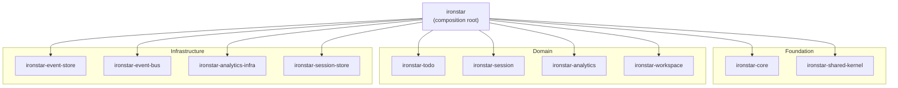

# ironstar (composition root)

Binary crate that wires all domain and infrastructure crates together behind axum HTTP handlers, SSE endpoints, and hypertext templates.
This crate has no spec counterpart -- it is the effect boundary where pure domain logic meets the outside world.
See the [crate dependency DAG](../README.md) for how this crate relates to the 10 library crates.

## Composition diagram



The binary crate depends on all 10 library crates.
Foundation and domain crates provide pure types and logic.
Infrastructure crates provide effectful implementations.
The composition root wires them together at startup and routes HTTP traffic to the appropriate handlers.

## Module structure

The `src/` directory is organized into four layers plus configuration and state.

```
src/
  main.rs              startup sequence (14 steps), graceful shutdown
  lib.rs               top-level module declarations
  config.rs            Config from environment variables (12-factor)
  state.rs             AppState container, FromRef implementations

  domain/
    mod.rs             re-exports from domain crates (todo, session, analytics, workspace, ...)
    signals.rs         Datastar signal types (TodoSignals, ChartSignals)

  application/
    mod.rs             command/query handler re-exports
    error.rs           AggregateError, CommandPipelineError
    todo/              handle_todo_command, query_all_todos, query_todo_state
    catalog/           handle_catalog_command, query_catalog_metadata
    query_session/     handle_query_session_command, spawn-after-persist
    workspace/         handle_workspace_command, workspace queries
    dashboard/         handle_dashboard_command
    saved_query/       handle_saved_query_command
    user_preferences/  handle_user_preferences_command
    workspace_preferences/ handle_workspace_preferences_command

  infrastructure/
    mod.rs             re-exports from infrastructure crates
    assets.rs          AssetManifest, static file router (rust-embed)
    error.rs           InfrastructureError, InfrastructureErrorKind
    metrics.rs         Prometheus recorder, 6 described metrics

  presentation/
    mod.rs             app_router composition, middleware stack
    todo.rs            Todo HTTP handlers and SSE endpoints
    todo_templates.rs  hypertext templates for Todo UI
    analytics.rs       Analytics HTTP handlers
    chart.rs           Chart HTTP handlers and SSE feed
    chart_templates.rs ECharts template rendering
    chart_transformer.rs  QueryResult → ChartConfig transformation
    bar_chart_transformer.rs  bar chart specialization
    workspace.rs       Workspace HTTP handlers
    components.rs      Reusable UI components (button, checkbox, icon, ...)
    datastar_bridge.rs ToDatastarEvents, SSE patch rendering
    extractors.rs      DatastarRequest, SessionExtractor
    layout.rs          Page layout template
    health.rs          /health/ready, /health/live endpoints
    metrics.rs         /metrics Prometheus exposition endpoint
    middleware.rs      UUID v7 request ID generation
    hotreload.rs       Hot reload SSE endpoint (debug builds only)
    error.rs           AppError → HTTP response mapping
```

## Startup sequence

The `main.rs` entry point follows a deterministic 14-step initialization.

1. Load `Config` from environment variables
2. Initialize tracing subscriber with `RUST_LOG` filter
3. Initialize Prometheus metrics recorder
4. Create SQLite database directory if needed
5. Create SQLite connection pool
6. Run database migrations
7. Load asset manifest (graceful fallback if frontend not built)
8. Initialize Zenoh event bus in embedded mode (optional, graceful fallback)
9. Initialize DuckDB analytics pool and load extensions (optional, graceful fallback)
10. Attach DuckLake catalogs (embedded first, network fallback)
11. Initialize analytics cache layer (moka)
12. Spawn cache invalidation subscriber (Zenoh key expression matching)
13. Construct `AppState` and compose the axum router
14. Start HTTP server with graceful shutdown (SIGINT/SIGTERM)

Each optional subsystem (Zenoh, DuckDB, analytics cache) degrades gracefully if unavailable, logging a warning and continuing with reduced functionality.

## Effect boundary

This crate is where the spec's pure/effectful split materializes in running code.
The four-layer architecture enforces a strict async/sync boundary.

The *domain layer* (`domain/`) re-exports pure, synchronous types from the domain crates.
Aggregates, events, commands, and value objects live here with no I/O.

The *application layer* (`application/`) orchestrates async infrastructure calls around sync domain logic.
Command handlers load state from the event store (async), call the decider's decide function (sync, pure), and persist resulting events (async).
Query handlers fold events through views to compute read models on demand.

The *infrastructure layer* (`infrastructure/`) re-exports effectful implementations from infrastructure crates and provides the binary-specific asset serving, error mapping, and metrics initialization.

The *presentation layer* (`presentation/`) maps HTTP requests to application commands and renders responses as HTML fragments or SSE events using hypertext templates and the datastar-rust bridge.

The `AppState` struct holds all infrastructure dependencies and provides `FromRef` implementations so handlers extract only the state they need (e.g., `TodoAppState`, `AnalyticsAppState`, `HealthState`, `MetricsState`).

## Cross-links

Foundation crates:
- [ironstar-core](../ironstar-core/README.md) (domain traits, error types, BoundedString, fmodel-rust re-exports)
- [ironstar-shared-kernel](../ironstar-shared-kernel/README.md) (UserId, OAuthProvider)

Domain crates:
- [ironstar-todo](../ironstar-todo/README.md) (Todo aggregate)
- [ironstar-session](../ironstar-session/README.md) (Session aggregate)
- [ironstar-analytics](../ironstar-analytics/README.md) (Catalog, QuerySession, combined decider)
- [ironstar-workspace](../ironstar-workspace/README.md) (Workspace, Dashboard, SavedQuery, UserPreferences, WorkspacePreferences)

Infrastructure crates:
- [ironstar-event-store](../ironstar-event-store/README.md) (SqliteEventRepository, SSE stream composition)
- [ironstar-event-bus](../ironstar-event-bus/README.md) (ZenohEventBus, key expression utilities)
- [ironstar-analytics-infra](../ironstar-analytics-infra/README.md) (DuckDBService, moka cache, cache invalidation)
- [ironstar-session-store](../ironstar-session-store/README.md) (SqliteSessionStore, TTL cleanup)

Spec: [spec/Core/](../../spec/Core/README.md) (pure domain abstractions; this crate realizes the effect boundary *around* them)
