# Beads Export

*Generated: Thu, 18 Dec 2025 00:20:22 EST*

## Summary

| Metric | Count |
|--------|-------|
| **Total** | 91 |
| Open | 91 |
| In Progress | 0 |
| Blocked | 0 |
| Closed | 0 |

## Quick Actions

Ready-to-run commands for bulk operations:

```bash
# Close open items (91 total, showing first 10)
bd close ironstar-7h9.11 ironstar-7h9.9 ironstar-7h9.8 ironstar-7h9.7 ironstar-7h9.6 ironstar-7h9.5 ironstar-7h9.4 ironstar-7h9.2 ironstar-7h9.1 ironstar-x0e.7

# View high-priority items (P0/P1)
bd show ironstar-7h9.11 ironstar-7h9.9 ironstar-7h9.8 ironstar-7h9.7 ironstar-7h9.6 ironstar-7h9.5 ironstar-7h9.4 ironstar-7h9.2 ironstar-7h9.1 ironstar-x0e.7 ironstar-x0e.6 ironstar-x0e.5 ironstar-x0e.3 ironstar-x0e.2 ironstar-x0e.1 ironstar-x0e ironstar-3dv.11 ironstar-3dv.10 ironstar-3dv.9 ironstar-3dv.8 ironstar-3dv.7 ironstar-3dv.6 ironstar-3dv.4 ironstar-3dv.3 ironstar-3dv.2 ironstar-3dv.1 ironstar-3jp.5 ironstar-3jp.4 ironstar-3jp.3 ironstar-3jp.2 ironstar-3jp.1 ironstar-3jp ironstar-cvo.3 ironstar-cvo.2 ironstar-cvo.1 ironstar-cvo ironstar-8bw.4 ironstar-8bw.3 ironstar-8bw.2 ironstar-8bw.1 ironstar-8bw ironstar-g8e.5 ironstar-g8e.4 ironstar-g8e.3 ironstar-g8e.2 ironstar-g8e.1 ironstar-g8e ironstar-vho.5 ironstar-vho.4 ironstar-vho.3 ironstar-vho.2 ironstar-vho.1 ironstar-vho ironstar-jnv.8 ironstar-jnv.7 ironstar-jnv.6 ironstar-jnv.5 ironstar-jnv.4 ironstar-jnv.3 ironstar-jnv.2 ironstar-jnv.1 ironstar-7h9.12 ironstar-7h9.10 ironstar-7h9.3 ironstar-7h9 ironstar-x0e.9 ironstar-x0e.8 ironstar-x0e.4 ironstar-3dv.12 ironstar-3dv.5 ironstar-3dv ironstar-3jp.6 ironstar-cvo.4

```

## Table of Contents

- [🟢 ironstar-7h9.11 Implement router composition with feature routes](#ironstar-7h9-11)
- [🟢 ironstar-7h9.9 Create base layout template with Datastar initialization](#ironstar-7h9-9)
- [🟢 ironstar-7h9.8 Implement RenderableToDatastar conversion trait](#ironstar-7h9-8)
- [🟢 ironstar-7h9.7 Implement query GET handlers](#ironstar-7h9-7)
- [🟢 ironstar-7h9.6 Implement command POST handlers](#ironstar-7h9-6)
- [🟢 ironstar-7h9.5 Implement SSE feed endpoint with event replay](#ironstar-7h9-5)
- [🟢 ironstar-7h9.4 Define AppState struct with all dependencies](#ironstar-7h9-4)
- [🟢 ironstar-7h9.2 Create devShell module with tools and environment](#ironstar-7h9-2)
- [🟢 ironstar-7h9.1 Add justfile with development and build tasks](#ironstar-7h9-1)
- [🟢 ironstar-x0e.7 Implement ProjectionManager with in-memory state](#ironstar-x0e-7)
- [🟢 ironstar-x0e.6 Create Projection trait for read models](#ironstar-x0e-6)
- [🟢 ironstar-x0e.5 Implement tokio broadcast event bus](#ironstar-x0e-5)
- [🟢 ironstar-x0e.3 Implement SQLite event store with sqlx](#ironstar-x0e-3)
- [🟢 ironstar-x0e.2 Create EventStore trait abstraction](#ironstar-x0e-2)
- [🟢 ironstar-x0e.1 Create database migrations/ directory with schema.sql](#ironstar-x0e-1)
- [🟢 ironstar-x0e Event sourcing infrastructure](#ironstar-x0e)
- [🟢 ironstar-3dv.11 Implement rust-embed conditional asset serving](#ironstar-3dv-11)
- [🟢 ironstar-3dv.10 Create static/dist/ output directory structure](#ironstar-3dv-10)
- [🟢 ironstar-3dv.9 Configure ts-rs export directory and justfile task](#ironstar-3dv-9)
- [🟢 ironstar-3dv.8 Add ts-rs dependency to Cargo.toml](#ironstar-3dv-8)
- [🟢 ironstar-3dv.7 Create web-components/index.ts entry point](#ironstar-3dv-7)
- [🟢 ironstar-3dv.6 Create TypeScript configuration (tsconfig.json)](#ironstar-3dv-6)
- [🟢 ironstar-3dv.4 Setup Open Props design tokens and theme layer](#ironstar-3dv-4)
- [🟢 ironstar-3dv.3 Setup PostCSS configuration for modern CSS features](#ironstar-3dv-3)
- [🟢 ironstar-3dv.2 Configure Rolldown bundler with content-based hashing](#ironstar-3dv-2)
- [🟢 ironstar-3dv.1 Create web-components/ project structure with package.json](#ironstar-3dv-1)
- [🟢 ironstar-3jp.5 Create Datastar signal types with ts-rs derives](#ironstar-3jp-5)
- [🟢 ironstar-3jp.4 Design aggregate root state machines](#ironstar-3jp-4)
- [🟢 ironstar-3jp.3 Implement value objects and smart constructors](#ironstar-3jp-3)
- [🟢 ironstar-3jp.2 Define algebraic domain types and aggregate structure](#ironstar-3jp-2)
- [🟢 ironstar-3jp.1 Initialize src/ directory structure with modular organization](#ironstar-3jp-1)
- [🟢 ironstar-3jp Domain layer](#ironstar-3jp)
- [🟢 ironstar-cvo.3 Add flake checks and nix build verification](#ironstar-cvo-3)
- [🟢 ironstar-cvo.2 Integrate with template CI structure](#ironstar-cvo-2)
- [🟢 ironstar-cvo.1 Create reusable GitHub Actions workflow for Rust builds](#ironstar-cvo-1)
- [🟢 ironstar-cvo CI/CD pipeline](#ironstar-cvo)
- [🟢 ironstar-8bw.4 Verify process-compose up works with all services](#ironstar-8bw-4)
- [🟢 ironstar-8bw.3 Set up service orchestration (frontend bundler, cargo-watch)](#ironstar-8bw-3)
- [🟢 ironstar-8bw.2 Configure process-compose.yaml for dev services](#ironstar-8bw-2)
- [🟢 ironstar-8bw.1 Integrate process-compose-flake patterns into devShell](#ironstar-8bw-1)
- [🟢 ironstar-8bw Process compose integration](#ironstar-8bw)
- [🟢 ironstar-g8e.5 Verify cargo check passes with workspace configuration](#ironstar-g8e-5)
- [🟢 ironstar-g8e.4 Set up per-crate crate.nix pattern for crane args](#ironstar-g8e-4)
- [🟢 ironstar-g8e.3 Configure Cargo.toml with workspace structure (resolver = 2)](#ironstar-g8e-3)
- [🟢 ironstar-g8e.2 Add rust-toolchain.toml with required components](#ironstar-g8e-2)
- [🟢 ironstar-g8e.1 Integrate rust-flake patterns (crane, rust-overlay)](#ironstar-g8e-1)
- [🟢 ironstar-g8e Rust workspace integration](#ironstar-g8e)
- [🟢 ironstar-vho.5 Create .gitignore with comprehensive patterns](#ironstar-vho-5)
- [🟢 ironstar-vho.4 Create initial git commit with generated structure](#ironstar-vho-4)
- [🟢 ironstar-vho.3 Verify nix develop enters working development shell](#ironstar-vho-3)
- [🟢 ironstar-vho.2 Configure secrets management and string replacement](#ironstar-vho-2)
- [🟢 ironstar-vho.1 Run om init with typescript-nix-template parameters](#ironstar-vho-1)
- [🟢 ironstar-vho Template instantiation](#ironstar-vho)
- [🟢 ironstar-jnv.8 Implement todo example route mounting](#ironstar-jnv-8)
- [🟢 ironstar-jnv.7 Implement todo_list_template rendering function](#ironstar-jnv-7)
- [🟢 ironstar-jnv.6 Implement GET /todos SSE feed endpoint](#ironstar-jnv-6)
- [🟢 ironstar-jnv.5 Implement delete_todo handler (POST /delete-todo)](#ironstar-jnv-5)
- [🟢 ironstar-jnv.4 Implement mark_todo handler (POST /mark-todo)](#ironstar-jnv-4)
- [🟢 ironstar-jnv.3 Implement add_todo handler (POST /add-todo)](#ironstar-jnv-3)
- [🟢 ironstar-jnv.2 Implement TodoListProjection with in-memory rebuild](#ironstar-jnv-2)
- [🟢 ironstar-jnv.1 Define Todo domain model (aggregate, events, commands)](#ironstar-jnv-1)
- [🟢 ironstar-7h9.12 Wire all components together in main.rs](#ironstar-7h9-12)
- [🟢 ironstar-7h9.10 Implement component-level hypertext templates](#ironstar-7h9-10)
- [🟢 ironstar-7h9.3 Configure pre-commit hooks for code quality](#ironstar-7h9-3)
- [🟢 ironstar-7h9 Presentation layer](#ironstar-7h9)
- [🟢 ironstar-x0e.9 Create Session axum extractor](#ironstar-x0e-9)
- [🟢 ironstar-x0e.8 Implement redb session store with ACID guarantees](#ironstar-x0e-8)
- [🟢 ironstar-x0e.4 Implement SQLite connection pooling and configuration](#ironstar-x0e-4)
- [🟢 ironstar-3dv.12 Create web-components/components/ directory for vanilla web components](#ironstar-3dv-12)
- [🟢 ironstar-3dv.5 Copy Open Props UI component CSS files](#ironstar-3dv-5)
- [🟢 ironstar-3dv Frontend build pipeline](#ironstar-3dv)
- [🟢 ironstar-3jp.6 Define application error types](#ironstar-3jp-6)
- [🟢 ironstar-cvo.4 Configure caching for cargo and nix](#ironstar-cvo-4)
- [🟢 ironstar-z01.5 Add structured logging with tracing](#ironstar-z01-5)
- [🟢 ironstar-z01.4 Create .env.development template file](#ironstar-z01-4)
- [🟢 ironstar-z01.2 Create template parameters and conditional includes](#ironstar-z01-2)
- [🟢 ironstar-z01.1 Create BOOTSTRAP.md with complete setup instructions](#ironstar-z01-1)
- [🟢 ironstar-1k8.3 Create end-to-end handler tests](#ironstar-1k8-3)
- [🟢 ironstar-1k8.2 Create projection tests](#ironstar-1k8-2)
- [🟢 ironstar-1k8.1 Create event store integration tests](#ironstar-1k8-1)
- [🟢 ironstar-1k8 Testing and integration](#ironstar-1k8)
- [🟢 ironstar-7ya.3 Set up Lucide icon build-time inlining](#ironstar-7ya-3)
- [🟢 ironstar-7ya.2 Implement sortable-list web component wrapper](#ironstar-7ya-2)
- [🟢 ironstar-7ya.1 Implement VegaChart web component wrapper](#ironstar-7ya-1)
- [🟢 ironstar-7ya Third-party library integration](#ironstar-7ya)
- [🟢 ironstar-jnv Example application (Todo)](#ironstar-jnv)
- [🟢 ironstar-7h9.14 Implement health check endpoint for process-compose](#ironstar-7h9-14)
- [🟢 ironstar-7h9.13 Implement dev-only hotreload SSE endpoint](#ironstar-7h9-13)
- [🟢 ironstar-x0e.10 Implement DuckDB analytics service](#ironstar-x0e-10)
- [🟢 ironstar-z01.3 Define om CLI instantiation tests and metadata](#ironstar-z01-3)
- [🟢 ironstar-z01 Documentation and template](#ironstar-z01)

---

## Dependency Graph

```mermaid
graph TD
    classDef open fill:#50FA7B,stroke:#333,color:#000
    classDef inprogress fill:#8BE9FD,stroke:#333,color:#000
    classDef blocked fill:#FF5555,stroke:#333,color:#000
    classDef closed fill:#6272A4,stroke:#333,color:#fff

    ironstar-7h911["ironstar-7h9.11<br/>Implement router composition with fea..."]
    class ironstar-7h911 open
    ironstar-7h911 -.-> ironstar-7h9
    ironstar-7h911 ==> ironstar-7h95
    ironstar-7h911 ==> ironstar-7h96
    ironstar-7h911 ==> ironstar-7h97
    ironstar-7h99["ironstar-7h9.9<br/>Create base layout template with Data..."]
    class ironstar-7h99 open
    ironstar-7h99 -.-> ironstar-7h9
    ironstar-7h99 ==> ironstar-7h98
    ironstar-7h99 ==> ironstar-3dv11
    ironstar-7h98["ironstar-7h9.8<br/>Implement RenderableToDatastar conver..."]
    class ironstar-7h98 open
    ironstar-7h98 -.-> ironstar-7h9
    ironstar-7h97["ironstar-7h9.7<br/>Implement query GET handlers"]
    class ironstar-7h97 open
    ironstar-7h97 -.-> ironstar-7h9
    ironstar-7h97 ==> ironstar-7h94
    ironstar-7h97 ==> ironstar-x0e7
    ironstar-7h96["ironstar-7h9.6<br/>Implement command POST handlers"]
    class ironstar-7h96 open
    ironstar-7h96 -.-> ironstar-7h9
    ironstar-7h96 ==> ironstar-7h94
    ironstar-7h96 ==> ironstar-3jp4
    ironstar-7h95["ironstar-7h9.5<br/>Implement SSE feed endpoint with even..."]
    class ironstar-7h95 open
    ironstar-7h95 -.-> ironstar-7h9
    ironstar-7h95 ==> ironstar-7h94
    ironstar-7h94["ironstar-7h9.4<br/>Define AppState struct with all depen..."]
    class ironstar-7h94 open
    ironstar-7h94 -.-> ironstar-7h9
    ironstar-7h94 ==> ironstar-x0e3
    ironstar-7h94 ==> ironstar-x0e8
    ironstar-7h94 ==> ironstar-x0e7
    ironstar-7h94 ==> ironstar-x0e5
    ironstar-7h92["ironstar-7h9.2<br/>Create devShell module with tools and..."]
    class ironstar-7h92 open
    ironstar-7h92 -.-> ironstar-7h9
    ironstar-7h91["ironstar-7h9.1<br/>Add justfile with development and bui..."]
    class ironstar-7h91 open
    ironstar-7h91 -.-> ironstar-7h9
    ironstar-x0e7["ironstar-x0e.7<br/>Implement ProjectionManager with in-m..."]
    class ironstar-x0e7 open
    ironstar-x0e7 -.-> ironstar-x0e
    ironstar-x0e7 ==> ironstar-x0e6
    ironstar-x0e7 ==> ironstar-x0e5
    ironstar-x0e7 ==> ironstar-x0e3
    ironstar-x0e6["ironstar-x0e.6<br/>Create Projection trait for read models"]
    class ironstar-x0e6 open
    ironstar-x0e6 -.-> ironstar-x0e
    ironstar-x0e6 ==> ironstar-3jp2
    ironstar-x0e5["ironstar-x0e.5<br/>Implement tokio broadcast event bus"]
    class ironstar-x0e5 open
    ironstar-x0e5 -.-> ironstar-x0e
    ironstar-x0e5 ==> ironstar-3jp2
    ironstar-x0e3["ironstar-x0e.3<br/>Implement SQLite event store with sqlx"]
    class ironstar-x0e3 open
    ironstar-x0e3 -.-> ironstar-x0e
    ironstar-x0e3 ==> ironstar-x0e2
    ironstar-x0e3 ==> ironstar-x0e1
    ironstar-x0e2["ironstar-x0e.2<br/>Create EventStore trait abstraction"]
    class ironstar-x0e2 open
    ironstar-x0e2 -.-> ironstar-x0e
    ironstar-x0e2 ==> ironstar-3jp2
    ironstar-x0e1["ironstar-x0e.1<br/>Create database migrations/ directory..."]
    class ironstar-x0e1 open
    ironstar-x0e1 -.-> ironstar-x0e
    ironstar-x0e["ironstar-x0e<br/>Event sourcing infrastructure"]
    class ironstar-x0e open
    ironstar-x0e ==> ironstar-3jp
    ironstar-3dv11["ironstar-3dv.11<br/>Implement rust-embed conditional asse..."]
    class ironstar-3dv11 open
    ironstar-3dv11 -.-> ironstar-3dv
    ironstar-3dv11 ==> ironstar-3dv10
    ironstar-3dv10["ironstar-3dv.10<br/>Create static/dist/ output directory ..."]
    class ironstar-3dv10 open
    ironstar-3dv10 -.-> ironstar-3dv
    ironstar-3dv10 ==> ironstar-3dv2
    ironstar-3dv9["ironstar-3dv.9<br/>Configure ts-rs export directory and ..."]
    class ironstar-3dv9 open
    ironstar-3dv9 -.-> ironstar-3dv
    ironstar-3dv9 ==> ironstar-3dv8
    ironstar-3dv8["ironstar-3dv.8<br/>Add ts-rs dependency to Cargo.toml"]
    class ironstar-3dv8 open
    ironstar-3dv8 -.-> ironstar-3dv
    ironstar-3dv7["ironstar-3dv.7<br/>Create web-components/index.ts entry ..."]
    class ironstar-3dv7 open
    ironstar-3dv7 -.-> ironstar-3dv
    ironstar-3dv7 ==> ironstar-3dv6
    ironstar-3dv6["ironstar-3dv.6<br/>Create TypeScript configuration (tsco..."]
    class ironstar-3dv6 open
    ironstar-3dv6 -.-> ironstar-3dv
    ironstar-3dv6 ==> ironstar-3dv1
    ironstar-3dv4["ironstar-3dv.4<br/>Setup Open Props design tokens and th..."]
    class ironstar-3dv4 open
    ironstar-3dv4 -.-> ironstar-3dv
    ironstar-3dv4 ==> ironstar-3dv3
    ironstar-3dv3["ironstar-3dv.3<br/>Setup PostCSS configuration for moder..."]
    class ironstar-3dv3 open
    ironstar-3dv3 -.-> ironstar-3dv
    ironstar-3dv3 ==> ironstar-3dv1
    ironstar-3dv2["ironstar-3dv.2<br/>Configure Rolldown bundler with conte..."]
    class ironstar-3dv2 open
    ironstar-3dv2 -.-> ironstar-3dv
    ironstar-3dv2 ==> ironstar-3dv1
    ironstar-3dv1["ironstar-3dv.1<br/>Create web-components/ project struct..."]
    class ironstar-3dv1 open
    ironstar-3dv1 -.-> ironstar-3dv
    ironstar-3jp5["ironstar-3jp.5<br/>Create Datastar signal types with ts-..."]
    class ironstar-3jp5 open
    ironstar-3jp5 -.-> ironstar-3jp
    ironstar-3jp5 ==> ironstar-3jp2
    ironstar-3jp4["ironstar-3jp.4<br/>Design aggregate root state machines"]
    class ironstar-3jp4 open
    ironstar-3jp4 -.-> ironstar-3jp
    ironstar-3jp4 ==> ironstar-3jp3
    ironstar-3jp3["ironstar-3jp.3<br/>Implement value objects and smart con..."]
    class ironstar-3jp3 open
    ironstar-3jp3 -.-> ironstar-3jp
    ironstar-3jp3 ==> ironstar-3jp2
    ironstar-3jp2["ironstar-3jp.2<br/>Define algebraic domain types and agg..."]
    class ironstar-3jp2 open
    ironstar-3jp2 -.-> ironstar-3jp
    ironstar-3jp2 ==> ironstar-3jp1
    ironstar-3jp1["ironstar-3jp.1<br/>Initialize src/ directory structure w..."]
    class ironstar-3jp1 open
    ironstar-3jp1 -.-> ironstar-3jp
    ironstar-3jp["ironstar-3jp<br/>Domain layer"]
    class ironstar-3jp open
    ironstar-3jp ==> ironstar-cvo
    ironstar-cvo3["ironstar-cvo.3<br/>Add flake checks and nix build verifi..."]
    class ironstar-cvo3 open
    ironstar-cvo3 -.-> ironstar-cvo
    ironstar-cvo3 ==> ironstar-cvo1
    ironstar-cvo2["ironstar-cvo.2<br/>Integrate with template CI structure"]
    class ironstar-cvo2 open
    ironstar-cvo2 -.-> ironstar-cvo
    ironstar-cvo2 ==> ironstar-cvo1
    ironstar-cvo1["ironstar-cvo.1<br/>Create reusable GitHub Actions workfl..."]
    class ironstar-cvo1 open
    ironstar-cvo1 -.-> ironstar-cvo
    ironstar-cvo["ironstar-cvo<br/>CI/CD pipeline"]
    class ironstar-cvo open
    ironstar-cvo ==> ironstar-8bw
    ironstar-8bw4["ironstar-8bw.4<br/>Verify process-compose up works with ..."]
    class ironstar-8bw4 open
    ironstar-8bw4 -.-> ironstar-8bw
    ironstar-8bw4 ==> ironstar-8bw3
    ironstar-8bw3["ironstar-8bw.3<br/>Set up service orchestration (fronten..."]
    class ironstar-8bw3 open
    ironstar-8bw3 -.-> ironstar-8bw
    ironstar-8bw3 ==> ironstar-8bw2
    ironstar-8bw2["ironstar-8bw.2<br/>Configure process-compose.yaml for de..."]
    class ironstar-8bw2 open
    ironstar-8bw2 -.-> ironstar-8bw
    ironstar-8bw2 ==> ironstar-8bw1
    ironstar-8bw1["ironstar-8bw.1<br/>Integrate process-compose-flake patte..."]
    class ironstar-8bw1 open
    ironstar-8bw1 -.-> ironstar-8bw
    ironstar-8bw["ironstar-8bw<br/>Process compose integration"]
    class ironstar-8bw open
    ironstar-8bw ==> ironstar-g8e
    ironstar-g8e5["ironstar-g8e.5<br/>Verify cargo check passes with worksp..."]
    class ironstar-g8e5 open
    ironstar-g8e5 -.-> ironstar-g8e
    ironstar-g8e5 ==> ironstar-g8e4
    ironstar-g8e4["ironstar-g8e.4<br/>Set up per-crate crate.nix pattern fo..."]
    class ironstar-g8e4 open
    ironstar-g8e4 -.-> ironstar-g8e
    ironstar-g8e4 ==> ironstar-g8e3
    ironstar-g8e3["ironstar-g8e.3<br/>Configure Cargo.toml with workspace s..."]
    class ironstar-g8e3 open
    ironstar-g8e3 -.-> ironstar-g8e
    ironstar-g8e3 ==> ironstar-g8e2
    ironstar-g8e2["ironstar-g8e.2<br/>Add rust-toolchain.toml with required..."]
    class ironstar-g8e2 open
    ironstar-g8e2 -.-> ironstar-g8e
    ironstar-g8e2 ==> ironstar-g8e1
    ironstar-g8e1["ironstar-g8e.1<br/>Integrate rust-flake patterns (crane,..."]
    class ironstar-g8e1 open
    ironstar-g8e1 -.-> ironstar-g8e
    ironstar-g8e["ironstar-g8e<br/>Rust workspace integration"]
    class ironstar-g8e open
    ironstar-g8e ==> ironstar-vho
    ironstar-vho5["ironstar-vho.5<br/>Create .gitignore with comprehensive ..."]
    class ironstar-vho5 open
    ironstar-vho5 -.-> ironstar-vho
    ironstar-vho5 ==> ironstar-vho4
    ironstar-vho4["ironstar-vho.4<br/>Create initial git commit with genera..."]
    class ironstar-vho4 open
    ironstar-vho4 -.-> ironstar-vho
    ironstar-vho4 ==> ironstar-vho3
    ironstar-vho4 ==> ironstar-vho2
    ironstar-vho3["ironstar-vho.3<br/>Verify nix develop enters working dev..."]
    class ironstar-vho3 open
    ironstar-vho3 -.-> ironstar-vho
    ironstar-vho3 ==> ironstar-vho1
    ironstar-vho2["ironstar-vho.2<br/>Configure secrets management and stri..."]
    class ironstar-vho2 open
    ironstar-vho2 -.-> ironstar-vho
    ironstar-vho2 ==> ironstar-vho1
    ironstar-vho1["ironstar-vho.1<br/>Run om init with typescript-nix-templ..."]
    class ironstar-vho1 open
    ironstar-vho1 -.-> ironstar-vho
    ironstar-vho["ironstar-vho<br/>Template instantiation"]
    class ironstar-vho open
    ironstar-jnv8["ironstar-jnv.8<br/>Implement todo example route mounting"]
    class ironstar-jnv8 open
    ironstar-jnv8 -.-> ironstar-jnv
    ironstar-jnv8 ==> ironstar-jnv6
    ironstar-jnv8 ==> ironstar-jnv3
    ironstar-jnv8 ==> ironstar-jnv4
    ironstar-jnv8 ==> ironstar-jnv5
    ironstar-jnv8 ==> ironstar-jnv7
    ironstar-jnv7["ironstar-jnv.7<br/>Implement todo_list_template renderin..."]
    class ironstar-jnv7 open
    ironstar-jnv7 -.-> ironstar-jnv
    ironstar-jnv7 ==> ironstar-7h910
    ironstar-jnv6["ironstar-jnv.6<br/>Implement GET /todos SSE feed endpoint"]
    class ironstar-jnv6 open
    ironstar-jnv6 -.-> ironstar-jnv
    ironstar-jnv6 ==> ironstar-jnv2
    ironstar-jnv6 ==> ironstar-7h95
    ironstar-jnv5["ironstar-jnv.5<br/>Implement delete_todo handler (POST /..."]
    class ironstar-jnv5 open
    ironstar-jnv5 -.-> ironstar-jnv
    ironstar-jnv5 ==> ironstar-jnv3
    ironstar-jnv4["ironstar-jnv.4<br/>Implement mark_todo handler (POST /ma..."]
    class ironstar-jnv4 open
    ironstar-jnv4 -.-> ironstar-jnv
    ironstar-jnv4 ==> ironstar-jnv3
    ironstar-jnv3["ironstar-jnv.3<br/>Implement add_todo handler (POST /add..."]
    class ironstar-jnv3 open
    ironstar-jnv3 -.-> ironstar-jnv
    ironstar-jnv3 ==> ironstar-jnv2
    ironstar-jnv3 ==> ironstar-7h96
    ironstar-jnv2["ironstar-jnv.2<br/>Implement TodoListProjection with in-..."]
    class ironstar-jnv2 open
    ironstar-jnv2 -.-> ironstar-jnv
    ironstar-jnv2 ==> ironstar-jnv1
    ironstar-jnv2 ==> ironstar-x0e7
    ironstar-jnv1["ironstar-jnv.1<br/>Define Todo domain model (aggregate, ..."]
    class ironstar-jnv1 open
    ironstar-jnv1 -.-> ironstar-jnv
    ironstar-jnv1 ==> ironstar-3jp2
    ironstar-7h912["ironstar-7h9.12<br/>Wire all components together in main.rs"]
    class ironstar-7h912 open
    ironstar-7h912 -.-> ironstar-7h9
    ironstar-7h912 ==> ironstar-7h911
    ironstar-7h910["ironstar-7h9.10<br/>Implement component-level hypertext t..."]
    class ironstar-7h910 open
    ironstar-7h910 -.-> ironstar-7h9
    ironstar-7h910 ==> ironstar-7h99
    ironstar-7h93["ironstar-7h9.3<br/>Configure pre-commit hooks for code q..."]
    class ironstar-7h93 open
    ironstar-7h93 -.-> ironstar-7h9
    ironstar-7h93 ==> ironstar-7h92
    ironstar-7h9["ironstar-7h9<br/>Presentation layer"]
    class ironstar-7h9 open
    ironstar-7h9 ==> ironstar-x0e
    ironstar-7h9 ==> ironstar-3dv
    ironstar-x0e9["ironstar-x0e.9<br/>Create Session axum extractor"]
    class ironstar-x0e9 open
    ironstar-x0e9 -.-> ironstar-x0e
    ironstar-x0e9 ==> ironstar-x0e8
    ironstar-x0e8["ironstar-x0e.8<br/>Implement redb session store with ACI..."]
    class ironstar-x0e8 open
    ironstar-x0e8 -.-> ironstar-x0e
    ironstar-x0e8 ==> ironstar-3jp2
    ironstar-x0e4["ironstar-x0e.4<br/>Implement SQLite connection pooling a..."]
    class ironstar-x0e4 open
    ironstar-x0e4 -.-> ironstar-x0e
    ironstar-x0e4 ==> ironstar-x0e3
    ironstar-3dv12["ironstar-3dv.12<br/>Create web-components/components/ dir..."]
    class ironstar-3dv12 open
    ironstar-3dv12 -.-> ironstar-3dv
    ironstar-3dv12 ==> ironstar-3dv7
    ironstar-3dv5["ironstar-3dv.5<br/>Copy Open Props UI component CSS files"]
    class ironstar-3dv5 open
    ironstar-3dv5 -.-> ironstar-3dv
    ironstar-3dv5 ==> ironstar-3dv4
    ironstar-3dv["ironstar-3dv<br/>Frontend build pipeline"]
    class ironstar-3dv open
    ironstar-3dv ==> ironstar-cvo
    ironstar-3jp6["ironstar-3jp.6<br/>Define application error types"]
    class ironstar-3jp6 open
    ironstar-3jp6 -.-> ironstar-3jp
    ironstar-3jp6 ==> ironstar-3jp2
    ironstar-cvo4["ironstar-cvo.4<br/>Configure caching for cargo and nix"]
    class ironstar-cvo4 open
    ironstar-cvo4 -.-> ironstar-cvo
    ironstar-cvo4 ==> ironstar-cvo2
    ironstar-z015["ironstar-z01.5<br/>Add structured logging with tracing"]
    class ironstar-z015 open
    ironstar-z015 -.-> ironstar-z01
    ironstar-z015 ==> ironstar-7h912
    ironstar-z014["ironstar-z01.4<br/>Create .env.development template file"]
    class ironstar-z014 open
    ironstar-z014 -.-> ironstar-z01
    ironstar-z014 ==> ironstar-x0e3
    ironstar-z012["ironstar-z01.2<br/>Create template parameters and condit..."]
    class ironstar-z012 open
    ironstar-z012 -.-> ironstar-z01
    ironstar-z012 ==> ironstar-g8e1
    ironstar-z011["ironstar-z01.1<br/>Create BOOTSTRAP.md with complete set..."]
    class ironstar-z011 open
    ironstar-z011 -.-> ironstar-z01
    ironstar-z011 ==> ironstar-7h912
    ironstar-1k83["ironstar-1k8.3<br/>Create end-to-end handler tests"]
    class ironstar-1k83 open
    ironstar-1k83 -.-> ironstar-1k8
    ironstar-1k83 ==> ironstar-7h912
    ironstar-1k82["ironstar-1k8.2<br/>Create projection tests"]
    class ironstar-1k82 open
    ironstar-1k82 -.-> ironstar-1k8
    ironstar-1k82 ==> ironstar-x0e7
    ironstar-1k81["ironstar-1k8.1<br/>Create event store integration tests"]
    class ironstar-1k81 open
    ironstar-1k81 -.-> ironstar-1k8
    ironstar-1k81 ==> ironstar-x0e3
    ironstar-1k8["ironstar-1k8<br/>Testing and integration"]
    class ironstar-1k8 open
    ironstar-1k8 ==> ironstar-jnv
    ironstar-7ya3["ironstar-7ya.3<br/>Set up Lucide icon build-time inlining"]
    class ironstar-7ya3 open
    ironstar-7ya3 -.-> ironstar-7ya
    ironstar-7ya3 ==> ironstar-3dv2
    ironstar-7ya2["ironstar-7ya.2<br/>Implement sortable-list web component..."]
    class ironstar-7ya2 open
    ironstar-7ya2 -.-> ironstar-7ya
    ironstar-7ya2 ==> ironstar-3dv12
    ironstar-7ya1["ironstar-7ya.1<br/>Implement VegaChart web component wra..."]
    class ironstar-7ya1 open
    ironstar-7ya1 -.-> ironstar-7ya
    ironstar-7ya1 ==> ironstar-3dv12
    ironstar-7ya["ironstar-7ya<br/>Third-party library integration"]
    class ironstar-7ya open
    ironstar-7ya ==> ironstar-3dv
    ironstar-jnv["ironstar-jnv<br/>Example application (Todo)"]
    class ironstar-jnv open
    ironstar-jnv ==> ironstar-7h9
    ironstar-7h914["ironstar-7h9.14<br/>Implement health check endpoint for p..."]
    class ironstar-7h914 open
    ironstar-7h914 -.-> ironstar-7h9
    ironstar-7h914 ==> ironstar-7h911
    ironstar-7h913["ironstar-7h9.13<br/>Implement dev-only hotreload SSE endp..."]
    class ironstar-7h913 open
    ironstar-7h913 -.-> ironstar-7h9
    ironstar-7h913 ==> ironstar-7h95
    ironstar-x0e10["ironstar-x0e.10<br/>Implement DuckDB analytics service"]
    class ironstar-x0e10 open
    ironstar-x0e10 -.-> ironstar-x0e
    ironstar-x0e10 ==> ironstar-3jp2
    ironstar-z013["ironstar-z01.3<br/>Define om CLI instantiation tests and..."]
    class ironstar-z013 open
    ironstar-z013 -.-> ironstar-z01
    ironstar-z013 ==> ironstar-z012
    ironstar-z01["ironstar-z01<br/>Documentation and template"]
    class ironstar-z01 open
    ironstar-z01 ==> ironstar-1k8
```



---

## 📋 ironstar-7h9.11 Implement router composition with feature routes

| Property | Value |
|----------|-------|
| **Type** | 📋 task |
| **Priority** | 🔥 Critical (P0) |
| **Status** | 🟢 open |
| **Created** | 2025-12-18 00:19 |
| **Updated** | 2025-12-18 00:19 |

### Description

Create main Router that merges feature modules. Each feature provides route() -> Router<AppState> composing GET/POST/SSE handlers. Use Router::merge to combine features and apply State layer to inject AppState.
Local refs: ~/projects/rust-workspace/axum

### Dependencies

- 🔗 **parent-child**: `ironstar-7h9`
- ⛔ **blocks**: `ironstar-7h9.5`
- ⛔ **blocks**: `ironstar-7h9.6`
- ⛔ **blocks**: `ironstar-7h9.7`

<details>
<summary>📋 Commands</summary>

```bash
# Start working on this issue
bd update ironstar-7h9.11 -s in_progress

# Add a comment
bd comment ironstar-7h9.11 'Your comment here'

# Change priority (0=Critical, 1=High, 2=Medium, 3=Low)
bd update ironstar-7h9.11 -p 1

# View full details
bd show ironstar-7h9.11
```

</details>

---

## 📋 ironstar-7h9.9 Create base layout template with Datastar initialization

| Property | Value |
|----------|-------|
| **Type** | 📋 task |
| **Priority** | 🔥 Critical (P0) |
| **Status** | 🟢 open |
| **Created** | 2025-12-18 00:19 |
| **Updated** | 2025-12-18 00:19 |

### Description

Implement base_layout() function using hypertext::maud! that renders html > head > body with conditional hotreload div (data-init for dev mode), CSS link to bundle.[hash].css, and JS script for datastar.js. Establishes HTML structure for all pages.
Local refs: ~/projects/rust-workspace/hypertext, ~/projects/lakescope-workspace/datastar-go-nats-template-northstar

### Dependencies

- 🔗 **parent-child**: `ironstar-7h9`
- ⛔ **blocks**: `ironstar-7h9.8`
- ⛔ **blocks**: `ironstar-3dv.11`

<details>
<summary>📋 Commands</summary>

```bash
# Start working on this issue
bd update ironstar-7h9.9 -s in_progress

# Add a comment
bd comment ironstar-7h9.9 'Your comment here'

# Change priority (0=Critical, 1=High, 2=Medium, 3=Low)
bd update ironstar-7h9.9 -p 1

# View full details
bd show ironstar-7h9.9
```

</details>

---

## 📋 ironstar-7h9.8 Implement RenderableToDatastar conversion trait

| Property | Value |
|----------|-------|
| **Type** | 📋 task |
| **Priority** | 🔥 Critical (P0) |
| **Status** | 🟢 open |
| **Created** | 2025-12-18 00:19 |
| **Updated** | 2025-12-18 00:19 |

### Description

Create extension trait for hypertext::Renderable with to_patch_elements(), append_to(selector), replace_inner(selector) methods that convert HTML to datastar-rust PatchElements. Bridges hypertext templates to Datastar SSE without manual boilerplate.
Local refs: ~/projects/rust-workspace/hypertext, ~/projects/rust-workspace/datastar-rust

### Dependencies

- 🔗 **parent-child**: `ironstar-7h9`

<details>
<summary>📋 Commands</summary>

```bash
# Start working on this issue
bd update ironstar-7h9.8 -s in_progress

# Add a comment
bd comment ironstar-7h9.8 'Your comment here'

# Change priority (0=Critical, 1=High, 2=Medium, 3=Low)
bd update ironstar-7h9.8 -p 1

# View full details
bd show ironstar-7h9.8
```

</details>

---

## 📋 ironstar-7h9.7 Implement query GET handlers

| Property | Value |
|----------|-------|
| **Type** | 📋 task |
| **Priority** | 🔥 Critical (P0) |
| **Status** | 🟢 open |
| **Created** | 2025-12-18 00:19 |
| **Updated** | 2025-12-18 00:19 |

### Description

Create GET handlers that call query handler (reads from projections), render hypertext template, and return as HTML or JSON. No event persistence, just read path. Handlers use State extractor to access AppState containing projections.
Local refs: ~/projects/rust-workspace/axum, ~/projects/rust-workspace/hypertext

### Dependencies

- 🔗 **parent-child**: `ironstar-7h9`
- ⛔ **blocks**: `ironstar-7h9.4`
- ⛔ **blocks**: `ironstar-x0e.7`

<details>
<summary>📋 Commands</summary>

```bash
# Start working on this issue
bd update ironstar-7h9.7 -s in_progress

# Add a comment
bd comment ironstar-7h9.7 'Your comment here'

# Change priority (0=Critical, 1=High, 2=Medium, 3=Low)
bd update ironstar-7h9.7 -p 1

# View full details
bd show ironstar-7h9.7
```

</details>

---

## 📋 ironstar-7h9.6 Implement command POST handlers

| Property | Value |
|----------|-------|
| **Type** | 📋 task |
| **Priority** | 🔥 Critical (P0) |
| **Status** | 🟢 open |
| **Created** | 2025-12-18 00:19 |
| **Updated** | 2025-12-18 00:19 |

### Description

Create POST handlers that extract Command from ReadSignals extractor, call command handler (pure logic), append events to event store, broadcast to subscribers, and return 202 Accepted immediately WITHOUT waiting for SSE update. Implements CQRS write path.
Local refs: ~/projects/rust-workspace/axum, ~/projects/rust-workspace/datastar-rust

### Dependencies

- 🔗 **parent-child**: `ironstar-7h9`
- ⛔ **blocks**: `ironstar-7h9.4`
- ⛔ **blocks**: `ironstar-3jp.4`

<details>
<summary>📋 Commands</summary>

```bash
# Start working on this issue
bd update ironstar-7h9.6 -s in_progress

# Add a comment
bd comment ironstar-7h9.6 'Your comment here'

# Change priority (0=Critical, 1=High, 2=Medium, 3=Low)
bd update ironstar-7h9.6 -p 1

# View full details
bd show ironstar-7h9.6
```

</details>

---

## 📋 ironstar-7h9.5 Implement SSE feed endpoint with event replay

| Property | Value |
|----------|-------|
| **Type** | 📋 task |
| **Priority** | 🔥 Critical (P0) |
| **Status** | 🟢 open |
| **Created** | 2025-12-18 00:19 |
| **Updated** | 2025-12-18 00:19 |

### Description

Create async sse_feed(headers, state) -> Sse handler that extracts Last-Event-ID, subscribes to broadcast channel, replays events since that ID from event store, chains with live stream, and emits SSE events with id field set to sequence number. Implements reconnection recovery.
Local refs: ~/projects/rust-workspace/axum, ~/projects/rust-workspace/datastar-rust, ~/projects/lakescope-workspace/datastar/sdk/ADR.md

### Dependencies

- 🔗 **parent-child**: `ironstar-7h9`
- ⛔ **blocks**: `ironstar-7h9.4`

<details>
<summary>📋 Commands</summary>

```bash
# Start working on this issue
bd update ironstar-7h9.5 -s in_progress

# Add a comment
bd comment ironstar-7h9.5 'Your comment here'

# Change priority (0=Critical, 1=High, 2=Medium, 3=Low)
bd update ironstar-7h9.5 -p 1

# View full details
bd show ironstar-7h9.5
```

</details>

---

## 📋 ironstar-7h9.4 Define AppState struct with all dependencies

| Property | Value |
|----------|-------|
| **Type** | 📋 task |
| **Priority** | 🔥 Critical (P0) |
| **Status** | 🟢 open |
| **Created** | 2025-12-18 00:19 |
| **Updated** | 2025-12-18 00:19 |

### Description

Create AppState struct holding Arc<EventStore>, Arc<SessionStore>, Arc<Projections>, broadcast::Sender<StoredEvent>, and optional debug-only reload channel. Implement AppState::new() to initialize all services and replay events to rebuild projections at startup.
Local refs: ~/projects/rust-workspace/axum, ~/projects/rust-workspace/tokio

### Dependencies

- 🔗 **parent-child**: `ironstar-7h9`
- ⛔ **blocks**: `ironstar-x0e.3`
- ⛔ **blocks**: `ironstar-x0e.8`
- ⛔ **blocks**: `ironstar-x0e.7`
- ⛔ **blocks**: `ironstar-x0e.5`

<details>
<summary>📋 Commands</summary>

```bash
# Start working on this issue
bd update ironstar-7h9.4 -s in_progress

# Add a comment
bd comment ironstar-7h9.4 'Your comment here'

# Change priority (0=Critical, 1=High, 2=Medium, 3=Low)
bd update ironstar-7h9.4 -p 1

# View full details
bd show ironstar-7h9.4
```

</details>

---

## 📋 ironstar-7h9.2 Create devShell module with tools and environment

| Property | Value |
|----------|-------|
| **Type** | 📋 task |
| **Priority** | 🔥 Critical (P0) |
| **Status** | 🟢 open |
| **Created** | 2025-12-18 00:19 |
| **Updated** | 2025-12-18 00:19 |

### Description

Implement nix/modules/devshell.nix defining default devShell with inputsFrom rust devShell and pre-commit hooks, plus packages: just, cargo-watch, pnpm, nodejs, process-compose, sqlite3, nixd, bacon. Complete development environment.
Local refs: ~/projects/rust-workspace/rust-nix-template/nix/modules/devshell.nix, ~/projects/nix-workspace/typescript-nix-template/modules/dev-shell.nix

### Dependencies

- 🔗 **parent-child**: `ironstar-7h9`

<details>
<summary>📋 Commands</summary>

```bash
# Start working on this issue
bd update ironstar-7h9.2 -s in_progress

# Add a comment
bd comment ironstar-7h9.2 'Your comment here'

# Change priority (0=Critical, 1=High, 2=Medium, 3=Low)
bd update ironstar-7h9.2 -p 1

# View full details
bd show ironstar-7h9.2
```

</details>

---

## 📋 ironstar-7h9.1 Add justfile with development and build tasks

| Property | Value |
|----------|-------|
| **Type** | 📋 task |
| **Priority** | 🔥 Critical (P0) |
| **Status** | 🟢 open |
| **Created** | 2025-12-18 00:19 |
| **Updated** | 2025-12-18 00:19 |

### Description

Create justfile at repository root with recipes: dev, dev-bg, gen-types, build-frontend, build-backend, build (full), test, fmt, lint, check, ci. Centralizes task orchestration following Rust conventions.
Local refs: ~/projects/rust-workspace/rust-nix-template/, ~/projects/nix-workspace/typescript-nix-template/justfile

### Dependencies

- 🔗 **parent-child**: `ironstar-7h9`

<details>
<summary>📋 Commands</summary>

```bash
# Start working on this issue
bd update ironstar-7h9.1 -s in_progress

# Add a comment
bd comment ironstar-7h9.1 'Your comment here'

# Change priority (0=Critical, 1=High, 2=Medium, 3=Low)
bd update ironstar-7h9.1 -p 1

# View full details
bd show ironstar-7h9.1
```

</details>

---

## 📋 ironstar-x0e.7 Implement ProjectionManager with in-memory state

| Property | Value |
|----------|-------|
| **Type** | 📋 task |
| **Priority** | 🔥 Critical (P0) |
| **Status** | 🟢 open |
| **Created** | 2025-12-18 00:19 |
| **Updated** | 2025-12-18 00:19 |

### Description

Create generic ProjectionManager<P: Projection> wrapping Arc<RwLock<P::State>>. Implement init() to replay all events from event store, spawn background task subscribing to broadcast for incremental updates, and query() to read current state.
Local refs: ~/projects/rust-workspace/tokio

### Dependencies

- 🔗 **parent-child**: `ironstar-x0e`
- ⛔ **blocks**: `ironstar-x0e.6`
- ⛔ **blocks**: `ironstar-x0e.5`
- ⛔ **blocks**: `ironstar-x0e.3`

<details>
<summary>📋 Commands</summary>

```bash
# Start working on this issue
bd update ironstar-x0e.7 -s in_progress

# Add a comment
bd comment ironstar-x0e.7 'Your comment here'

# Change priority (0=Critical, 1=High, 2=Medium, 3=Low)
bd update ironstar-x0e.7 -p 1

# View full details
bd show ironstar-x0e.7
```

</details>

---

## 📋 ironstar-x0e.6 Create Projection trait for read models

| Property | Value |
|----------|-------|
| **Type** | 📋 task |
| **Priority** | 🔥 Critical (P0) |
| **Status** | 🟢 open |
| **Created** | 2025-12-18 00:19 |
| **Updated** | 2025-12-18 00:19 |

### Description

Define async trait with rebuild(events), apply(state, event), to_sse_event(state, sequence) methods. Enables multiple projection types to independently subscribe to events and maintain their own read models.

### Dependencies

- 🔗 **parent-child**: `ironstar-x0e`
- ⛔ **blocks**: `ironstar-3jp.2`

<details>
<summary>📋 Commands</summary>

```bash
# Start working on this issue
bd update ironstar-x0e.6 -s in_progress

# Add a comment
bd comment ironstar-x0e.6 'Your comment here'

# Change priority (0=Critical, 1=High, 2=Medium, 3=Low)
bd update ironstar-x0e.6 -p 1

# View full details
bd show ironstar-x0e.6
```

</details>

---

## 📋 ironstar-x0e.5 Implement tokio broadcast event bus

| Property | Value |
|----------|-------|
| **Type** | 📋 task |
| **Priority** | 🔥 Critical (P0) |
| **Status** | 🟢 open |
| **Created** | 2025-12-18 00:19 |
| **Updated** | 2025-12-18 00:19 |

### Description

Create EventBus wrapper around tokio::sync::broadcast::channel with Sender holding domain events. Implement publish() method returning Result and subscribe() method returning Receiver. Set default capacity to 256 events. Enables in-process fan-out to multiple subscribers.
Local refs: ~/projects/rust-workspace/tokio

### Dependencies

- 🔗 **parent-child**: `ironstar-x0e`
- ⛔ **blocks**: `ironstar-3jp.2`

<details>
<summary>📋 Commands</summary>

```bash
# Start working on this issue
bd update ironstar-x0e.5 -s in_progress

# Add a comment
bd comment ironstar-x0e.5 'Your comment here'

# Change priority (0=Critical, 1=High, 2=Medium, 3=Low)
bd update ironstar-x0e.5 -p 1

# View full details
bd show ironstar-x0e.5
```

</details>

---

## 📋 ironstar-x0e.3 Implement SQLite event store with sqlx

| Property | Value |
|----------|-------|
| **Type** | 📋 task |
| **Priority** | 🔥 Critical (P0) |
| **Status** | 🟢 open |
| **Created** | 2025-12-18 00:19 |
| **Updated** | 2025-12-18 00:19 |

### Description

Create SqliteEventStore struct implementing EventStore trait with query_all, query_since_sequence, query_aggregate methods. Use sqlx compile-time query validation. Create events table with sequence, aggregate_type, aggregate_id, event_type, payload JSON columns. Append-only log foundation for CQRS.
Local refs: ~/projects/rust-workspace/sqlx

### Dependencies

- 🔗 **parent-child**: `ironstar-x0e`
- ⛔ **blocks**: `ironstar-x0e.2`
- ⛔ **blocks**: `ironstar-x0e.1`

<details>
<summary>📋 Commands</summary>

```bash
# Start working on this issue
bd update ironstar-x0e.3 -s in_progress

# Add a comment
bd comment ironstar-x0e.3 'Your comment here'

# Change priority (0=Critical, 1=High, 2=Medium, 3=Low)
bd update ironstar-x0e.3 -p 1

# View full details
bd show ironstar-x0e.3
```

</details>

---

## 📋 ironstar-x0e.2 Create EventStore trait abstraction

| Property | Value |
|----------|-------|
| **Type** | 📋 task |
| **Priority** | 🔥 Critical (P0) |
| **Status** | 🟢 open |
| **Created** | 2025-12-18 00:19 |
| **Updated** | 2025-12-18 00:19 |

### Description

Define async trait with append, query_all, query_since_sequence, query_aggregate methods using async_trait. Enables swapping implementations (SQLite now, Zenoh later) without changing application code.

### Dependencies

- 🔗 **parent-child**: `ironstar-x0e`
- ⛔ **blocks**: `ironstar-3jp.2`

<details>
<summary>📋 Commands</summary>

```bash
# Start working on this issue
bd update ironstar-x0e.2 -s in_progress

# Add a comment
bd comment ironstar-x0e.2 'Your comment here'

# Change priority (0=Critical, 1=High, 2=Medium, 3=Low)
bd update ironstar-x0e.2 -p 1

# View full details
bd show ironstar-x0e.2
```

</details>

---

## 📋 ironstar-x0e.1 Create database migrations/ directory with schema.sql

| Property | Value |
|----------|-------|
| **Type** | 📋 task |
| **Priority** | 🔥 Critical (P0) |
| **Status** | 🟢 open |
| **Created** | 2025-12-18 00:19 |
| **Updated** | 2025-12-18 00:19 |

### Description

Initialize migrations/ subdirectory with migrations/schema.sql containing SQLite DDL: events table (id, aggregate_type, aggregate_id, sequence, event_type, payload, metadata, created_at), unique constraint, indexes. Referenced by process-compose db-init.

### Dependencies

- 🔗 **parent-child**: `ironstar-x0e`

<details>
<summary>📋 Commands</summary>

```bash
# Start working on this issue
bd update ironstar-x0e.1 -s in_progress

# Add a comment
bd comment ironstar-x0e.1 'Your comment here'

# Change priority (0=Critical, 1=High, 2=Medium, 3=Low)
bd update ironstar-x0e.1 -p 1

# View full details
bd show ironstar-x0e.1
```

</details>

---

## 🏔️ ironstar-x0e Event sourcing infrastructure

| Property | Value |
|----------|-------|
| **Type** | 🏔️ epic |
| **Priority** | 🔥 Critical (P0) |
| **Status** | 🟢 open |
| **Created** | 2025-12-18 00:19 |
| **Updated** | 2025-12-18 00:19 |

### Description

Event sourcing and CQRS infrastructure implementing append-only event log (SQLite + sqlx), in-memory projection manager with RwLock, tokio broadcast for event distribution, redb for ACID session storage, and optional DuckDB for OLAP analytics. Separates write path (commands emit events) from read path (projections subscribe to events and maintain denormalized views).

### Dependencies

- ⛔ **blocks**: `ironstar-3jp`

<details>
<summary>📋 Commands</summary>

```bash
# Start working on this issue
bd update ironstar-x0e -s in_progress

# Add a comment
bd comment ironstar-x0e 'Your comment here'

# Change priority (0=Critical, 1=High, 2=Medium, 3=Low)
bd update ironstar-x0e -p 1

# View full details
bd show ironstar-x0e
```

</details>

---

## 📋 ironstar-3dv.11 Implement rust-embed conditional asset serving

| Property | Value |
|----------|-------|
| **Type** | 📋 task |
| **Priority** | 🔥 Critical (P0) |
| **Status** | 🟢 open |
| **Created** | 2025-12-18 00:19 |
| **Updated** | 2025-12-18 00:19 |

### Description

Create dual-mode asset serving: dev mode serves from filesystem via tower-http::ServeDir with no-store cache headers; prod mode embeds static/dist/ via rust-embed with immutable cache headers. Include AssetManifest loader for hashed filename resolution.
Local refs: ~/projects/rust-workspace/rust-embed

### Dependencies

- 🔗 **parent-child**: `ironstar-3dv`
- ⛔ **blocks**: `ironstar-3dv.10`

<details>
<summary>📋 Commands</summary>

```bash
# Start working on this issue
bd update ironstar-3dv.11 -s in_progress

# Add a comment
bd comment ironstar-3dv.11 'Your comment here'

# Change priority (0=Critical, 1=High, 2=Medium, 3=Low)
bd update ironstar-3dv.11 -p 1

# View full details
bd show ironstar-3dv.11
```

</details>

---

## 📋 ironstar-3dv.10 Create static/dist/ output directory structure

| Property | Value |
|----------|-------|
| **Type** | 📋 task |
| **Priority** | 🔥 Critical (P0) |
| **Status** | 🟢 open |
| **Created** | 2025-12-18 00:19 |
| **Updated** | 2025-12-18 00:19 |

### Description

Initialize static/dist/ directory placeholder for Rolldown build outputs (bundle.[hash].css, bundle.[hash].js, manifest.json). Create static/datastar/ for runtime datastar.js. Aligns with single-binary asset embedding in production.

### Dependencies

- 🔗 **parent-child**: `ironstar-3dv`
- ⛔ **blocks**: `ironstar-3dv.2`

<details>
<summary>📋 Commands</summary>

```bash
# Start working on this issue
bd update ironstar-3dv.10 -s in_progress

# Add a comment
bd comment ironstar-3dv.10 'Your comment here'

# Change priority (0=Critical, 1=High, 2=Medium, 3=Low)
bd update ironstar-3dv.10 -p 1

# View full details
bd show ironstar-3dv.10
```

</details>

---

## 📋 ironstar-3dv.9 Configure ts-rs export directory and justfile task

| Property | Value |
|----------|-------|
| **Type** | 📋 task |
| **Priority** | 🔥 Critical (P0) |
| **Status** | 🟢 open |
| **Created** | 2025-12-18 00:19 |
| **Updated** | 2025-12-18 00:19 |

### Description

Add [env] section to .cargo/config.toml setting TS_RS_EXPORT_DIR. Create gen-types task in justfile: TS_RS_EXPORT_DIR=web-components/types cargo test --lib. Centralizes type generation configuration.
Local refs: ~/projects/rust-workspace/ts-rs

### Dependencies

- 🔗 **parent-child**: `ironstar-3dv`
- ⛔ **blocks**: `ironstar-3dv.8`

<details>
<summary>📋 Commands</summary>

```bash
# Start working on this issue
bd update ironstar-3dv.9 -s in_progress

# Add a comment
bd comment ironstar-3dv.9 'Your comment here'

# Change priority (0=Critical, 1=High, 2=Medium, 3=Low)
bd update ironstar-3dv.9 -p 1

# View full details
bd show ironstar-3dv.9
```

</details>

---

## 📋 ironstar-3dv.8 Add ts-rs dependency to Cargo.toml

| Property | Value |
|----------|-------|
| **Type** | 📋 task |
| **Priority** | 🔥 Critical (P0) |
| **Status** | 🟢 open |
| **Created** | 2025-12-18 00:19 |
| **Updated** | 2025-12-18 00:19 |

### Description

Add ts-rs 11.1+ with features serde-compat and uuid-impl. Enables deriving TS traits on Rust types to generate TypeScript definitions. Ensures frontend and backend signal contracts stay synchronized.
Local refs: ~/projects/rust-workspace/ts-rs

### Dependencies

- 🔗 **parent-child**: `ironstar-3dv`

<details>
<summary>📋 Commands</summary>

```bash
# Start working on this issue
bd update ironstar-3dv.8 -s in_progress

# Add a comment
bd comment ironstar-3dv.8 'Your comment here'

# Change priority (0=Critical, 1=High, 2=Medium, 3=Low)
bd update ironstar-3dv.8 -p 1

# View full details
bd show ironstar-3dv.8
```

</details>

---

## 📋 ironstar-3dv.7 Create web-components/index.ts entry point

| Property | Value |
|----------|-------|
| **Type** | 📋 task |
| **Priority** | 🔥 Critical (P0) |
| **Status** | 🟢 open |
| **Created** | 2025-12-18 00:19 |
| **Updated** | 2025-12-18 00:19 |

### Description

Create index.ts that imports main.css (processed by PostCSS plugin) and auto-registers vanilla web components by importing from components/ subdirectory. Export TypeScript types from web-components/types/ for frontend type safety.
Local refs: ~/projects/lakescope-workspace/datastar-go-nats-template-northstar/web/index.ts

### Dependencies

- 🔗 **parent-child**: `ironstar-3dv`
- ⛔ **blocks**: `ironstar-3dv.6`

<details>
<summary>📋 Commands</summary>

```bash
# Start working on this issue
bd update ironstar-3dv.7 -s in_progress

# Add a comment
bd comment ironstar-3dv.7 'Your comment here'

# Change priority (0=Critical, 1=High, 2=Medium, 3=Low)
bd update ironstar-3dv.7 -p 1

# View full details
bd show ironstar-3dv.7
```

</details>

---

## 📋 ironstar-3dv.6 Create TypeScript configuration (tsconfig.json)

| Property | Value |
|----------|-------|
| **Type** | 📋 task |
| **Priority** | 🔥 Critical (P0) |
| **Status** | 🟢 open |
| **Created** | 2025-12-18 00:19 |
| **Updated** | 2025-12-18 00:19 |

### Description

Create web-components/tsconfig.json with strict mode enabled, ESNext target and module, bundler moduleResolution, include glob patterns for all TypeScript files and generated types directory. Add path mapping for @types alias.
Local refs: ~/projects/rust-workspace/ts-rs

### Dependencies

- 🔗 **parent-child**: `ironstar-3dv`
- ⛔ **blocks**: `ironstar-3dv.1`

<details>
<summary>📋 Commands</summary>

```bash
# Start working on this issue
bd update ironstar-3dv.6 -s in_progress

# Add a comment
bd comment ironstar-3dv.6 'Your comment here'

# Change priority (0=Critical, 1=High, 2=Medium, 3=Low)
bd update ironstar-3dv.6 -p 1

# View full details
bd show ironstar-3dv.6
```

</details>

---

## 📋 ironstar-3dv.4 Setup Open Props design tokens and theme layer

| Property | Value |
|----------|-------|
| **Type** | 📋 task |
| **Priority** | 🔥 Critical (P0) |
| **Status** | 🟢 open |
| **Created** | 2025-12-18 00:19 |
| **Updated** | 2025-12-18 00:19 |

### Description

Create web-components/styles/main.css importing Open Props design tokens. Create web-components/styles/theme.css with CSS custom properties using light-dark() function for automatic dark mode. Establish CSS cascade layers: openprops, normalize, theme, components, utilities, app.
Local refs: ~/projects/lakescope-workspace/open-props, ~/projects/lakescope-workspace/open-props-ui

### Dependencies

- 🔗 **parent-child**: `ironstar-3dv`
- ⛔ **blocks**: `ironstar-3dv.3`

<details>
<summary>📋 Commands</summary>

```bash
# Start working on this issue
bd update ironstar-3dv.4 -s in_progress

# Add a comment
bd comment ironstar-3dv.4 'Your comment here'

# Change priority (0=Critical, 1=High, 2=Medium, 3=Low)
bd update ironstar-3dv.4 -p 1

# View full details
bd show ironstar-3dv.4
```

</details>

---

## 📋 ironstar-3dv.3 Setup PostCSS configuration for modern CSS features

| Property | Value |
|----------|-------|
| **Type** | 📋 task |
| **Priority** | 🔥 Critical (P0) |
| **Status** | 🟢 open |
| **Created** | 2025-12-18 00:19 |
| **Updated** | 2025-12-18 00:19 |

### Description

Create web-components/postcss.config.js with plugins: postcss-import, postcss-preset-env (stage 0 for OKLch/light-dark/custom-media), autoprefixer, cssnano. Enables Open Props and modern CSS features.
Local refs: ~/projects/lakescope-workspace/open-props/

### Dependencies

- 🔗 **parent-child**: `ironstar-3dv`
- ⛔ **blocks**: `ironstar-3dv.1`

<details>
<summary>📋 Commands</summary>

```bash
# Start working on this issue
bd update ironstar-3dv.3 -s in_progress

# Add a comment
bd comment ironstar-3dv.3 'Your comment here'

# Change priority (0=Critical, 1=High, 2=Medium, 3=Low)
bd update ironstar-3dv.3 -p 1

# View full details
bd show ironstar-3dv.3
```

</details>

---

## 📋 ironstar-3dv.2 Configure Rolldown bundler with content-based hashing

| Property | Value |
|----------|-------|
| **Type** | 📋 task |
| **Priority** | 🔥 Critical (P0) |
| **Status** | 🟢 open |
| **Created** | 2025-12-18 00:19 |
| **Updated** | 2025-12-18 00:19 |

### Description

Create web-components/rolldown.config.ts with input entries (bundle: index.ts, components: components/index.ts), output directory (static/dist), ESM format, content-based hashing ([name].[hash].js), and postcss-plugin for CSS extraction. Enables cache-busting and single-binary asset embedding.
Local refs: ~/projects/rust-workspace/rolldown (clone needed: https://github.com/rolldown/rolldown)

### Dependencies

- 🔗 **parent-child**: `ironstar-3dv`
- ⛔ **blocks**: `ironstar-3dv.1`

<details>
<summary>📋 Commands</summary>

```bash
# Start working on this issue
bd update ironstar-3dv.2 -s in_progress

# Add a comment
bd comment ironstar-3dv.2 'Your comment here'

# Change priority (0=Critical, 1=High, 2=Medium, 3=Low)
bd update ironstar-3dv.2 -p 1

# View full details
bd show ironstar-3dv.2
```

</details>

---

## 📋 ironstar-3dv.1 Create web-components/ project structure with package.json

| Property | Value |
|----------|-------|
| **Type** | 📋 task |
| **Priority** | 🔥 Critical (P0) |
| **Status** | 🟢 open |
| **Created** | 2025-12-18 00:19 |
| **Updated** | 2025-12-18 00:19 |

### Description

Initialize web-components/ subdirectory with package.json (type: module, scripts: dev/build for Rolldown), tsconfig.json (target ES2020, experimentalDecorators, strict mode), and PostCSS configuration. Establishes the frontend asset build pipeline.
Local refs: ~/projects/lakescope-workspace/open-props, ~/projects/lakescope-workspace/open-props-ui

### Dependencies

- 🔗 **parent-child**: `ironstar-3dv`

<details>
<summary>📋 Commands</summary>

```bash
# Start working on this issue
bd update ironstar-3dv.1 -s in_progress

# Add a comment
bd comment ironstar-3dv.1 'Your comment here'

# Change priority (0=Critical, 1=High, 2=Medium, 3=Low)
bd update ironstar-3dv.1 -p 1

# View full details
bd show ironstar-3dv.1
```

</details>

---

## 📋 ironstar-3jp.5 Create Datastar signal types with ts-rs derives

| Property | Value |
|----------|-------|
| **Type** | 📋 task |
| **Priority** | 🔥 Critical (P0) |
| **Status** | 🟢 open |
| **Created** | 2025-12-18 00:19 |
| **Updated** | 2025-12-18 00:19 |

### Description

Define frontend signal contract types using serde::Serialize + ts_rs::TS derives so TypeScript definitions auto-generate. These types specify the shape of signals flowing from browser to server, ensuring type safety across the HTTP boundary.
Local refs: ~/projects/rust-workspace/ts-rs

### Dependencies

- 🔗 **parent-child**: `ironstar-3jp`
- ⛔ **blocks**: `ironstar-3jp.2`

<details>
<summary>📋 Commands</summary>

```bash
# Start working on this issue
bd update ironstar-3jp.5 -s in_progress

# Add a comment
bd comment ironstar-3jp.5 'Your comment here'

# Change priority (0=Critical, 1=High, 2=Medium, 3=Low)
bd update ironstar-3jp.5 -p 1

# View full details
bd show ironstar-3jp.5
```

</details>

---

## 📋 ironstar-3jp.4 Design aggregate root state machines

| Property | Value |
|----------|-------|
| **Type** | 📋 task |
| **Priority** | 🔥 Critical (P0) |
| **Status** | 🟢 open |
| **Created** | 2025-12-18 00:19 |
| **Updated** | 2025-12-18 00:19 |

### Description

Model aggregate state machines using Rust enums (e.g., TodoAggregate as an enum of Todo variants with different state). Apply commands to aggregates via pure functions that validate state transitions and emit events as output.

### Dependencies

- 🔗 **parent-child**: `ironstar-3jp`
- ⛔ **blocks**: `ironstar-3jp.3`

<details>
<summary>📋 Commands</summary>

```bash
# Start working on this issue
bd update ironstar-3jp.4 -s in_progress

# Add a comment
bd comment ironstar-3jp.4 'Your comment here'

# Change priority (0=Critical, 1=High, 2=Medium, 3=Low)
bd update ironstar-3jp.4 -p 1

# View full details
bd show ironstar-3jp.4
```

</details>

---

## 📋 ironstar-3jp.3 Implement value objects and smart constructors

| Property | Value |
|----------|-------|
| **Type** | 📋 task |
| **Priority** | 🔥 Critical (P0) |
| **Status** | 🟢 open |
| **Created** | 2025-12-18 00:19 |
| **Updated** | 2025-12-18 00:19 |

### Description

Create validated value objects (e.g., TodoText, SessionId) with smart constructor functions that enforce invariants at construction time. Product types reject invalid values before they enter the system, preventing bug vectors at the type level.

### Dependencies

- 🔗 **parent-child**: `ironstar-3jp`
- ⛔ **blocks**: `ironstar-3jp.2`

<details>
<summary>📋 Commands</summary>

```bash
# Start working on this issue
bd update ironstar-3jp.3 -s in_progress

# Add a comment
bd comment ironstar-3jp.3 'Your comment here'

# Change priority (0=Critical, 1=High, 2=Medium, 3=Low)
bd update ironstar-3jp.3 -p 1

# View full details
bd show ironstar-3jp.3
```

</details>

---

## 📋 ironstar-3jp.2 Define algebraic domain types and aggregate structure

| Property | Value |
|----------|-------|
| **Type** | 📋 task |
| **Priority** | 🔥 Critical (P0) |
| **Status** | 🟢 open |
| **Created** | 2025-12-18 00:19 |
| **Updated** | 2025-12-18 00:19 |

### Description

Implement sum types for DomainEvent, Command, and aggregate states as Rust enums with serde serialization. Establishes the core algebraic vocabulary making invalid states unrepresentable and ensures type-level guarantees for all domain logic.
Local refs: ~/projects/rust-workspace/ironstar

### Dependencies

- 🔗 **parent-child**: `ironstar-3jp`
- ⛔ **blocks**: `ironstar-3jp.1`

<details>
<summary>📋 Commands</summary>

```bash
# Start working on this issue
bd update ironstar-3jp.2 -s in_progress

# Add a comment
bd comment ironstar-3jp.2 'Your comment here'

# Change priority (0=Critical, 1=High, 2=Medium, 3=Low)
bd update ironstar-3jp.2 -p 1

# View full details
bd show ironstar-3jp.2
```

</details>

---

## 📋 ironstar-3jp.1 Initialize src/ directory structure with modular organization

| Property | Value |
|----------|-------|
| **Type** | 📋 task |
| **Priority** | 🔥 Critical (P0) |
| **Status** | 🟢 open |
| **Created** | 2025-12-18 00:19 |
| **Updated** | 2025-12-18 00:19 |

### Description

Create src/ subdirectories for domain/ (aggregates, events, commands, values, signals.rs), application/ (command_handlers, query_handlers, projections), infrastructure/ (event_store, session_store, analytics, event_bus), and presentation/ (routes, handlers, templates). Create placeholder mod.rs files.
Local refs: CLAUDE.md Project structure section

### Dependencies

- 🔗 **parent-child**: `ironstar-3jp`

<details>
<summary>📋 Commands</summary>

```bash
# Start working on this issue
bd update ironstar-3jp.1 -s in_progress

# Add a comment
bd comment ironstar-3jp.1 'Your comment here'

# Change priority (0=Critical, 1=High, 2=Medium, 3=Low)
bd update ironstar-3jp.1 -p 1

# View full details
bd show ironstar-3jp.1
```

</details>

---

## 🏔️ ironstar-3jp Domain layer

| Property | Value |
|----------|-------|
| **Type** | 🏔️ epic |
| **Priority** | 🔥 Critical (P0) |
| **Status** | 🟢 open |
| **Created** | 2025-12-18 00:19 |
| **Updated** | 2025-12-18 00:19 |

### Description

Implement the domain layer using algebraic data types to make invalid states unrepresentable. Defines sum types for domain events and commands, product types for aggregates and value objects, smart constructors for validation, and ts-rs derives for TypeScript signal contract generation. Establishes the core vocabulary of the application with type-level guarantees.

### Dependencies

- ⛔ **blocks**: `ironstar-cvo`

<details>
<summary>📋 Commands</summary>

```bash
# Start working on this issue
bd update ironstar-3jp -s in_progress

# Add a comment
bd comment ironstar-3jp 'Your comment here'

# Change priority (0=Critical, 1=High, 2=Medium, 3=Low)
bd update ironstar-3jp -p 1

# View full details
bd show ironstar-3jp
```

</details>

---

## 📋 ironstar-cvo.3 Add flake checks and nix build verification

| Property | Value |
|----------|-------|
| **Type** | 📋 task |
| **Priority** | 🔥 Critical (P0) |
| **Status** | 🟢 open |
| **Created** | 2025-12-18 00:19 |
| **Updated** | 2025-12-18 00:19 |

### Description

Create nix/modules/checks.nix defining perSystem.checks with: cargo test, cargo clippy (pedantic), cargo fmt --check, cargo doc --no-deps, frontend typecheck. Expose as flake.checks for nix flake check command.
Local refs: ~/projects/nix-workspace/typescript-nix-template/modules/checks/

### Dependencies

- 🔗 **parent-child**: `ironstar-cvo`
- ⛔ **blocks**: `ironstar-cvo.1`

<details>
<summary>📋 Commands</summary>

```bash
# Start working on this issue
bd update ironstar-cvo.3 -s in_progress

# Add a comment
bd comment ironstar-cvo.3 'Your comment here'

# Change priority (0=Critical, 1=High, 2=Medium, 3=Low)
bd update ironstar-cvo.3 -p 1

# View full details
bd show ironstar-cvo.3
```

</details>

---

## 📋 ironstar-cvo.2 Integrate with template CI structure

| Property | Value |
|----------|-------|
| **Type** | 📋 task |
| **Priority** | 🔥 Critical (P0) |
| **Status** | 🟢 open |
| **Created** | 2025-12-18 00:19 |
| **Updated** | 2025-12-18 00:19 |

### Description

Adapt typescript-nix-template CI patterns for Rust: category-based workflows (build, test, lint), content-addressed caching, matrix builds for multiple platforms. Ensure CI integrates seamlessly with Nix flake checks.
Local refs: ~/projects/nix-workspace/typescript-nix-template/.github/workflows/

### Dependencies

- 🔗 **parent-child**: `ironstar-cvo`
- ⛔ **blocks**: `ironstar-cvo.1`

<details>
<summary>📋 Commands</summary>

```bash
# Start working on this issue
bd update ironstar-cvo.2 -s in_progress

# Add a comment
bd comment ironstar-cvo.2 'Your comment here'

# Change priority (0=Critical, 1=High, 2=Medium, 3=Low)
bd update ironstar-cvo.2 -p 1

# View full details
bd show ironstar-cvo.2
```

</details>

---

## 📋 ironstar-cvo.1 Create reusable GitHub Actions workflow for Rust builds

| Property | Value |
|----------|-------|
| **Type** | 📋 task |
| **Priority** | 🔥 Critical (P0) |
| **Status** | 🟢 open |
| **Created** | 2025-12-18 00:19 |
| **Updated** | 2025-12-18 00:19 |

### Description

Create .github/workflows/ci.yml with jobs: check (cargo check), test (cargo test), lint (cargo fmt --check, cargo clippy), frontend (pnpm typecheck, pnpm lint). Use actions-rs/toolchain for Rust setup. Follows template CI structure pattern.
Local refs: ~/projects/rust-workspace/rust-nix-template/.github/, ~/projects/nix-workspace/typescript-nix-template/.github/

### Dependencies

- 🔗 **parent-child**: `ironstar-cvo`

<details>
<summary>📋 Commands</summary>

```bash
# Start working on this issue
bd update ironstar-cvo.1 -s in_progress

# Add a comment
bd comment ironstar-cvo.1 'Your comment here'

# Change priority (0=Critical, 1=High, 2=Medium, 3=Low)
bd update ironstar-cvo.1 -p 1

# View full details
bd show ironstar-cvo.1
```

</details>

---

## 🏔️ ironstar-cvo CI/CD pipeline

| Property | Value |
|----------|-------|
| **Type** | 🏔️ epic |
| **Priority** | 🔥 Critical (P0) |
| **Status** | 🟢 open |
| **Created** | 2025-12-18 00:19 |
| **Updated** | 2025-12-18 00:19 |

### Description

Establish comprehensive CI/CD pipeline using GitHub Actions with category-based workflows (build, test, lint), Nix flake checks, content-addressed caching, and matrix builds. Integrates patterns from typescript-nix-template for deterministic, reproducible builds with Rust-specific cargo tooling (check, test, fmt, clippy, doc).

### Dependencies

- ⛔ **blocks**: `ironstar-8bw`

<details>
<summary>📋 Commands</summary>

```bash
# Start working on this issue
bd update ironstar-cvo -s in_progress

# Add a comment
bd comment ironstar-cvo 'Your comment here'

# Change priority (0=Critical, 1=High, 2=Medium, 3=Low)
bd update ironstar-cvo -p 1

# View full details
bd show ironstar-cvo
```

</details>

---

## 📋 ironstar-8bw.4 Verify process-compose up works with all services

| Property | Value |
|----------|-------|
| **Type** | 📋 task |
| **Priority** | 🔥 Critical (P0) |
| **Status** | 🟢 open |
| **Created** | 2025-12-18 00:19 |
| **Updated** | 2025-12-18 00:19 |

### Description

Test that process-compose up successfully starts all services in correct order. Verify readiness probes work, dependencies are respected, and logs are properly separated. Test that services restart appropriately when files change.

### Dependencies

- 🔗 **parent-child**: `ironstar-8bw`
- ⛔ **blocks**: `ironstar-8bw.3`

<details>
<summary>📋 Commands</summary>

```bash
# Start working on this issue
bd update ironstar-8bw.4 -s in_progress

# Add a comment
bd comment ironstar-8bw.4 'Your comment here'

# Change priority (0=Critical, 1=High, 2=Medium, 3=Low)
bd update ironstar-8bw.4 -p 1

# View full details
bd show ironstar-8bw.4
```

</details>

---

## 📋 ironstar-8bw.3 Set up service orchestration (frontend bundler, cargo-watch)

| Property | Value |
|----------|-------|
| **Type** | 📋 task |
| **Priority** | 🔥 Critical (P0) |
| **Status** | 🟢 open |
| **Created** | 2025-12-18 00:19 |
| **Updated** | 2025-12-18 00:19 |

### Description

Configure service startup order and dependencies in process-compose.yaml. Ensure db-init completes before backend starts, typegen runs when Rust files change, frontend rebuilds on TypeScript changes, backend restarts on Rust changes, hotreload triggers browser refresh after successful backend build.

### Dependencies

- 🔗 **parent-child**: `ironstar-8bw`
- ⛔ **blocks**: `ironstar-8bw.2`

<details>
<summary>📋 Commands</summary>

```bash
# Start working on this issue
bd update ironstar-8bw.3 -s in_progress

# Add a comment
bd comment ironstar-8bw.3 'Your comment here'

# Change priority (0=Critical, 1=High, 2=Medium, 3=Low)
bd update ironstar-8bw.3 -p 1

# View full details
bd show ironstar-8bw.3
```

</details>

---

## 📋 ironstar-8bw.2 Configure process-compose.yaml for dev services

| Property | Value |
|----------|-------|
| **Type** | 📋 task |
| **Priority** | 🔥 Critical (P0) |
| **Status** | 🟢 open |
| **Created** | 2025-12-18 00:19 |
| **Updated** | 2025-12-18 00:19 |

### Description

Create process-compose.yaml with processes: db-init (one-shot SQLite schema), frontend (Rolldown watch), typegen (ts-rs watch), backend (cargo watch), hotreload (browser SSE trigger). Define process dependencies, readiness probes, and log_location for each service.
Local refs: ~/projects/nix-workspace/process-compose

### Dependencies

- 🔗 **parent-child**: `ironstar-8bw`
- ⛔ **blocks**: `ironstar-8bw.1`

<details>
<summary>📋 Commands</summary>

```bash
# Start working on this issue
bd update ironstar-8bw.2 -s in_progress

# Add a comment
bd comment ironstar-8bw.2 'Your comment here'

# Change priority (0=Critical, 1=High, 2=Medium, 3=Low)
bd update ironstar-8bw.2 -p 1

# View full details
bd show ironstar-8bw.2
```

</details>

---

## 📋 ironstar-8bw.1 Integrate process-compose-flake patterns into devShell

| Property | Value |
|----------|-------|
| **Type** | 📋 task |
| **Priority** | 🔥 Critical (P0) |
| **Status** | 🟢 open |
| **Created** | 2025-12-18 00:19 |
| **Updated** | 2025-12-18 00:19 |

### Description

Create nix/modules/process-compose.nix importing process-compose-flake.flakeModule. Define perSystem process-compose configurations. Expose as packages.dev runnable via nix run .#dev. Integrates declarative process orchestration into Nix workflow.
Local refs: ~/projects/nix-workspace/process-compose-flake

### Dependencies

- 🔗 **parent-child**: `ironstar-8bw`

<details>
<summary>📋 Commands</summary>

```bash
# Start working on this issue
bd update ironstar-8bw.1 -s in_progress

# Add a comment
bd comment ironstar-8bw.1 'Your comment here'

# Change priority (0=Critical, 1=High, 2=Medium, 3=Low)
bd update ironstar-8bw.1 -p 1

# View full details
bd show ironstar-8bw.1
```

</details>

---

## 🏔️ ironstar-8bw Process compose integration

| Property | Value |
|----------|-------|
| **Type** | 🏔️ epic |
| **Priority** | 🔥 Critical (P0) |
| **Status** | 🟢 open |
| **Created** | 2025-12-18 00:19 |
| **Updated** | 2025-12-18 00:19 |

### Description

Integrate process-compose for orchestrating development services including database initialization, frontend bundler watch mode, TypeScript type generation, backend cargo-watch, and browser hotreload. Uses process-compose-flake for Nix integration and declarative service configuration with dependency ordering and readiness probes.

### Dependencies

- ⛔ **blocks**: `ironstar-g8e`

<details>
<summary>📋 Commands</summary>

```bash
# Start working on this issue
bd update ironstar-8bw -s in_progress

# Add a comment
bd comment ironstar-8bw 'Your comment here'

# Change priority (0=Critical, 1=High, 2=Medium, 3=Low)
bd update ironstar-8bw -p 1

# View full details
bd show ironstar-8bw
```

</details>

---

## 📋 ironstar-g8e.5 Verify cargo check passes with workspace configuration

| Property | Value |
|----------|-------|
| **Type** | 📋 task |
| **Priority** | 🔥 Critical (P0) |
| **Status** | 🟢 open |
| **Created** | 2025-12-18 00:19 |
| **Updated** | 2025-12-18 00:19 |

### Description

Run cargo check to validate workspace configuration, dependency resolution, and that all crates compile. Fix any issues with feature flags or dependency versions. Ensures Rust workspace is properly configured before proceeding to process orchestration.

### Dependencies

- 🔗 **parent-child**: `ironstar-g8e`
- ⛔ **blocks**: `ironstar-g8e.4`

<details>
<summary>📋 Commands</summary>

```bash
# Start working on this issue
bd update ironstar-g8e.5 -s in_progress

# Add a comment
bd comment ironstar-g8e.5 'Your comment here'

# Change priority (0=Critical, 1=High, 2=Medium, 3=Low)
bd update ironstar-g8e.5 -p 1

# View full details
bd show ironstar-g8e.5
```

</details>

---

## 📋 ironstar-g8e.4 Set up per-crate crate.nix pattern for crane args

| Property | Value |
|----------|-------|
| **Type** | 📋 task |
| **Priority** | 🔥 Critical (P0) |
| **Status** | 🟢 open |
| **Created** | 2025-12-18 00:19 |
| **Updated** | 2025-12-18 00:19 |

### Description

Create crate.nix files for each workspace crate defining crane-specific build arguments. Implements pattern from rustlings-workspace for granular build customization. Currently only needed for main ironstar crate, but establishes pattern for future workspace expansion.
Local refs: ~/projects/rust-workspace/rustlings-workspace/

### Dependencies

- 🔗 **parent-child**: `ironstar-g8e`
- ⛔ **blocks**: `ironstar-g8e.3`

<details>
<summary>📋 Commands</summary>

```bash
# Start working on this issue
bd update ironstar-g8e.4 -s in_progress

# Add a comment
bd comment ironstar-g8e.4 'Your comment here'

# Change priority (0=Critical, 1=High, 2=Medium, 3=Low)
bd update ironstar-g8e.4 -p 1

# View full details
bd show ironstar-g8e.4
```

</details>

---

## 📋 ironstar-g8e.3 Configure Cargo.toml with workspace structure (resolver = 2)

| Property | Value |
|----------|-------|
| **Type** | 📋 task |
| **Priority** | 🔥 Critical (P0) |
| **Status** | 🟢 open |
| **Created** | 2025-12-18 00:19 |
| **Updated** | 2025-12-18 00:19 |

### Description

Create Cargo.toml at repository root with [workspace], resolver = "2", members array, and workspace.dependencies section for DRY dependency management. Include all core dependencies: axum, tokio, sqlx, duckdb, ts-rs, datastar, hypertext, redb, rust-embed, thiserror. Add release profile optimizations.
Local refs: ~/projects/rust-workspace/rustlings-workspace/Cargo.toml

### Dependencies

- 🔗 **parent-child**: `ironstar-g8e`
- ⛔ **blocks**: `ironstar-g8e.2`

<details>
<summary>📋 Commands</summary>

```bash
# Start working on this issue
bd update ironstar-g8e.3 -s in_progress

# Add a comment
bd comment ironstar-g8e.3 'Your comment here'

# Change priority (0=Critical, 1=High, 2=Medium, 3=Low)
bd update ironstar-g8e.3 -p 1

# View full details
bd show ironstar-g8e.3
```

</details>

---

## 📋 ironstar-g8e.2 Add rust-toolchain.toml with required components

| Property | Value |
|----------|-------|
| **Type** | 📋 task |
| **Priority** | 🔥 Critical (P0) |
| **Status** | 🟢 open |
| **Created** | 2025-12-18 00:19 |
| **Updated** | 2025-12-18 00:19 |

### Description

Create rust-toolchain.toml at repository root specifying stable channel with components: rustfmt, clippy, rust-analyzer, rust-src. Ensures consistent Rust version across development environments and CI.
Local refs: ~/projects/rust-workspace/rust-nix-template/rust-toolchain.toml

### Dependencies

- 🔗 **parent-child**: `ironstar-g8e`
- ⛔ **blocks**: `ironstar-g8e.1`

<details>
<summary>📋 Commands</summary>

```bash
# Start working on this issue
bd update ironstar-g8e.2 -s in_progress

# Add a comment
bd comment ironstar-g8e.2 'Your comment here'

# Change priority (0=Critical, 1=High, 2=Medium, 3=Low)
bd update ironstar-g8e.2 -p 1

# View full details
bd show ironstar-g8e.2
```

</details>

---

## 📋 ironstar-g8e.1 Integrate rust-flake patterns (crane, rust-overlay)

| Property | Value |
|----------|-------|
| **Type** | 📋 task |
| **Priority** | 🔥 Critical (P0) |
| **Status** | 🟢 open |
| **Created** | 2025-12-18 00:19 |
| **Updated** | 2025-12-18 00:19 |

### Description

Create nix/modules/rust.nix importing rust-flake module. Configure crane for Rust builds, rust-overlay for toolchain management, and per-crate crane.args pattern. Add platform-specific buildInputs (darwin frameworks, openssl). Establishes deterministic Rust build infrastructure.
Local refs: ~/projects/rust-workspace/rust-nix-template/nix/modules/rust.nix, ~/projects/rust-workspace/rustlings-workspace/nix/modules/rust.nix

### Dependencies

- 🔗 **parent-child**: `ironstar-g8e`

<details>
<summary>📋 Commands</summary>

```bash
# Start working on this issue
bd update ironstar-g8e.1 -s in_progress

# Add a comment
bd comment ironstar-g8e.1 'Your comment here'

# Change priority (0=Critical, 1=High, 2=Medium, 3=Low)
bd update ironstar-g8e.1 -p 1

# View full details
bd show ironstar-g8e.1
```

</details>

---

## 🏔️ ironstar-g8e Rust workspace integration

| Property | Value |
|----------|-------|
| **Type** | 🏔️ epic |
| **Priority** | 🔥 Critical (P0) |
| **Status** | 🟢 open |
| **Created** | 2025-12-18 00:19 |
| **Updated** | 2025-12-18 00:19 |

### Description

Integrate Rust toolchain and workspace patterns into the Nix flake using rust-flake, crane for deterministic builds, and rust-overlay for toolchain management. Establishes Cargo workspace structure with resolver 2, workspace.dependencies for DRY, and per-crate crane.args configuration following rustlings-workspace and rust-nix-template patterns.

### Dependencies

- ⛔ **blocks**: `ironstar-vho`

<details>
<summary>📋 Commands</summary>

```bash
# Start working on this issue
bd update ironstar-g8e -s in_progress

# Add a comment
bd comment ironstar-g8e 'Your comment here'

# Change priority (0=Critical, 1=High, 2=Medium, 3=Low)
bd update ironstar-g8e -p 1

# View full details
bd show ironstar-g8e
```

</details>

---

## 📋 ironstar-vho.5 Create .gitignore with comprehensive patterns

| Property | Value |
|----------|-------|
| **Type** | 📋 task |
| **Priority** | 🔥 Critical (P0) |
| **Status** | 🟢 open |
| **Created** | 2025-12-18 00:19 |
| **Updated** | 2025-12-18 00:19 |

### Description

Create .gitignore at repository root with patterns: /target/, Cargo.lock, /static/dist/, web-components/dist, node_modules, .env*, dev.db*, .DS_Store, .direnv, result, .beads/. Protects against accidental secret commits and build artifacts.

### Dependencies

- 🔗 **parent-child**: `ironstar-vho`
- ⛔ **blocks**: `ironstar-vho.4`

<details>
<summary>📋 Commands</summary>

```bash
# Start working on this issue
bd update ironstar-vho.5 -s in_progress

# Add a comment
bd comment ironstar-vho.5 'Your comment here'

# Change priority (0=Critical, 1=High, 2=Medium, 3=Low)
bd update ironstar-vho.5 -p 1

# View full details
bd show ironstar-vho.5
```

</details>

---

## 📋 ironstar-vho.4 Create initial git commit with generated structure

| Property | Value |
|----------|-------|
| **Type** | 📋 task |
| **Priority** | 🔥 Critical (P0) |
| **Status** | 🟢 open |
| **Created** | 2025-12-18 00:19 |
| **Updated** | 2025-12-18 00:19 |

### Description

Stage all generated files from om init and create initial commit with message: 'feat: initialize ironstar from typescript-nix-template'. Establishes baseline for tracking subsequent changes.

### Dependencies

- 🔗 **parent-child**: `ironstar-vho`
- ⛔ **blocks**: `ironstar-vho.3`
- ⛔ **blocks**: `ironstar-vho.2`

<details>
<summary>📋 Commands</summary>

```bash
# Start working on this issue
bd update ironstar-vho.4 -s in_progress

# Add a comment
bd comment ironstar-vho.4 'Your comment here'

# Change priority (0=Critical, 1=High, 2=Medium, 3=Low)
bd update ironstar-vho.4 -p 1

# View full details
bd show ironstar-vho.4
```

</details>

---

## 📋 ironstar-vho.3 Verify nix develop enters working development shell

| Property | Value |
|----------|-------|
| **Type** | 📋 task |
| **Priority** | 🔥 Critical (P0) |
| **Status** | 🟢 open |
| **Created** | 2025-12-18 00:19 |
| **Updated** | 2025-12-18 00:19 |

### Description

Test that nix develop successfully enters the devShell with basic tooling available. Verify nixd, direnv, and foundational utilities are present. This validates the template instantiation before proceeding to Rust integration.

### Dependencies

- 🔗 **parent-child**: `ironstar-vho`
- ⛔ **blocks**: `ironstar-vho.1`

<details>
<summary>📋 Commands</summary>

```bash
# Start working on this issue
bd update ironstar-vho.3 -s in_progress

# Add a comment
bd comment ironstar-vho.3 'Your comment here'

# Change priority (0=Critical, 1=High, 2=Medium, 3=Low)
bd update ironstar-vho.3 -p 1

# View full details
bd show ironstar-vho.3
```

</details>

---

## 📋 ironstar-vho.2 Configure secrets management and string replacement

| Property | Value |
|----------|-------|
| **Type** | 📋 task |
| **Priority** | 🔥 Critical (P0) |
| **Status** | 🟢 open |
| **Created** | 2025-12-18 00:19 |
| **Updated** | 2025-12-18 00:19 |

### Description

Create .env.development template with DATABASE_URL, LOG_LEVEL, SERVER_PORT, RELOAD_ENABLED. Replace template placeholder strings with ironstar-specific values. Add .env* to .gitignore to prevent secret commits.
Local refs: ~/.claude/commands/preferences/secrets.md

### Dependencies

- 🔗 **parent-child**: `ironstar-vho`
- ⛔ **blocks**: `ironstar-vho.1`

<details>
<summary>📋 Commands</summary>

```bash
# Start working on this issue
bd update ironstar-vho.2 -s in_progress

# Add a comment
bd comment ironstar-vho.2 'Your comment here'

# Change priority (0=Critical, 1=High, 2=Medium, 3=Low)
bd update ironstar-vho.2 -p 1

# View full details
bd show ironstar-vho.2
```

</details>

---

## 📋 ironstar-vho.1 Run om init with typescript-nix-template parameters

| Property | Value |
|----------|-------|
| **Type** | 📋 task |
| **Priority** | 🔥 Critical (P0) |
| **Status** | 🟢 open |
| **Created** | 2025-12-18 00:19 |
| **Updated** | 2025-12-18 00:19 |

### Description

Execute om init github:user/typescript-nix-template/main with parameters: project-name (ironstar), github-ci (true), nix-template (true). This generates the initial flake structure with flake-parts, import-tree module composition, and GitHub Actions workflows.
Local refs: ~/projects/nix-workspace/typescript-nix-template

### Dependencies

- 🔗 **parent-child**: `ironstar-vho`

<details>
<summary>📋 Commands</summary>

```bash
# Start working on this issue
bd update ironstar-vho.1 -s in_progress

# Add a comment
bd comment ironstar-vho.1 'Your comment here'

# Change priority (0=Critical, 1=High, 2=Medium, 3=Low)
bd update ironstar-vho.1 -p 1

# View full details
bd show ironstar-vho.1
```

</details>

---

## 🏔️ ironstar-vho Template instantiation

| Property | Value |
|----------|-------|
| **Type** | 🏔️ epic |
| **Priority** | 🔥 Critical (P0) |
| **Status** | 🟢 open |
| **Created** | 2025-12-18 00:19 |
| **Updated** | 2025-12-18 00:19 |

### Description

Bootstrap the ironstar project from typescript-nix-template using omnix om CLI. This epic establishes the foundational Nix flake structure with deterministic development environments, secrets management patterns, and git repository initialization. Validates that the template instantiation succeeds before proceeding to Rust-specific integration.

<details>
<summary>📋 Commands</summary>

```bash
# Start working on this issue
bd update ironstar-vho -s in_progress

# Add a comment
bd comment ironstar-vho 'Your comment here'

# Change priority (0=Critical, 1=High, 2=Medium, 3=Low)
bd update ironstar-vho -p 1

# View full details
bd show ironstar-vho
```

</details>

---

## 📋 ironstar-jnv.8 Implement todo example route mounting

| Property | Value |
|----------|-------|
| **Type** | 📋 task |
| **Priority** | ⚡ High (P1) |
| **Status** | 🟢 open |
| **Created** | 2025-12-18 00:20 |
| **Updated** | 2025-12-18 00:20 |

### Description

Create routes() function that mounts GET /todos, POST /add-todo, POST /mark-todo, POST /delete-todo, and GET /todos-feed endpoints. Wire state with TodoStore, EventStore, Projections, and event_bus. Mount under /api prefix in main Router.
Local refs: ~/projects/rust-workspace/axum

### Dependencies

- 🔗 **parent-child**: `ironstar-jnv`
- ⛔ **blocks**: `ironstar-jnv.6`
- ⛔ **blocks**: `ironstar-jnv.3`
- ⛔ **blocks**: `ironstar-jnv.4`
- ⛔ **blocks**: `ironstar-jnv.5`
- ⛔ **blocks**: `ironstar-jnv.7`

<details>
<summary>📋 Commands</summary>

```bash
# Start working on this issue
bd update ironstar-jnv.8 -s in_progress

# Add a comment
bd comment ironstar-jnv.8 'Your comment here'

# Change priority (0=Critical, 1=High, 2=Medium, 3=Low)
bd update ironstar-jnv.8 -p 1

# View full details
bd show ironstar-jnv.8
```

</details>

---

## 📋 ironstar-jnv.7 Implement todo_list_template rendering function

| Property | Value |
|----------|-------|
| **Type** | 📋 task |
| **Priority** | ⚡ High (P1) |
| **Status** | 🟢 open |
| **Created** | 2025-12-18 00:20 |
| **Updated** | 2025-12-18 00:20 |

### Description

Create hypertext function fn todo_list_template(todos: &[TodoItem]) -> impl Renderable that renders ul#todo-list with li items, checkboxes with data-on:change, delete buttons with data-on:click, and add-todo form with input data-bind. Demonstrates complete Datastar integration for todo app.
Local refs: ~/projects/rust-workspace/hypertext, ~/projects/lakescope-workspace/datastar-go-nats-template-northstar

### Dependencies

- 🔗 **parent-child**: `ironstar-jnv`
- ⛔ **blocks**: `ironstar-7h9.10`

<details>
<summary>📋 Commands</summary>

```bash
# Start working on this issue
bd update ironstar-jnv.7 -s in_progress

# Add a comment
bd comment ironstar-jnv.7 'Your comment here'

# Change priority (0=Critical, 1=High, 2=Medium, 3=Low)
bd update ironstar-jnv.7 -p 1

# View full details
bd show ironstar-jnv.7
```

</details>

---

## 📋 ironstar-jnv.6 Implement GET /todos SSE feed endpoint

| Property | Value |
|----------|-------|
| **Type** | 📋 task |
| **Priority** | ⚡ High (P1) |
| **Status** | 🟢 open |
| **Created** | 2025-12-18 00:20 |
| **Updated** | 2025-12-18 00:20 |

### Description

Create async handler returning Sse<impl Stream> that on initial connection sends TodoListProjection current state as PatchElements(todo_list_template(todos)), then streams incremental updates from broadcast channel. Implements Tao of Datastar principle 1 (backend is source of truth) with fat morph initial state.
Local refs: ~/projects/rust-workspace/axum, ~/projects/rust-workspace/datastar-rust

### Dependencies

- 🔗 **parent-child**: `ironstar-jnv`
- ⛔ **blocks**: `ironstar-jnv.2`
- ⛔ **blocks**: `ironstar-7h9.5`

<details>
<summary>📋 Commands</summary>

```bash
# Start working on this issue
bd update ironstar-jnv.6 -s in_progress

# Add a comment
bd comment ironstar-jnv.6 'Your comment here'

# Change priority (0=Critical, 1=High, 2=Medium, 3=Low)
bd update ironstar-jnv.6 -p 1

# View full details
bd show ironstar-jnv.6
```

</details>

---

## 📋 ironstar-jnv.5 Implement delete_todo handler (POST /delete-todo)

| Property | Value |
|----------|-------|
| **Type** | 📋 task |
| **Priority** | ⚡ High (P1) |
| **Status** | 🟢 open |
| **Created** | 2025-12-18 00:20 |
| **Updated** | 2025-12-18 00:20 |

### Description

Create async handler accepting ReadSignals<{id: Uuid}> that emits TodoDeleted event, appends to event store, broadcasts, returns 202. SSE morphs todo-list to remove deleted item or replaces entire list.
Local refs: ~/projects/rust-workspace/axum

### Dependencies

- 🔗 **parent-child**: `ironstar-jnv`
- ⛔ **blocks**: `ironstar-jnv.3`

<details>
<summary>📋 Commands</summary>

```bash
# Start working on this issue
bd update ironstar-jnv.5 -s in_progress

# Add a comment
bd comment ironstar-jnv.5 'Your comment here'

# Change priority (0=Critical, 1=High, 2=Medium, 3=Low)
bd update ironstar-jnv.5 -p 1

# View full details
bd show ironstar-jnv.5
```

</details>

---

## 📋 ironstar-jnv.4 Implement mark_todo handler (POST /mark-todo)

| Property | Value |
|----------|-------|
| **Type** | 📋 task |
| **Priority** | ⚡ High (P1) |
| **Status** | 🟢 open |
| **Created** | 2025-12-18 00:20 |
| **Updated** | 2025-12-18 00:20 |

### Description

Create async handler accepting ReadSignals<{id: Uuid}> that emits TodoCompleted event, appends to event store, broadcasts, returns 202. SSE updates todo item to show completed state via hypertext morphing.
Local refs: ~/projects/rust-workspace/axum

### Dependencies

- 🔗 **parent-child**: `ironstar-jnv`
- ⛔ **blocks**: `ironstar-jnv.3`

<details>
<summary>📋 Commands</summary>

```bash
# Start working on this issue
bd update ironstar-jnv.4 -s in_progress

# Add a comment
bd comment ironstar-jnv.4 'Your comment here'

# Change priority (0=Critical, 1=High, 2=Medium, 3=Low)
bd update ironstar-jnv.4 -p 1

# View full details
bd show ironstar-jnv.4
```

</details>

---

## 📋 ironstar-jnv.3 Implement add_todo handler (POST /add-todo)

| Property | Value |
|----------|-------|
| **Type** | 📋 task |
| **Priority** | ⚡ High (P1) |
| **Status** | 🟢 open |
| **Created** | 2025-12-18 00:19 |
| **Updated** | 2025-12-18 00:19 |

### Description

Create async handler accepting ReadSignals<AddTodoCommand> with text field. Validates non-empty, emits TodoCreated event, appends to event store, broadcasts to subscribers, returns 202. Frontend removes loading indicator via SSE update. Demonstrates write path with immediate response.
Local refs: ~/projects/rust-workspace/axum, ~/projects/rust-workspace/datastar-rust

### Dependencies

- 🔗 **parent-child**: `ironstar-jnv`
- ⛔ **blocks**: `ironstar-jnv.2`
- ⛔ **blocks**: `ironstar-7h9.6`

<details>
<summary>📋 Commands</summary>

```bash
# Start working on this issue
bd update ironstar-jnv.3 -s in_progress

# Add a comment
bd comment ironstar-jnv.3 'Your comment here'

# Change priority (0=Critical, 1=High, 2=Medium, 3=Low)
bd update ironstar-jnv.3 -p 1

# View full details
bd show ironstar-jnv.3
```

</details>

---

## 📋 ironstar-jnv.2 Implement TodoListProjection with in-memory rebuild

| Property | Value |
|----------|-------|
| **Type** | 📋 task |
| **Priority** | ⚡ High (P1) |
| **Status** | 🟢 open |
| **Created** | 2025-12-18 00:19 |
| **Updated** | 2025-12-18 00:19 |

### Description

Create struct TodoListProjection(Vec<TodoItem>) implementing Projection trait. rebuild() method replays all TodoCreated/TodoCompleted/TodoDeleted events to reconstruct current state. apply() method handles incremental event updates. Demonstrates projection pattern.
Local refs: ~/projects/rust-workspace/datastar-rust-lince

### Dependencies

- 🔗 **parent-child**: `ironstar-jnv`
- ⛔ **blocks**: `ironstar-jnv.1`
- ⛔ **blocks**: `ironstar-x0e.7`

<details>
<summary>📋 Commands</summary>

```bash
# Start working on this issue
bd update ironstar-jnv.2 -s in_progress

# Add a comment
bd comment ironstar-jnv.2 'Your comment here'

# Change priority (0=Critical, 1=High, 2=Medium, 3=Low)
bd update ironstar-jnv.2 -p 1

# View full details
bd show ironstar-jnv.2
```

</details>

---

## 📋 ironstar-jnv.1 Define Todo domain model (aggregate, events, commands)

| Property | Value |
|----------|-------|
| **Type** | 📋 task |
| **Priority** | ⚡ High (P1) |
| **Status** | 🟢 open |
| **Created** | 2025-12-18 00:19 |
| **Updated** | 2025-12-18 00:19 |

### Description

Create src/domain/ with TodoAggregate struct (id, text, completed, created_at, updated_at), TodoCreated/TodoCompleted/TodoDeleted event types, and AddTodoCommand/MarkTodoCommand/DeleteTodoCommand types. Demonstrates algebraic modeling with sum types (events) and product types (aggregates).
Local refs: ~/projects/lakescope-workspace/datastar-go-nats-template-northstar

### Dependencies

- 🔗 **parent-child**: `ironstar-jnv`
- ⛔ **blocks**: `ironstar-3jp.2`

<details>
<summary>📋 Commands</summary>

```bash
# Start working on this issue
bd update ironstar-jnv.1 -s in_progress

# Add a comment
bd comment ironstar-jnv.1 'Your comment here'

# Change priority (0=Critical, 1=High, 2=Medium, 3=Low)
bd update ironstar-jnv.1 -p 1

# View full details
bd show ironstar-jnv.1
```

</details>

---

## 📋 ironstar-7h9.12 Wire all components together in main.rs

| Property | Value |
|----------|-------|
| **Type** | 📋 task |
| **Priority** | ⚡ High (P1) |
| **Status** | 🟢 open |
| **Created** | 2025-12-18 00:19 |
| **Updated** | 2025-12-18 00:19 |

### Description

Create main.rs that initializes EventStore, SessionStore, Projections, EventBus, composes Router, and starts axum server on configured port. Handle graceful shutdown. Orchestration layer tying all services together.
Local refs: ~/projects/rust-workspace/axum, ~/projects/rust-workspace/tokio

### Dependencies

- 🔗 **parent-child**: `ironstar-7h9`
- ⛔ **blocks**: `ironstar-7h9.11`

<details>
<summary>📋 Commands</summary>

```bash
# Start working on this issue
bd update ironstar-7h9.12 -s in_progress

# Add a comment
bd comment ironstar-7h9.12 'Your comment here'

# Change priority (0=Critical, 1=High, 2=Medium, 3=Low)
bd update ironstar-7h9.12 -p 1

# View full details
bd show ironstar-7h9.12
```

</details>

---

## 📋 ironstar-7h9.10 Implement component-level hypertext templates

| Property | Value |
|----------|-------|
| **Type** | 📋 task |
| **Priority** | ⚡ High (P1) |
| **Status** | 🟢 open |
| **Created** | 2025-12-18 00:19 |
| **Updated** | 2025-12-18 00:19 |

### Description

Create reusable component functions (e.g., button, form_field, loading_spinner) returning impl Renderable. Components accept data and emit proper Datastar attributes (data-on:, data-show, data-bind). These compose into page templates.
Local refs: ~/projects/rust-workspace/hypertext

### Dependencies

- 🔗 **parent-child**: `ironstar-7h9`
- ⛔ **blocks**: `ironstar-7h9.9`

<details>
<summary>📋 Commands</summary>

```bash
# Start working on this issue
bd update ironstar-7h9.10 -s in_progress

# Add a comment
bd comment ironstar-7h9.10 'Your comment here'

# Change priority (0=Critical, 1=High, 2=Medium, 3=Low)
bd update ironstar-7h9.10 -p 1

# View full details
bd show ironstar-7h9.10
```

</details>

---

## 📋 ironstar-7h9.3 Configure pre-commit hooks for code quality

| Property | Value |
|----------|-------|
| **Type** | 📋 task |
| **Priority** | ⚡ High (P1) |
| **Status** | 🟢 open |
| **Created** | 2025-12-18 00:19 |
| **Updated** | 2025-12-18 00:19 |

### Description

Create nix/modules/pre-commit.nix with git hooks for rustfmt, clippy, prettier (frontend), and linters. Set up .pre-commit-config.yaml to integrate with devShell via git-hooks.nix flake module.
Local refs: ~/projects/rust-workspace/rust-nix-template/nix/modules/pre-commit.nix

### Dependencies

- 🔗 **parent-child**: `ironstar-7h9`
- ⛔ **blocks**: `ironstar-7h9.2`

<details>
<summary>📋 Commands</summary>

```bash
# Start working on this issue
bd update ironstar-7h9.3 -s in_progress

# Add a comment
bd comment ironstar-7h9.3 'Your comment here'

# Change priority (0=Critical, 1=High, 2=Medium, 3=Low)
bd update ironstar-7h9.3 -p 1

# View full details
bd show ironstar-7h9.3
```

</details>

---

## 🏔️ ironstar-7h9 Presentation layer

| Property | Value |
|----------|-------|
| **Type** | 🏔️ epic |
| **Priority** | ⚡ High (P1) |
| **Status** | 🟢 open |
| **Created** | 2025-12-18 00:19 |
| **Updated** | 2025-12-18 00:19 |

### Description

HTTP presentation layer using axum for routing and extractors, SSE for server-sent events with Last-Event-ID reconnection, hypertext for lazy HTML template rendering, datastar-rust for SSE generation conforming to Datastar SDK specification, and devShell configuration. Implements Tao of Datastar principles: backend as source of truth, fat morph for resilience, CQRS separation of read/write endpoints.

### Dependencies

- ⛔ **blocks**: `ironstar-x0e`
- ⛔ **blocks**: `ironstar-3dv`

<details>
<summary>📋 Commands</summary>

```bash
# Start working on this issue
bd update ironstar-7h9 -s in_progress

# Add a comment
bd comment ironstar-7h9 'Your comment here'

# Change priority (0=Critical, 1=High, 2=Medium, 3=Low)
bd update ironstar-7h9 -p 1

# View full details
bd show ironstar-7h9
```

</details>

---

## 📋 ironstar-x0e.9 Create Session axum extractor

| Property | Value |
|----------|-------|
| **Type** | 📋 task |
| **Priority** | ⚡ High (P1) |
| **Status** | 🟢 open |
| **Created** | 2025-12-18 00:19 |
| **Updated** | 2025-12-18 00:19 |

### Description

Implement FromRequestParts for Session type extracting session_id from CookieJar. Load or initialize SessionData from SessionStore. Return Session struct with id and data fields for use in handlers.
Local refs: ~/projects/rust-workspace/axum

### Dependencies

- 🔗 **parent-child**: `ironstar-x0e`
- ⛔ **blocks**: `ironstar-x0e.8`

<details>
<summary>📋 Commands</summary>

```bash
# Start working on this issue
bd update ironstar-x0e.9 -s in_progress

# Add a comment
bd comment ironstar-x0e.9 'Your comment here'

# Change priority (0=Critical, 1=High, 2=Medium, 3=Low)
bd update ironstar-x0e.9 -p 1

# View full details
bd show ironstar-x0e.9
```

</details>

---

## 📋 ironstar-x0e.8 Implement redb session store with ACID guarantees

| Property | Value |
|----------|-------|
| **Type** | 📋 task |
| **Priority** | ⚡ High (P1) |
| **Status** | 🟢 open |
| **Created** | 2025-12-18 00:19 |
| **Updated** | 2025-12-18 00:19 |

### Description

Create SessionStore wrapper around redb::Database with get(session_id) and put(session_id, data) methods. Use bincode serialization for SessionData struct. Implement linear type semantics with WriteTransaction bracket pattern. Provides server-side session storage with ACID durability.
Local refs: ~/projects/rust-workspace/redb, ~/projects/rust-workspace/redb/docs/design.md

### Dependencies

- 🔗 **parent-child**: `ironstar-x0e`
- ⛔ **blocks**: `ironstar-3jp.2`

<details>
<summary>📋 Commands</summary>

```bash
# Start working on this issue
bd update ironstar-x0e.8 -s in_progress

# Add a comment
bd comment ironstar-x0e.8 'Your comment here'

# Change priority (0=Critical, 1=High, 2=Medium, 3=Low)
bd update ironstar-x0e.8 -p 1

# View full details
bd show ironstar-x0e.8
```

</details>

---

## 📋 ironstar-x0e.4 Implement SQLite connection pooling and configuration

| Property | Value |
|----------|-------|
| **Type** | 📋 task |
| **Priority** | ⚡ High (P1) |
| **Status** | 🟢 open |
| **Created** | 2025-12-18 00:19 |
| **Updated** | 2025-12-18 00:19 |

### Description

Configure SqlitePool with PRAGMA settings for event sourcing: journal_mode=WAL, synchronous=FULL, cache_size=-64000 (64MB), temp_store=MEMORY. Optimizes for durability and read throughput on the event store workload.
Local refs: ~/projects/rust-workspace/sqlx

### Dependencies

- 🔗 **parent-child**: `ironstar-x0e`
- ⛔ **blocks**: `ironstar-x0e.3`

<details>
<summary>📋 Commands</summary>

```bash
# Start working on this issue
bd update ironstar-x0e.4 -s in_progress

# Add a comment
bd comment ironstar-x0e.4 'Your comment here'

# Change priority (0=Critical, 1=High, 2=Medium, 3=Low)
bd update ironstar-x0e.4 -p 1

# View full details
bd show ironstar-x0e.4
```

</details>

---

## 📋 ironstar-3dv.12 Create web-components/components/ directory for vanilla web components

| Property | Value |
|----------|-------|
| **Type** | 📋 task |
| **Priority** | ⚡ High (P1) |
| **Status** | 🟢 open |
| **Created** | 2025-12-18 00:19 |
| **Updated** | 2025-12-18 00:19 |

### Description

Set up web-components/components/ directory structure for vanilla web components. Create index.ts that exports/registers all components. Contains thin wrapper web components for third-party libraries following the data-ignore-morph pattern with Datastar integration.
Local refs: ~/projects/lakescope-workspace/datastar-go-nats-template-northstar/web/components/

### Dependencies

- 🔗 **parent-child**: `ironstar-3dv`
- ⛔ **blocks**: `ironstar-3dv.7`

<details>
<summary>📋 Commands</summary>

```bash
# Start working on this issue
bd update ironstar-3dv.12 -s in_progress

# Add a comment
bd comment ironstar-3dv.12 'Your comment here'

# Change priority (0=Critical, 1=High, 2=Medium, 3=Low)
bd update ironstar-3dv.12 -p 1

# View full details
bd show ironstar-3dv.12
```

</details>

---

## 📋 ironstar-3dv.5 Copy Open Props UI component CSS files

| Property | Value |
|----------|-------|
| **Type** | 📋 task |
| **Priority** | ⚡ High (P1) |
| **Status** | 🟢 open |
| **Created** | 2025-12-18 00:19 |
| **Updated** | 2025-12-18 00:19 |

### Description

Copy component CSS from ~/projects/lakescope-workspace/open-props-ui into web-components/styles/components/ (button.css, card.css, dialog.css, input.css, field.css, etc). Customize for ironstar theming. This follows the copy-paste ownership model where project owns and customizes component CSS.
Local refs: ~/projects/lakescope-workspace/open-props-ui

### Dependencies

- 🔗 **parent-child**: `ironstar-3dv`
- ⛔ **blocks**: `ironstar-3dv.4`

<details>
<summary>📋 Commands</summary>

```bash
# Start working on this issue
bd update ironstar-3dv.5 -s in_progress

# Add a comment
bd comment ironstar-3dv.5 'Your comment here'

# Change priority (0=Critical, 1=High, 2=Medium, 3=Low)
bd update ironstar-3dv.5 -p 1

# View full details
bd show ironstar-3dv.5
```

</details>

---

## 🏔️ ironstar-3dv Frontend build pipeline

| Property | Value |
|----------|-------|
| **Type** | 🏔️ epic |
| **Priority** | ⚡ High (P1) |
| **Status** | 🟢 open |
| **Created** | 2025-12-18 00:19 |
| **Updated** | 2025-12-18 00:19 |

### Description

Build pipeline for frontend assets using Rolldown (Rust-native bundler), PostCSS for modern CSS (OKLch, light-dark, container queries), Open Props design tokens, Open Props UI component CSS, TypeScript for type safety, and ts-rs for Rust-to-TypeScript type generation. Outputs content-hashed bundles for single-binary embedding via rust-embed.

### Dependencies

- ⛔ **blocks**: `ironstar-cvo`

<details>
<summary>📋 Commands</summary>

```bash
# Start working on this issue
bd update ironstar-3dv -s in_progress

# Add a comment
bd comment ironstar-3dv 'Your comment here'

# Change priority (0=Critical, 1=High, 2=Medium, 3=Low)
bd update ironstar-3dv -p 1

# View full details
bd show ironstar-3dv
```

</details>

---

## 📋 ironstar-3jp.6 Define application error types

| Property | Value |
|----------|-------|
| **Type** | 📋 task |
| **Priority** | ⚡ High (P1) |
| **Status** | 🟢 open |
| **Created** | 2025-12-18 00:19 |
| **Updated** | 2025-12-18 00:19 |

### Description

Create AppError enum using thiserror::Error with variants for Validation, NotFound, Database, Internal. Implement From conversions and IntoResponse for proper HTTP responses.

### Dependencies

- 🔗 **parent-child**: `ironstar-3jp`
- ⛔ **blocks**: `ironstar-3jp.2`

<details>
<summary>📋 Commands</summary>

```bash
# Start working on this issue
bd update ironstar-3jp.6 -s in_progress

# Add a comment
bd comment ironstar-3jp.6 'Your comment here'

# Change priority (0=Critical, 1=High, 2=Medium, 3=Low)
bd update ironstar-3jp.6 -p 1

# View full details
bd show ironstar-3jp.6
```

</details>

---

## 📋 ironstar-cvo.4 Configure caching for cargo and nix

| Property | Value |
|----------|-------|
| **Type** | 📋 task |
| **Priority** | ⚡ High (P1) |
| **Status** | 🟢 open |
| **Created** | 2025-12-18 00:19 |
| **Updated** | 2025-12-18 00:19 |

### Description

Set up GitHub Actions caching for: cargo registry/git/target directories, nix store paths. Use cachix for Nix binary cache if applicable. Reduces CI build times significantly for incremental changes.

### Dependencies

- 🔗 **parent-child**: `ironstar-cvo`
- ⛔ **blocks**: `ironstar-cvo.2`

<details>
<summary>📋 Commands</summary>

```bash
# Start working on this issue
bd update ironstar-cvo.4 -s in_progress

# Add a comment
bd comment ironstar-cvo.4 'Your comment here'

# Change priority (0=Critical, 1=High, 2=Medium, 3=Low)
bd update ironstar-cvo.4 -p 1

# View full details
bd show ironstar-cvo.4
```

</details>

---

## 📋 ironstar-z01.5 Add structured logging with tracing

| Property | Value |
|----------|-------|
| **Type** | 📋 task |
| **Priority** | 🔹 Medium (P2) |
| **Status** | 🟢 open |
| **Created** | 2025-12-18 00:20 |
| **Updated** | 2025-12-18 00:20 |

### Description

Integrate tracing and tracing-subscriber crates for structured logging of events appended, handlers executed, projection updates, and errors. Use span context to correlate logs across request lifecycle.

### Dependencies

- 🔗 **parent-child**: `ironstar-z01`
- ⛔ **blocks**: `ironstar-7h9.12`

<details>
<summary>📋 Commands</summary>

```bash
# Start working on this issue
bd update ironstar-z01.5 -s in_progress

# Add a comment
bd comment ironstar-z01.5 'Your comment here'

# Change priority (0=Critical, 1=High, 2=Medium, 3=Low)
bd update ironstar-z01.5 -p 1

# View full details
bd show ironstar-z01.5
```

</details>

---

## 📋 ironstar-z01.4 Create .env.development template file

| Property | Value |
|----------|-------|
| **Type** | 📋 task |
| **Priority** | 🔹 Medium (P2) |
| **Status** | 🟢 open |
| **Created** | 2025-12-18 00:20 |
| **Updated** | 2025-12-18 00:20 |

### Description

Create template .env.development with DATABASE_URL=dev.db, LOG_LEVEL=debug, SERVER_PORT=3000, RELOAD_ENABLED=true, STATIC_DIR=static/dist. Document in README that users should copy to .env for local development. Add .env* to .gitignore.

### Dependencies

- 🔗 **parent-child**: `ironstar-z01`
- ⛔ **blocks**: `ironstar-x0e.3`

<details>
<summary>📋 Commands</summary>

```bash
# Start working on this issue
bd update ironstar-z01.4 -s in_progress

# Add a comment
bd comment ironstar-z01.4 'Your comment here'

# Change priority (0=Critical, 1=High, 2=Medium, 3=Low)
bd update ironstar-z01.4 -p 1

# View full details
bd show ironstar-z01.4
```

</details>

---

## 📋 ironstar-z01.2 Create template parameters and conditional includes

| Property | Value |
|----------|-------|
| **Type** | 📋 task |
| **Priority** | 🔹 Medium (P2) |
| **Status** | 🟢 open |
| **Created** | 2025-12-18 00:20 |
| **Updated** | 2025-12-18 00:20 |

### Description

Implement nix/modules/template.nix defining omnix template parameters: project-name, crate-name, github-ci (conditional .github/workflows), example-todo (conditional examples/), nix-template (conditional nix/modules/template.nix). Follow typescript-nix-template pattern.
Local refs: ~/projects/nix-workspace/typescript-nix-template/modules/template.nix

### Dependencies

- 🔗 **parent-child**: `ironstar-z01`
- ⛔ **blocks**: `ironstar-g8e.1`

<details>
<summary>📋 Commands</summary>

```bash
# Start working on this issue
bd update ironstar-z01.2 -s in_progress

# Add a comment
bd comment ironstar-z01.2 'Your comment here'

# Change priority (0=Critical, 1=High, 2=Medium, 3=Low)
bd update ironstar-z01.2 -p 1

# View full details
bd show ironstar-z01.2
```

</details>

---

## 📋 ironstar-z01.1 Create BOOTSTRAP.md with complete setup instructions

| Property | Value |
|----------|-------|
| **Type** | 📋 task |
| **Priority** | 🔹 Medium (P2) |
| **Status** | 🟢 open |
| **Created** | 2025-12-18 00:20 |
| **Updated** | 2025-12-18 00:20 |

### Description

Write BOOTSTRAP.md documenting: prerequisites (Nix, direnv), flake.nix structure overview, Nix modules organization, devShell contents, process-compose processes, development workflow, frontend/backend build separation. Include troubleshooting section.

### Dependencies

- 🔗 **parent-child**: `ironstar-z01`
- ⛔ **blocks**: `ironstar-7h9.12`

<details>
<summary>📋 Commands</summary>

```bash
# Start working on this issue
bd update ironstar-z01.1 -s in_progress

# Add a comment
bd comment ironstar-z01.1 'Your comment here'

# Change priority (0=Critical, 1=High, 2=Medium, 3=Low)
bd update ironstar-z01.1 -p 1

# View full details
bd show ironstar-z01.1
```

</details>

---

## 📋 ironstar-1k8.3 Create end-to-end handler tests

| Property | Value |
|----------|-------|
| **Type** | 📋 task |
| **Priority** | 🔹 Medium (P2) |
| **Status** | 🟢 open |
| **Created** | 2025-12-18 00:20 |
| **Updated** | 2025-12-18 00:20 |

### Description

Write integration tests for complete command/query flow: POST command -> event appended -> broadcast sent -> projection updated -> SSE responds with new state. Use test utilities to initialize temporary AppState.
Local refs: ~/projects/rust-workspace/axum, ~/projects/rust-workspace/tokio

### Dependencies

- 🔗 **parent-child**: `ironstar-1k8`
- ⛔ **blocks**: `ironstar-7h9.12`

<details>
<summary>📋 Commands</summary>

```bash
# Start working on this issue
bd update ironstar-1k8.3 -s in_progress

# Add a comment
bd comment ironstar-1k8.3 'Your comment here'

# Change priority (0=Critical, 1=High, 2=Medium, 3=Low)
bd update ironstar-1k8.3 -p 1

# View full details
bd show ironstar-1k8.3
```

</details>

---

## 📋 ironstar-1k8.2 Create projection tests

| Property | Value |
|----------|-------|
| **Type** | 📋 task |
| **Priority** | 🔹 Medium (P2) |
| **Status** | 🟢 open |
| **Created** | 2025-12-18 00:20 |
| **Updated** | 2025-12-18 00:20 |

### Description

Write tests for ProjectionManager: rebuild from events produces correct state, apply increments state correctly, concurrent applies via RwLock don't lose updates. Mock EventStore and Projection trait implementations.
Local refs: ~/projects/rust-workspace/tokio

### Dependencies

- 🔗 **parent-child**: `ironstar-1k8`
- ⛔ **blocks**: `ironstar-x0e.7`

<details>
<summary>📋 Commands</summary>

```bash
# Start working on this issue
bd update ironstar-1k8.2 -s in_progress

# Add a comment
bd comment ironstar-1k8.2 'Your comment here'

# Change priority (0=Critical, 1=High, 2=Medium, 3=Low)
bd update ironstar-1k8.2 -p 1

# View full details
bd show ironstar-1k8.2
```

</details>

---

## 📋 ironstar-1k8.1 Create event store integration tests

| Property | Value |
|----------|-------|
| **Type** | 📋 task |
| **Priority** | 🔹 Medium (P2) |
| **Status** | 🟢 open |
| **Created** | 2025-12-18 00:20 |
| **Updated** | 2025-12-18 00:20 |

### Description

Write tests for SqliteEventStore: append returns monotonic sequences, query_all returns all events, query_since_sequence returns only newer events, index queries work correctly. Use temp SQLite database for isolation.
Local refs: ~/projects/rust-workspace/sqlx

### Dependencies

- 🔗 **parent-child**: `ironstar-1k8`
- ⛔ **blocks**: `ironstar-x0e.3`

<details>
<summary>📋 Commands</summary>

```bash
# Start working on this issue
bd update ironstar-1k8.1 -s in_progress

# Add a comment
bd comment ironstar-1k8.1 'Your comment here'

# Change priority (0=Critical, 1=High, 2=Medium, 3=Low)
bd update ironstar-1k8.1 -p 1

# View full details
bd show ironstar-1k8.1
```

</details>

---

## 🏔️ ironstar-1k8 Testing and integration

| Property | Value |
|----------|-------|
| **Type** | 🏔️ epic |
| **Priority** | 🔹 Medium (P2) |
| **Status** | 🟢 open |
| **Created** | 2025-12-18 00:20 |
| **Updated** | 2025-12-18 00:20 |

### Description

Comprehensive test coverage including event store integration tests (SQLite append/query semantics), projection tests (rebuild correctness, RwLock concurrency safety), and end-to-end handler tests (command -> event -> broadcast -> projection -> SSE). Uses temporary databases for isolation and mock implementations for unit testing trait boundaries.

### Dependencies

- ⛔ **blocks**: `ironstar-jnv`

<details>
<summary>📋 Commands</summary>

```bash
# Start working on this issue
bd update ironstar-1k8 -s in_progress

# Add a comment
bd comment ironstar-1k8 'Your comment here'

# Change priority (0=Critical, 1=High, 2=Medium, 3=Low)
bd update ironstar-1k8 -p 1

# View full details
bd show ironstar-1k8
```

</details>

---

## 📋 ironstar-7ya.3 Set up Lucide icon build-time inlining

| Property | Value |
|----------|-------|
| **Type** | 📋 task |
| **Priority** | 🔹 Medium (P2) |
| **Status** | 🟢 open |
| **Created** | 2025-12-18 00:20 |
| **Updated** | 2025-12-18 00:20 |

### Description

Configure rolldown.config.ts to import lucide icons and inline SVG into bundle. Create icon helper function in hypertext templates for consistent icon usage. Provides zero-runtime icon system.
Local refs: ~/projects/lakescope-workspace/open-props-ui, ~/projects/rust-workspace/hypertext

### Dependencies

- 🔗 **parent-child**: `ironstar-7ya`
- ⛔ **blocks**: `ironstar-3dv.2`

<details>
<summary>📋 Commands</summary>

```bash
# Start working on this issue
bd update ironstar-7ya.3 -s in_progress

# Add a comment
bd comment ironstar-7ya.3 'Your comment here'

# Change priority (0=Critical, 1=High, 2=Medium, 3=Low)
bd update ironstar-7ya.3 -p 1

# View full details
bd show ironstar-7ya.3
```

</details>

---

## 📋 ironstar-7ya.2 Implement sortable-list web component wrapper

| Property | Value |
|----------|-------|
| **Type** | 📋 task |
| **Priority** | 🔹 Medium (P2) |
| **Status** | 🟢 open |
| **Created** | 2025-12-18 00:20 |
| **Updated** | 2025-12-18 00:20 |

### Description

Create web-components/components/sortable-list.ts implementing Pattern 1 thin wrapper around SortableJS library. Dispatches custom reorder event with detail containing oldIndex/newIndex. Integrates with Datastar via data-on:reorder.
Local refs: ~/projects/lakescope-workspace/datastar-go-nats-template-northstar

### Dependencies

- 🔗 **parent-child**: `ironstar-7ya`
- ⛔ **blocks**: `ironstar-3dv.12`

<details>
<summary>📋 Commands</summary>

```bash
# Start working on this issue
bd update ironstar-7ya.2 -s in_progress

# Add a comment
bd comment ironstar-7ya.2 'Your comment here'

# Change priority (0=Critical, 1=High, 2=Medium, 3=Low)
bd update ironstar-7ya.2 -p 1

# View full details
bd show ironstar-7ya.2
```

</details>

---

## 📋 ironstar-7ya.1 Implement VegaChart web component wrapper

| Property | Value |
|----------|-------|
| **Type** | 📋 task |
| **Priority** | 🔹 Medium (P2) |
| **Status** | 🟢 open |
| **Created** | 2025-12-18 00:20 |
| **Updated** | 2025-12-18 00:20 |

### Description

Create vanilla TypeScript web component (web-components/components/vega-chart.ts) that wraps vega-embed, stores Result and View instances, implements observedAttributes=['spec-url', 'data-url', 'signal-values'], and calls result?.finalize() on disconnect. Must use data-ignore-morph to prevent Datastar from morphing Vega's DOM.
Local refs: ~/projects/lakescope-workspace/vega-embed, ~/projects/lakescope-workspace/datastar-go-nats-template-northstar

### Dependencies

- 🔗 **parent-child**: `ironstar-7ya`
- ⛔ **blocks**: `ironstar-3dv.12`

<details>
<summary>📋 Commands</summary>

```bash
# Start working on this issue
bd update ironstar-7ya.1 -s in_progress

# Add a comment
bd comment ironstar-7ya.1 'Your comment here'

# Change priority (0=Critical, 1=High, 2=Medium, 3=Low)
bd update ironstar-7ya.1 -p 1

# View full details
bd show ironstar-7ya.1
```

</details>

---

## 🏔️ ironstar-7ya Third-party library integration

| Property | Value |
|----------|-------|
| **Type** | 🏔️ epic |
| **Priority** | 🔹 Medium (P2) |
| **Status** | 🟢 open |
| **Created** | 2025-12-18 00:20 |
| **Updated** | 2025-12-18 00:20 |

### Description

Integration patterns for third-party JavaScript libraries with Datastar: Pattern 1 vanilla web components as thin wrappers (sortable-list), Pattern 2 Vega-Lite with data-ignore-morph and View API updates, and build-time Lucide icon inlining. Demonstrates how to bridge imperative JS libraries with declarative hypermedia-driven architecture while preserving Datastar's backend-as-source-of-truth principle.

### Dependencies

- ⛔ **blocks**: `ironstar-3dv`

<details>
<summary>📋 Commands</summary>

```bash
# Start working on this issue
bd update ironstar-7ya -s in_progress

# Add a comment
bd comment ironstar-7ya 'Your comment here'

# Change priority (0=Critical, 1=High, 2=Medium, 3=Low)
bd update ironstar-7ya -p 1

# View full details
bd show ironstar-7ya
```

</details>

---

## 🏔️ ironstar-jnv Example application (Todo)

| Property | Value |
|----------|-------|
| **Type** | 🏔️ epic |
| **Priority** | 🔹 Medium (P2) |
| **Status** | 🟢 open |
| **Created** | 2025-12-18 00:19 |
| **Updated** | 2025-12-18 00:19 |

### Description

Complete TodoMVC demonstration integrating all architectural layers: Todo domain model with algebraic types, event-sourced state management, SSE-driven UI updates via Datastar, hypertext template rendering, and CQRS command/query separation. Demonstrates the full stack in action with a familiar reference application following northstar patterns adapted for Rust.

### Dependencies

- ⛔ **blocks**: `ironstar-7h9`

<details>
<summary>📋 Commands</summary>

```bash
# Start working on this issue
bd update ironstar-jnv -s in_progress

# Add a comment
bd comment ironstar-jnv 'Your comment here'

# Change priority (0=Critical, 1=High, 2=Medium, 3=Low)
bd update ironstar-jnv -p 1

# View full details
bd show ironstar-jnv
```

</details>

---

## 📋 ironstar-7h9.14 Implement health check endpoint for process-compose

| Property | Value |
|----------|-------|
| **Type** | 📋 task |
| **Priority** | 🔹 Medium (P2) |
| **Status** | 🟢 open |
| **Created** | 2025-12-18 00:19 |
| **Updated** | 2025-12-18 00:19 |

### Description

Create GET /health endpoint that returns 200 OK when server is ready. Used by process-compose readiness_probe to coordinate startup dependency ordering between db-init, backend, frontend, and hotreload processes.
Local refs: ~/projects/rust-workspace/axum

### Dependencies

- 🔗 **parent-child**: `ironstar-7h9`
- ⛔ **blocks**: `ironstar-7h9.11`

<details>
<summary>📋 Commands</summary>

```bash
# Start working on this issue
bd update ironstar-7h9.14 -s in_progress

# Add a comment
bd comment ironstar-7h9.14 'Your comment here'

# Change priority (0=Critical, 1=High, 2=Medium, 3=Low)
bd update ironstar-7h9.14 -p 1

# View full details
bd show ironstar-7h9.14
```

</details>

---

## 📋 ironstar-7h9.13 Implement dev-only hotreload SSE endpoint

| Property | Value |
|----------|-------|
| **Type** | 📋 task |
| **Priority** | 🔹 Medium (P2) |
| **Status** | 🟢 open |
| **Created** | 2025-12-18 00:19 |
| **Updated** | 2025-12-18 00:19 |

### Description

Create conditional compilation block (#[cfg(debug_assertions)]) with GET /hotreload SSE endpoint that broadcasts ExecuteScript(window.location.reload()) when triggered, plus POST /hotreload/trigger endpoint. Coordinates with cargo-watch for browser reload on build completion.
Local refs: ~/projects/rust-workspace/axum, ~/projects/rust-workspace/datastar-rust

### Dependencies

- 🔗 **parent-child**: `ironstar-7h9`
- ⛔ **blocks**: `ironstar-7h9.5`

<details>
<summary>📋 Commands</summary>

```bash
# Start working on this issue
bd update ironstar-7h9.13 -s in_progress

# Add a comment
bd comment ironstar-7h9.13 'Your comment here'

# Change priority (0=Critical, 1=High, 2=Medium, 3=Low)
bd update ironstar-7h9.13 -p 1

# View full details
bd show ironstar-7h9.13
```

</details>

---

## 📋 ironstar-x0e.10 Implement DuckDB analytics service

| Property | Value |
|----------|-------|
| **Type** | 📋 task |
| **Priority** | 🔹 Medium (P2) |
| **Status** | 🟢 open |
| **Created** | 2025-12-18 00:19 |
| **Updated** | 2025-12-18 00:19 |

### Description

Create AnalyticsService wrapping duckdb::Connection using one-connection-per-task pattern. Implement query methods returning Vec of analytics results. Wrap blocking operations in tokio::task::block_in_place() for quick queries. Enables OLAP queries over event history.
Local refs: ~/projects/omicslake-workspace/duckdb-rs

### Dependencies

- 🔗 **parent-child**: `ironstar-x0e`
- ⛔ **blocks**: `ironstar-3jp.2`

<details>
<summary>📋 Commands</summary>

```bash
# Start working on this issue
bd update ironstar-x0e.10 -s in_progress

# Add a comment
bd comment ironstar-x0e.10 'Your comment here'

# Change priority (0=Critical, 1=High, 2=Medium, 3=Low)
bd update ironstar-x0e.10 -p 1

# View full details
bd show ironstar-x0e.10
```

</details>

---

## 📋 ironstar-z01.3 Define om CLI instantiation tests and metadata

| Property | Value |
|----------|-------|
| **Type** | 📋 task |
| **Priority** | ☕ Low (P3) |
| **Status** | 🟢 open |
| **Created** | 2025-12-18 00:20 |
| **Updated** | 2025-12-18 00:20 |

### Description

Add om.templates.ironstar definition with template description, parameters array, and integration tests validating: Cargo.toml generation, flake.nix presence, .github/workflows/ci.yml conditionally present, packages.default builds successfully.
Local refs: ~/projects/rust-workspace/rust-nix-template/nix/modules/template.nix

### Dependencies

- 🔗 **parent-child**: `ironstar-z01`
- ⛔ **blocks**: `ironstar-z01.2`

<details>
<summary>📋 Commands</summary>

```bash
# Start working on this issue
bd update ironstar-z01.3 -s in_progress

# Add a comment
bd comment ironstar-z01.3 'Your comment here'

# Change priority (0=Critical, 1=High, 2=Medium, 3=Low)
bd update ironstar-z01.3 -p 1

# View full details
bd show ironstar-z01.3
```

</details>

---

## 🏔️ ironstar-z01 Documentation and template

| Property | Value |
|----------|-------|
| **Type** | 🏔️ epic |
| **Priority** | ☕ Low (P3) |
| **Status** | 🟢 open |
| **Created** | 2025-12-18 00:20 |
| **Updated** | 2025-12-18 00:20 |

### Description

Template finalization with omnix integration (om CLI parameters, conditional file inclusion), comprehensive BOOTSTRAP.md documentation, environment configuration templates, and structured logging via tracing. Enables users to instantiate ironstar as a template project with parameterized customization following typescript-nix-template and rust-nix-template patterns.

### Dependencies

- ⛔ **blocks**: `ironstar-1k8`

<details>
<summary>📋 Commands</summary>

```bash
# Start working on this issue
bd update ironstar-z01 -s in_progress

# Add a comment
bd comment ironstar-z01 'Your comment here'

# Change priority (0=Critical, 1=High, 2=Medium, 3=Low)
bd update ironstar-z01 -p 1

# View full details
bd show ironstar-z01
```

</details>

---

