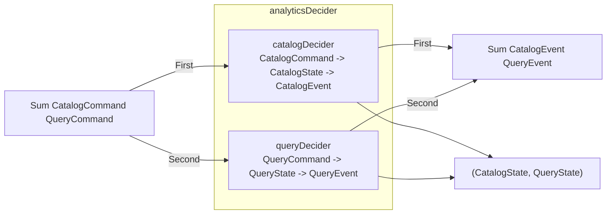
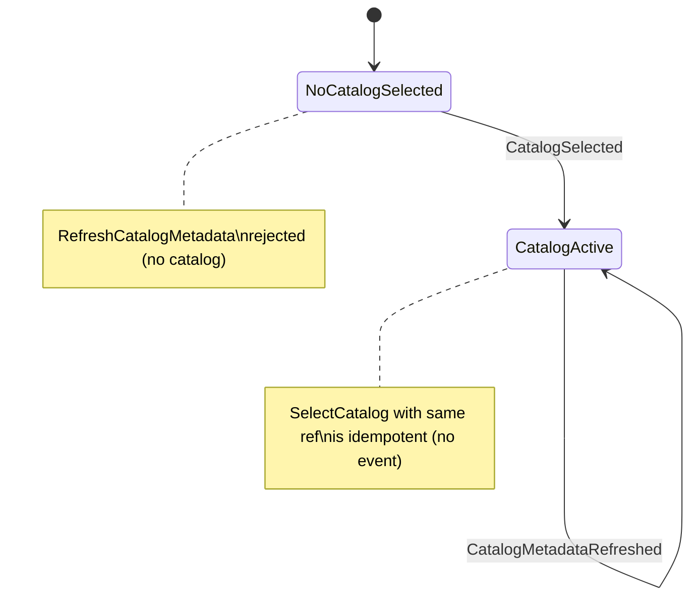
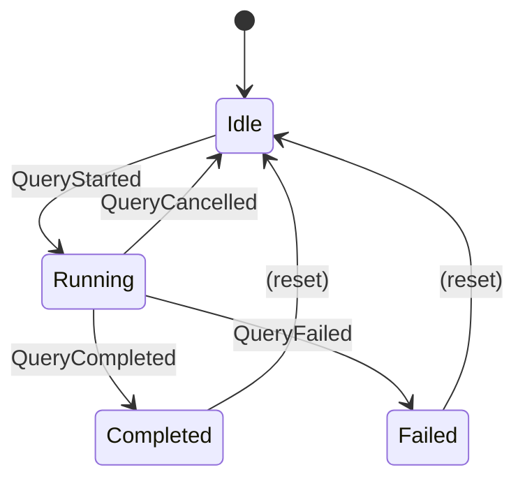

# Analytics bounded context (specification)

The Analytics bounded context is ironstar's core domain and primary value proposition.
It manages DuckLake catalog selection, query lifecycle, and chart visualization, composing two independent aggregates (Catalog and QuerySession) into a single combined Decider via fmodel's `combine` combinator.
See the [Rust implementation](../../crates/ironstar-analytics/README.md) for the concrete realization of these types.

## Aggregate composition

The `analyticsDecider` composes `catalogDecider` and `queryDecider` using the `Sum` coproduct to route commands and events to the appropriate sub-decider while maintaining independent state for each aggregate.

```idris
analyticsDecider : Decider (Sum CatalogCommand QueryCommand) (CatalogState, QueryState) (Sum CatalogEvent QueryEvent) String
analyticsDecider = combine catalogDecider queryDecider
```



## Catalog state machine

The Catalog aggregate is a singleton that tracks which DuckLake catalog is active.
Only one catalog can be active at a time, and selecting the same catalog again is idempotent.



## QuerySession state machine

The QuerySession aggregate manages the lifecycle of an analytical query from submission through execution to a terminal state.
Terminal states (Completed, Failed) require an explicit reset before a new query can begin.



## Chart value objects

The `Chart` module defines value objects for visualization specifications, supporting both ECharts and Vega-Lite chart types.

`ChartType` variants: `Line`, `Bar`, `Scatter`, `Pie`, `Heatmap`, `Area`, `Histogram`, `Boxplot`.

The configuration hierarchy is a nested product type structure where `ChartConfig` contains a `ChartType` and `ChartOptions`, which in turn contains optional `AxisConfig` (label, min, max, scale), `LegendConfig` (show, position), `GridConfig` (padding), and `ColorPalette` (hex color codes).
Default configurations are provided for all sub-components.
The `validateChartData` function enforces chart-type-specific invariants, such as requiring exactly one data series for pie charts.

## Zenoh key expressions

Analytics events are published to Zenoh using hierarchical key expression patterns for fine-grained subscription filtering.

| Pattern | Scope |
|---------|-------|
| `events/Analytics/**` | All analytics events (both aggregates) |
| `events/Analytics/Catalog/**` | Catalog events only |
| `events/Analytics/QuerySession/**` | QuerySession events only |

## Cross-links

- [Core Decider pattern](../Core/README.md) for the `Decider`, `View`, `Sum`, and `combine` abstractions used throughout this context.
- [Rust implementation](../../crates/ironstar-analytics/README.md) for the concrete types, smart constructors, and workflow pipeline.
