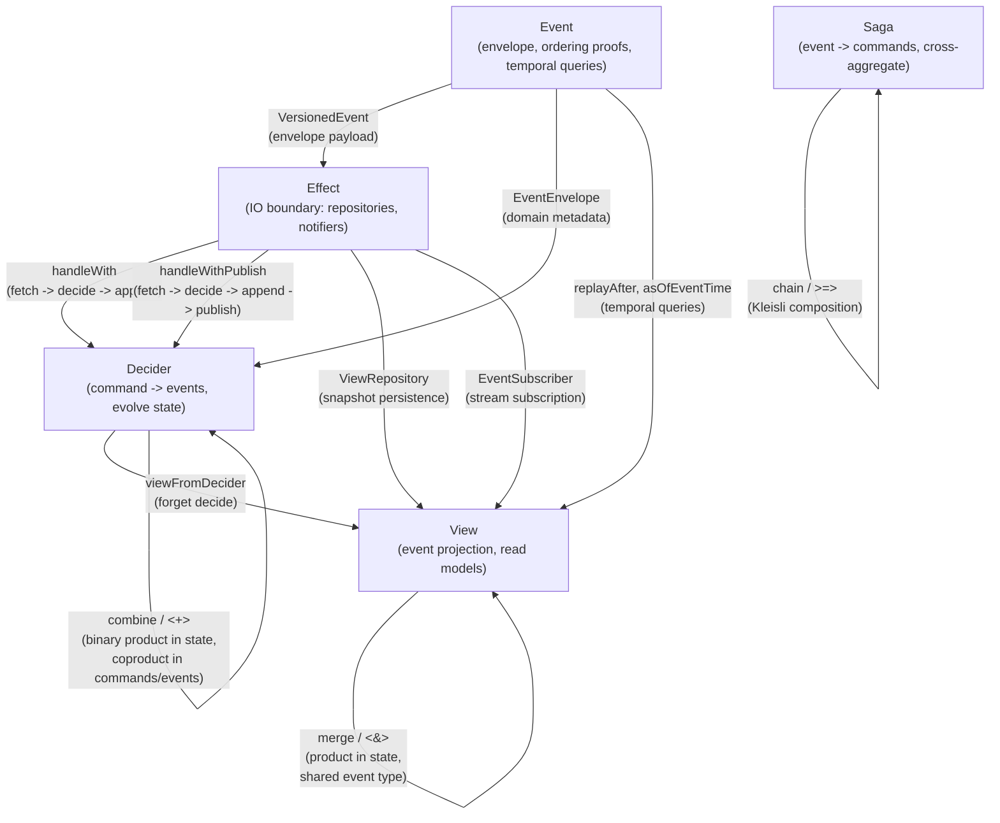
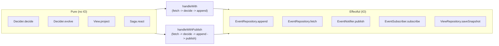

# Core patterns

These five modules define the domain-independent algebraic abstractions that all bounded contexts in ironstar build upon.
The patterns originate from Jeremie Chassaing's Decider pattern and are implemented in Rust via [fmodel-rust](../../crates/ironstar-core/README.md).
Each module is a self-contained Idris2 specification encoding the types, composition operators, and proof obligations that the Rust implementation must satisfy.

## Pattern relationships

The five core abstractions form a layered architecture where pure domain logic is separated from effectful infrastructure by explicit interfaces.



The Decider is the central abstraction.
View is structurally a Decider without `decide`, derived via `viewFromDecider`.
Saga maps events to commands for cross-aggregate coordination.
Effect defines the four IO interfaces that bridge pure logic to infrastructure.
Event provides the envelope types, ordering proofs, and temporal query operations.

## Decider algebra

The Decider record encapsulates pure decision logic for an event-sourced aggregate.

```idris
record Decider (c : Type) (s : Type) (e : Type) (err : Type) where
  constructor MkDecider
  decide : c -> s -> Either err (List e)
  evolve : s -> e -> s
  initialState : s
```

The `decide` function is a coalgebra that unfolds commands into events.
The `evolve` function is an algebra that folds events into state.
Together they form a coalgebra-algebra adjoint pair: `decide` produces the event stream that `evolve` consumes.

State reconstruction is a catamorphism over the event history:

```idris
reconstruct : Decider c s e err -> List e -> s
reconstruct d events = foldl d.evolve d.initialState events
```

The `combine` operator forms coproducts on commands and events while taking the product of states, enabling multi-aggregate bounded contexts:

```idris
combine : Decider c1 s1 e1 err -> Decider c2 s2 e2 err -> Decider (Sum c1 c2) (s1, s2) (Sum e1 e2) err
```

The `Sum`, `Sum3`, and `Sum5` progression supports bounded contexts of increasing breadth.
`Sum` and `Sum3` are defined in `Core.Decider`; `Sum5` is defined in `Workspace.Workspace` for the five-aggregate workspace context.
Each aggregate's commands and events are routed through the tagged union while their states remain isolated in the product tuple.

The Rust realization uses `fmodel_rust::Decider` with `Box<dyn Fn>` wrappers and `Send + Sync` bounds that the Idris2 specification eliminates as incidental complexity.

## Effect boundary

The pure/effectful split is the architectural invariant that all bounded contexts must preserve.



The four IO interfaces that form the effect boundary:

```idris
interface EventRepository (e : Type) (err : Type) where
  append : AggregateId -> List e -> IO (Either err (List (VersionedEvent e)))
  fetch : AggregateId -> IO (Either err (List (VersionedEvent e)))
  fetchSince : EventId -> IO (Either err (List (VersionedEvent e)))
  fetchSinceVersion : AggregateId -> Version -> IO (Either err (List (VersionedEvent e)))

interface ViewRepository (s : Type) (err : Type) where
  saveSnapshot : String -> s -> IO (Either err ())
  loadSnapshot : String -> IO (Either err (Maybe s))

interface EventNotifier (e : Type) where
  publish : e -> IO ()
  publishAll : List e -> IO ()

interface EventSubscriber (e : Type) where
  subscribe : String -> IO (IO e)
  unsubscribe : String -> IO ()
```

EventRepository is realized by [ironstar-event-store](../../crates/ironstar-event-store/README.md) (SqliteEventRepository).
EventNotifier and EventSubscriber are realized by [ironstar-event-bus](../../crates/ironstar-event-bus/README.md) (ZenohEventBus).

## Algebraic laws and proof terms

The spec encodes proof terms as 0-quantity (erased at runtime) declarations.
These serve as compile-time verification that the algebraic laws hold and have no Rust equivalent; they exist purely in the specification layer.

| Proof term | Type signature | What it proves |
|---|---|---|
| `decideIsPure` | `(d : Decider c s e err) -> (cmd : c) -> (st : s) -> d.decide cmd st = d.decide cmd st` | Referential transparency of decide |
| `evolveIsDeterministic` | `(d : Decider c s e err) -> (st : s) -> (evt : e) -> d.evolve st evt = d.evolve st evt` | Determinism of evolve |
| `replayDeterministic` | `(d : Decider c s e err) -> (es : List e) -> reconstruct d es = reconstruct d es` | State reconstruction is deterministic |
| `foldlAssociative` | `(f : s -> e -> s) -> (init : s) -> (es1, es2 : List e) -> foldl f init (es1 ++ es2) = foldl f (foldl f init es1) es2` | Snapshot correctness: replaying from any prefix yields same result |
| `projectDeterministic` | `(v : View s e) -> (es : List e) -> project v es = project v es` | View projection determinism |
| `projectIncremental` | `(v : View s e) -> (es1 : List e) -> (es2 : List e) -> project v (es1 ++ es2) = projectFrom v (project v es1) es2` | Incremental projection correctness |
| `appendLeftIdentity` | `(xs : List a) -> [] ++ xs = xs` | Free monoid left identity |
| `appendRightIdentity` | `(xs : List a) -> xs ++ [] = xs` | Free monoid right identity |
| `appendAssociative` | `(xs, ys, zs : List a) -> (xs ++ ys) ++ zs = xs ++ (ys ++ zs)` | Free monoid associativity |
| `reactIsPure` | `(s : Saga ar a) -> (x : ar) -> s.react x = s.react x` | Referential transparency of saga react |
| `identityLaw` | `(x : a) -> identity.react x = [x]` | Identity saga preserves input |
| `emptyLaw` | `(x : ar) -> empty.react x = []` | Empty saga produces nothing |

The first three proofs (`decideIsPure`, `evolveIsDeterministic`, `replayDeterministic`) follow trivially from reflexivity.
The `foldlAssociative` proof proceeds by structural induction on the first list argument.
The `projectIncremental` proof is non-trivial and currently uses `believe_me` pending a full inductive proof via the `foldlAssociative` lemma.
The free monoid laws (`appendLeftIdentity`, `appendRightIdentity`, `appendAssociative`) are proved by structural induction on lists.

## Dependent types beyond Rust

Several types in the spec exploit dependent typing that Rust's type system cannot express.

`EventIdLT` is a value-level proof of strict ordering between two event IDs:

```idris
data EventIdLT : EventId -> EventId -> Type where
  MkEventIdLT : {x, y : Integer} -> (0 prf : x < y = True)
             -> EventIdLT (MkEventId x) (MkEventId y)
```

`MonotonicIds` is a proof that a list of event IDs is monotonically increasing, ensuring the event store's ordering invariant is captured at the type level:

```idris
data MonotonicIds : List EventId -> Type where
  MonoNil  : MonotonicIds []
  MonoOne  : (eid : EventId) -> MonotonicIds [eid]
  MonoCons : MonotonicIds (eid :: eids) -> MonotonicIds eids
```

`FailureEventPreservesState` is an interface that ensures failure events do not modify aggregate state:

```idris
interface FailureEventPreservesState (e : Type) (s : Type) where
  isFailureEvent : e -> Bool
```

The full proof obligation (that `evolve st evt = st` when `isFailureEvent evt = True`) is sketched in comments but not yet encoded as a 0-quantity proof term.

In Rust, these invariants are maintained by convention, runtime assertions, and property-based testing rather than type-level proofs.
The Idris2 spec makes the obligations explicit so that violations are detectable during specification review even when the Rust compiler cannot enforce them.

## Navigation

Bounded contexts that use these core patterns:

- [Todo](../Todo/) -- single-aggregate context using Decider directly
- [Session](../Session/) -- session aggregate with TTL lifecycle
- [Analytics](../Analytics/) -- combined Decider (Catalog + QuerySession) using `combine`
- [Workspace](../Workspace/) -- five-aggregate context using `Sum5` and `combine5`
- [SharedKernel](../SharedKernel/) -- cross-context value objects (UserId, OAuthProvider)

Rust implementation counterparts:

- [ironstar-core](../../crates/ironstar-core/README.md) -- domain traits, fmodel-rust re-exports
- [ironstar-event-store](../../crates/ironstar-event-store/README.md) -- EventRepository realization (SQLite)
- [ironstar-event-bus](../../crates/ironstar-event-bus/README.md) -- EventNotifier/EventSubscriber realization (Zenoh)
