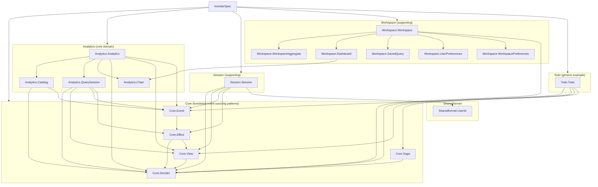

# Ironstar specification

This directory contains a dependently-typed algebraic specification in Idris2 that defines the domain model, algebraic laws, and correctness proofs for the ironstar template.
The Rust implementation in [crates/](../crates/README.md) realizes these specifications as concrete types and trait implementations.

The specification serves two purposes: it provides a single import point (`IronstarSpec`) for external consumers needing full spec access, and it type-checks that all modules compose correctly.
Where Idris2 can express properties as compile-time proof terms (deterministic replay, monoid laws, purity), the Rust side maintains these invariants by convention and testing.

## Module hierarchy

## Bounded context classification

Each bounded context is classified per DDD strategic design.

| Context | Classification | Rationale |
|---------|---------------|-----------|
| Analytics | Core domain | Primary value proposition: DuckLake catalog selection, query execution, chart visualization |
| Session | Supporting | Enables OAuth authentication and provides user identity to other contexts via shared kernel |
| Workspace | Supporting | User organization: dashboards, saved queries, preferences (user-scoped and workspace-scoped) |
| Todo | Generic (example) | Canonical CQRS/ES demonstration validating the infrastructure works for any domain |

## Spec-to-implementation correspondence

Each spec module maps to one or more Rust crates.
The divergences column notes where the Idris2 formalization and the Rust implementation differ structurally.

| Spec module | Idris2 key types | Rust crate | Rust key types | Divergences |
|-------------|-----------------|------------|----------------|-------------|
| Core.Decider | `Decider c s e err`, `Sum a b`, `combine` | ironstar-core + fmodel-rust | `DeciderType`, `fmodel_rust::Decider` | Rust uses trait-based dispatch; Idris2 uses a record with function fields |
| Core.Effect | `EventRepository`, `EventNotifier`, `EventSubscriber` | ironstar-event-store, ironstar-event-bus | `SqliteEventRepository`, `ZenohEventBus` | Spec uses interfaces; Rust uses concrete implementations |
| Core.Event | `EventIdLT`, `MonotonicIds`, `EventEnvelope` | ironstar-event-store | event types | Dependent types (ordering proofs) have no Rust equivalent |
| Core.View | `View s e`, `merge` | ironstar-core + fmodel-rust | `fmodel_rust::View` | Same structure |
| Core.Saga | `Saga ar a`, `chain`, `merge` | ironstar-core + fmodel-rust | `fmodel_rust::Saga` | Same structure |
| Analytics.Catalog | `CatalogCommand`/`Event`/`State`, `catalogDecider` | ironstar-analytics | `catalog::Command`/`Event`/`State`, `catalog::decider()` | Direct correspondence |
| Analytics.QuerySession | `QueryCommand`/`Event`/`State`, `queryDecider` | ironstar-analytics | `query_session::Command`/`Event`/`State` | Direct correspondence |
| Analytics.Chart | `ChartType`, `ChartConfig`, `ChartOptions` | ironstar-analytics | `values::ChartType`, `values::ChartConfig` | Direct correspondence |
| Analytics.Analytics | `analyticsDecider` (combined via `Sum`) | ironstar-analytics | `combined_decider()` | Direct correspondence |
| Session.Session | `SessionCommand`/`Event`/`State`, `sessionDecider` | ironstar-session | `Command`/`Event`/`State`, `decider()` | Direct correspondence |
| SharedKernel.UserId | `UserId (provider, externalId)`, `OAuthProvider` | ironstar-shared-kernel | `UserId(Uuid)`, `OAuthProvider` | Spec uses composite key (provider, externalId); Rust uses canonical UUID with separate lookup table |
| Todo.Todo | `TodoCommand`/`Event`/`State`/`Error`, `todoDecider`, `completionNotificationSaga` | ironstar-todo | `Command`/`Event`/`State`, `decider()` | Direct correspondence |
| Workspace.Workspace | `Sum5`, `combine5`, `workspaceContextDecider` | ironstar-workspace | 5 subdirectory modules | Direct correspondence |
| Workspace.WorkspaceAggregate | `WorkspaceCommand`/`Event`/`State`, `workspaceDecider` | ironstar-workspace | `workspace_aggregate::*` | Direct correspondence |
| Workspace.Dashboard | `DashboardCommand`/`Event`/`State`, `dashboardDecider` | ironstar-workspace | `dashboard::*` | Direct correspondence |
| Workspace.SavedQuery | `SavedQueryCommand`/`Event`/`State`, `savedQueryDecider` | ironstar-workspace | `saved_query::*` | Direct correspondence |
| Workspace.UserPreferences | `PreferencesCommand`/`Event`/`State`, `preferencesDecider` | ironstar-workspace | `user_preferences::*` | Direct correspondence |
| Workspace.WorkspacePreferences | `WorkspacePreferencesCommand`/`Event`/`State`, `workspacePreferencesDecider` | ironstar-workspace | `workspace_preferences::*` | Direct correspondence |
| (no spec) | -- | ironstar (binary crate) | `AppState`, axum routes, handlers | Composition root is outside spec scope |
| (no spec) | -- | ironstar-analytics-infra | `DuckDBService`, moka cache | Infrastructure is outside spec scope |
| (no spec) | -- | ironstar-session-store | `SqliteSessionStore` | Infrastructure is outside spec scope |

## Algebraic properties

The spec includes proof terms that verify correctness invariants at the type level.
These exist as 0-quantity (erased) terms that are checked at compile time but have no runtime representation.

The key properties proved or postulated are:

- Replay determinism: `foldlAssociative` establishes that folding over concatenated event lists is associative, enabling snapshot correctness (`foldl f s (es1 ++ es2) = foldl f (foldl f s es1) es2`).
- Free monoid structure of event logs: `appendLeftIdentity`, `appendRightIdentity`, and `appendAssociative` verify that event lists form a monoid under concatenation, formalizing append-only semantics.
- Purity of decide functions: `decideIsPure` states that `decide` is referentially transparent for the same command and state.
- Determinism of evolve: `evolveIsDeterministic` states that evolving the same state with the same event always produces the same result.
- Incremental projection: `projectIncremental` establishes that projecting over a concatenation equals projecting incrementally from a snapshot, justifying read model snapshots.

Rust cannot express these properties in its type system.
They are maintained by convention (pure functions, no interior mutability in aggregates) and verified through property-based testing.
See [Core patterns](Core/README.md) for the full treatment of these properties.

## Navigation

- [Core patterns](Core/README.md) -- Decider, View, Saga, Effect, Event
- [Analytics](Analytics/README.md) -- Catalog, QuerySession, Chart
- [Session](Session/README.md) -- Authentication lifecycle
- [SharedKernel](SharedKernel/README.md) -- Cross-context identity
- [Todo](Todo/README.md) -- CQRS/ES example
- [Workspace](Workspace/README.md) -- Workspace management
