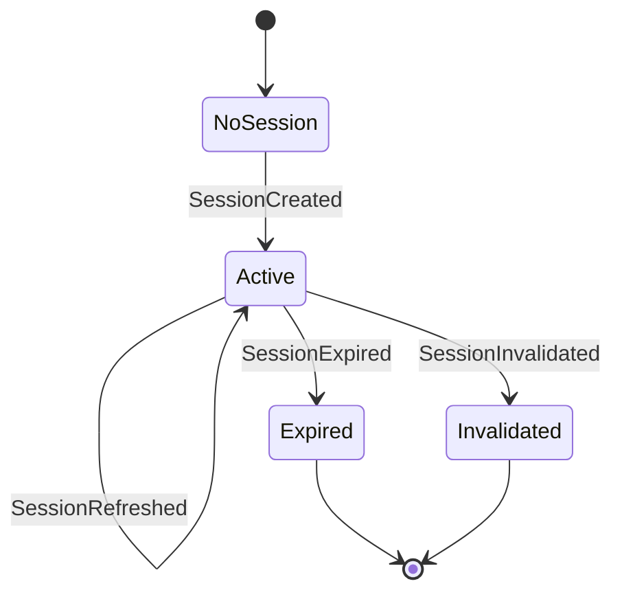

# Session bounded context (specification)

Session is a supporting domain that enables authentication and session management.
It is a single-aggregate context: the Session aggregate manages the full lifecycle from OAuth callback through expiration or explicit logout, with no intra-context aggregate composition required.
`UserId` and `OAuthProvider` are shared kernel types defined in [SharedKernel](../SharedKernel/README.md).
See the [Rust implementation](../../crates/ironstar-session/README.md) for the concrete realization of these types.

## Session state machine

The Session aggregate follows a linear lifecycle with two terminal states.
`Expired` events are generated by the boundary layer when TTL is exceeded, not by the decider itself.



`Expired` and `Invalidated` are terminal states.
No command can transition out of either state once reached.
The `SessionRefreshed` self-transition on `Active` extends the TTL without changing the session identity or user.

## Command, event, and state types

```idris
data SessionCommand
  = CreateSession UserId OAuthProvider
  | RefreshSession SessionId
  | InvalidateSession SessionId

data SessionEvent
  = SessionCreated SessionId UserId OAuthProvider Timestamp ExpiresAt SessionMetadata
  | SessionRefreshed SessionId ExpiresAt Timestamp
  | SessionInvalidated SessionId Timestamp
  | SessionExpired SessionId Timestamp

data SessionState
  = NoSession
  | Active SessionId UserId ExpiresAt
  | Expired SessionId
  | Invalidated SessionId
```

Value objects supporting the aggregate:

```idris
record ExpiresAt where
  constructor MkExpiresAt
  unExpiresAt : Integer

data RevocationReason
  = UserLogout
  | AdminAction
  | SecurityConcern

data SessionStatus
  = SsActive
  | SsExpired
  | SsRevoked

record SessionMetadata where
  constructor MkSessionMetadata
  ipAddress : Maybe String
  userAgent : Maybe String
  geoLocation : Maybe String
```

## Session decider

The decider is a pure function with no side effects.
All boundary concerns (OAuth token exchange, timestamp generation, `SessionId` creation, metadata extraction) are provided as holes filled at the boundary layer.

```idris
sessionDecider : Decider SessionCommand SessionState SessionEvent String
```

Key invariants enforced by `decide`:

- `CreateSession` succeeds only from `NoSession`.
- `RefreshSession` and `InvalidateSession` succeed only from `Active` with matching `SessionId`.
- Terminal states (`Expired`, `Invalidated`) reject all commands.
- `SessionExpired` events are boundary-generated; the decider does not emit them.

The `evolve` function is total and deterministic, applying events as historical facts.

## ActiveSessionView

The read-side projection provides quick session lookup by `SessionId`.

```idris
record ActiveSessionView where
  constructor MkActiveSessionView
  activeSession : Maybe (SessionId, UserId, ExpiresAt)

activeSessionView : View ActiveSessionView SessionEvent
```

`Created` and `Refreshed` events populate the active session projection.
`Invalidated` and `Expired` events clear it to `Nothing`.
This view is disposable and can be rebuilt from the event stream (Hoffman's Laws 3 and 5).

## Cross-links

- [Core patterns](../Core/README.md) for `Decider`, `View`, and `EventType` definitions.
- [SharedKernel](../SharedKernel/README.md) for `UserId` and `OAuthProvider`.
- [Rust implementation](../../crates/ironstar-session/README.md) for the concrete crate.
- [Session store](../../crates/ironstar-session-store/README.md) for SQLite persistence.
