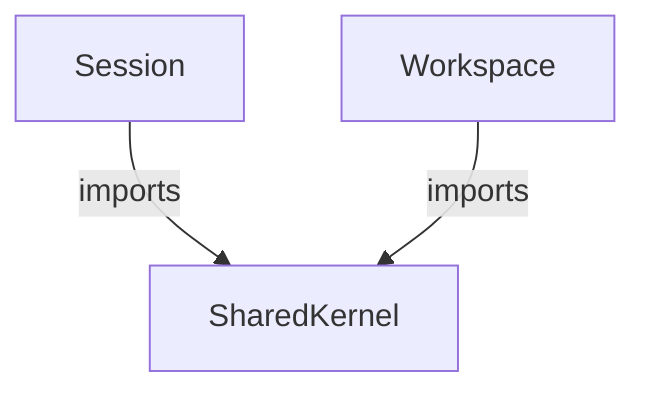

# Shared kernel (specification)

Cross-context identity types shared between the Session and Workspace bounded contexts.
This is a Shared Kernel in DDD terms: a small set of types owned by neither context but imported by both, enabling bidirectional sharing without creating unidirectional dependencies.
See the [Rust implementation](../../crates/ironstar-shared-kernel/README.md) for the concrete realization.

## Types

```idris
data OAuthProvider = GitHub | Google

record UserId where
  constructor MkUserId
  provider : OAuthProvider
  externalId : String
```

`OAuthProvider` enumerates authentication providers, with GitHub as the primary provider and Google planned for future extension.
`UserId` combines a provider with the provider's external identifier to form a composite key for user lookup.

## Evolution strategy

The spec currently defines `UserId` as a composite key `(provider, externalId)` reflecting the MVP OAuth-only authentication model.
The planned evolution path proceeds without breaking changes:

1. Introduce a canonical UUID as `users.id` for internal identity reference.
2. Store composite `(provider, externalId)` in a `user_identities` lookup table.
3. Events reference the canonical UUID rather than the composite key.
4. `OAuthProvider` extends to an `AuthMethod` sum type adding `Passkey` and `EnterpriseSso` variants while preserving existing OAuth variants.

This evolution separates the stable domain identity (UUID) from the authentication mechanism (OAuth composite key), allowing new authentication methods without schema migration of existing events.

## Spec-implementation divergence

The Rust implementation has already advanced to the target state: `UserId(Uuid)` wraps a UUID v4 as the canonical identity reference.
The spec retains the composite key `(provider, externalId)` as the simpler logical model.
This is an intentional spec-leads-implementation pattern where the spec captures the domain concept and the implementation bridges to the infrastructure reality.
The composite key lookup remains an infrastructure concern handled by the `user_identities` table schema documented in the authentication architecture.

## Consumers



Both Session and Workspace contexts import `UserId` and `OAuthProvider` from the shared kernel.
Neither context owns these types, preserving symmetric coupling.

## Cross-links

- [Session](../Session/README.md) for session aggregate using `UserId` and `OAuthProvider`.
- [Workspace](../Workspace/README.md) for workspace ownership using `UserId`.
- [Rust implementation](../../crates/ironstar-shared-kernel/README.md) for the concrete crate.
