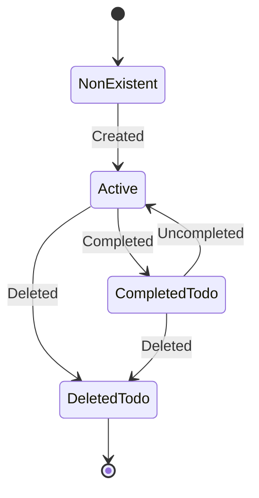
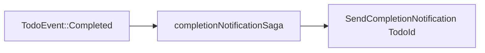

# Todo bounded context (specification)

The Todo bounded context is a generic (example) domain that serves as the canonical CQRS/ES demonstration for ironstar.
It validates the Decider, View, and Saga patterns against a maximally simple state machine, establishing confidence that the infrastructure works for any domain before applying it to more complex bounded contexts.

See the [Rust implementation](../../crates/ironstar-todo/README.md) for the crate that realizes this specification.

## Todo state machine

The Todo aggregate encodes a lifecycle with four states.
`DeletedTodo` is a terminal state (`IsFinal`): once a todo is deleted, no further transitions are permitted.
Idempotent operations (completing an already-completed todo, uncompleting an already-active todo, deleting an already-deleted todo) return an empty event list rather than an error.



`DeletedTodo` implements `IsFinal`, signaling to infrastructure that the aggregate's event stream is sealed.

## Types

### Commands

```idris
data TodoCommand
  = Create String
  | Complete
  | Uncomplete
  | Delete
```

Commands carry raw user input and are imperative (present tense).
Validation is the Decider's responsibility, not the command's.

### Events

```idris
data TodoEvent
  = Created TodoId String Timestamp
  | Completed Timestamp
  | Uncompleted Timestamp
  | Deleted Timestamp
```

Events are past-tense facts (Hoffman's Law 1).
Event payloads are immutable once recorded.

### State

```idris
data TodoState
  = NonExistent
  | Active TodoId String
  | CompletedTodo TodoId String
  | DeletedTodo TodoId
```

The state machine is encoded as a sum type.
Pattern matching in `decide` prevents invalid transitions at the type level.

### Errors

```idris
data TodoError
  = TodoAlreadyExists
  | CannotCompleteInCurrentState
  | CannotUncompleteInCurrentState
  | CannotDeleteNothing
```

Each error variant maps to a precondition violation in the Decider.

## Saga

The `completionNotificationSaga` demonstrates the Saga (process manager) pattern.
It reacts to `TodoEvent` values and produces `NotificationCommand` values, enabling cross-aggregate coordination without coupling.

```idris
completionNotificationSaga : Saga TodoEvent NotificationCommand
```



When a todo is completed, the saga emits a `SendCompletionNotification` command targeting a notification aggregate.
Other event variants produce an empty command list.
Saga composition via `<|>` enables merging multiple process managers that react to the same event stream.

## Proof terms

Three proof terms establish correctness properties specific to the Todo Decider.

`todoReplayDeterminism` proves that state reconstruction via event replay is deterministic: for any event history, replaying produces the same final state.
This follows from the determinism of `foldl` over a pure `evolve` function.

```idris
0 todoReplayDeterminism : (es : List TodoEvent) ->
    reconstruct todoDecider es = reconstruct todoDecider es
```

`todoDecidePurity` proves that the `decide` function is referentially transparent: same command and state always produce the same event list.
Idris 2's totality checker enforces this by construction (no IO, no global state).

```idris
0 todoDecidePurity : (cmd : TodoCommand) -> (st : TodoState) ->
    todoDecider.decide cmd st = todoDecider.decide cmd st
```

`todoDecisionsAreDeterministic` restates the purity property with an emphasis on determinism: decisions are computed from the command and state alone, with no external input.

```idris
0 todoDecisionsAreDeterministic : (cmd : TodoCommand) -> (st : TodoState) ->
    (todoDecider.decide cmd st = todoDecider.decide cmd st)
```

## Cross-links

- [Core patterns](../Core/README.md) -- Decider, View, and Saga abstractions that this context instantiates
- [Rust implementation](../../crates/ironstar-todo/README.md) -- `ironstar-todo` crate realizing this specification
