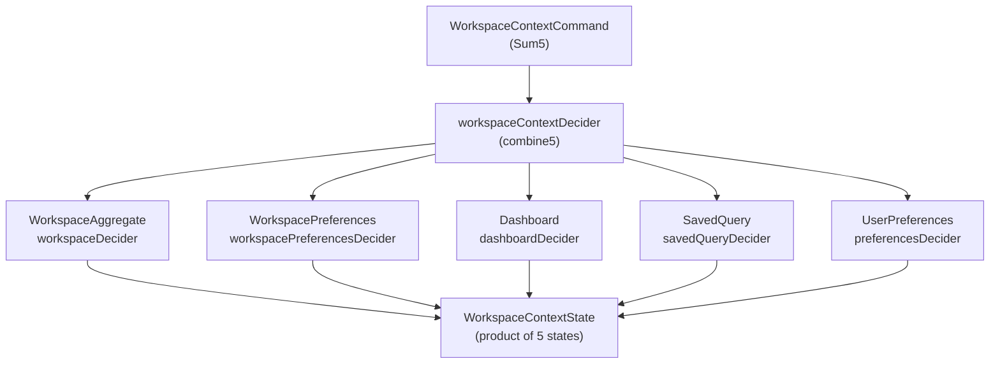
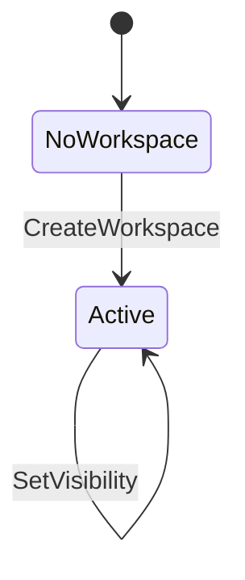
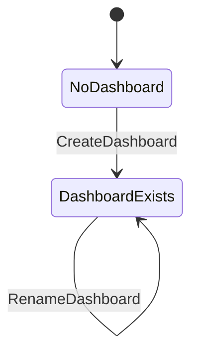
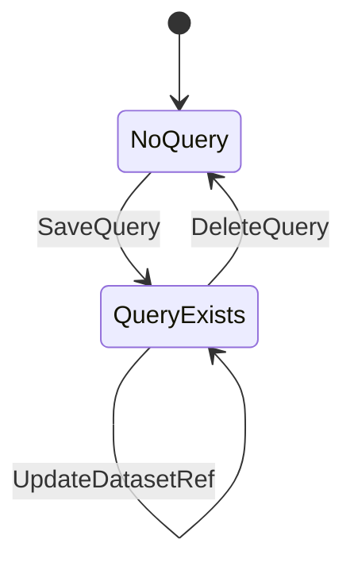
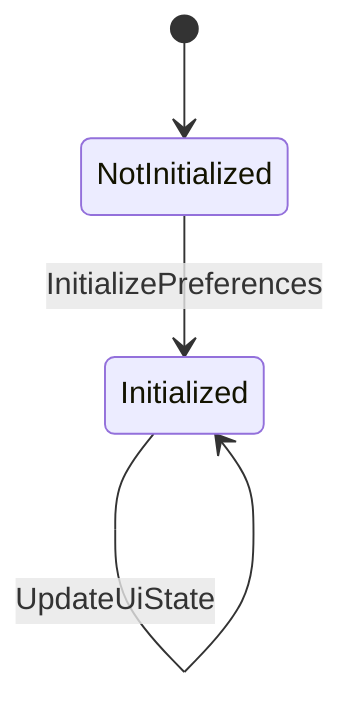
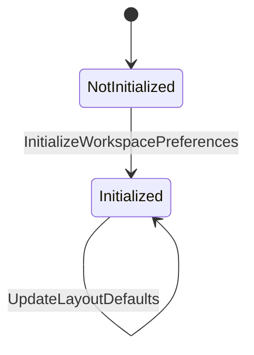

# Workspace bounded context (specification)

The Workspace bounded context is a *supporting domain* managing user workspace lifecycle, persistent dashboard layouts, saved queries, and preference configuration.
It is the most complex composition in the system, combining 5 independent aggregates via `combine5` and the `Sum5` coproduct into a single `Decider`.
Each aggregate handles its own command/event/state types while sharing a unified interface, with state isolation guaranteed by monoidal composition.

See the [Rust implementation](../../crates/ironstar-workspace/README.md) for the concrete realization.

## Aggregate composition

The `workspaceContextDecider` composes all five deciders, transforming commands through `Sum5` routing and maintaining a product of independent states.

```idris
workspaceContextDecider : Decider WorkspaceContextCommand WorkspaceContextState WorkspaceContextEvent String
workspaceContextDecider = combine5
  WA.workspaceDecider
  WP.workspacePreferencesDecider
  D.dashboardDecider
  SQ.savedQueryDecider
  UP.preferencesDecider
```



## Cross-context dependency

Dashboard imports `Analytics.Chart.ChartDefinitionRef` to reference chart definitions placed on dashboard grids.
This is a Customer-Supplier relationship where Analytics is the upstream supplier and Workspace is the downstream consumer.
Workspace does not emit events that Analytics subscribes to.

The `UserId` type is imported from `SharedKernel.UserId` for workspace ownership attribution, establishing a Shared Kernel relationship with the Session context.

## State machines

### WorkspaceAggregate

A single-state aggregate tracking workspace identity, name, ownership (`UserId`), and visibility (`Public`/`Private`).
Once created, the workspace always exists (no delete transition defined).



### Dashboard

Layout configuration with chart placements, tab organization, and grid positioning.
Belongs to a workspace via `WorkspaceId`.



### SavedQuery

Named DuckDB queries with dataset references, belonging to a workspace.
The only aggregate in this context with a terminal transition (`DeleteQuery` returns to initial state).



### UserPreferences

User-scoped settings (theme, locale, UI state) that follow the user across all workspaces.
Single-state record after initialization.



### WorkspacePreferences

Workspace-scoped settings (default catalog, layout defaults) shared across all users in a workspace.
Single-state record after initialization.



## Cross-links

- [Core patterns](../Core/README.md) (Decider, View, Sum types)
- [Analytics](../Analytics/README.md) (ChartDefinitionRef supplier)
- [SharedKernel](../SharedKernel/README.md) (UserId)
- [Rust implementation](../../crates/ironstar-workspace/README.md)
